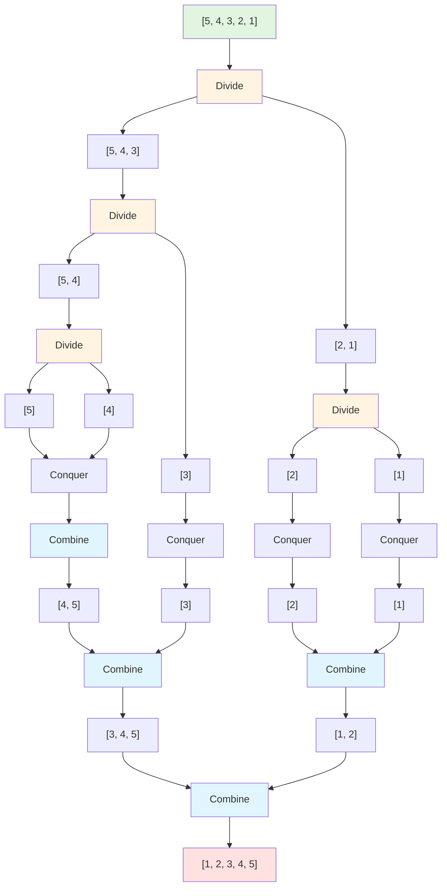

# 수 정렬하기 2

## 📌 문제 요약

N개의 수가 주어졌을 때, 이를 오름차순으로 정렬하는 프로그램을 작성한다.

---

## 🔍 문제 설명

* N개의 수가 주어진다.
* 이 수들을 오름차순으로 정렬하여 출력한다.
* N은 최대 1,000,000까지 가능하다.
* 각 수는 절댓값이 1,000,000보다 작거나 같은 정수이다.

---

## 📥 입력 조건

* 첫째 줄에 수의 개수 N(1 ≤ N ≤ 1,000,000)이 주어진다.
* 둘째 줄부터 N개의 줄에는 수가 주어진다.
* 이 수는 절댓값이 1,000,000보다 작거나 같은 정수이다.
* 수는 중복되지 않는다.

---

## 📤 출력 조건

* 첫째 줄부터 N개의 줄에 오름차순으로 정렬한 결과를 한 줄에 하나씩 출력한다.

---

## 💡 문제 핵심 해석

이 문제는 **대량의 데이터를 정렬**하는 문제이다.

* **데이터 크기**: 최대 1,000,000개의 수
* **정렬 알고리즘 선택**: O(N²) 알고리즘은 시간 초과
* **필요한 알고리즘**: O(N log N) 정렬 알고리즘

### 왜 병합 정렬이 적합한가?

* **최악의 경우에도 O(N log N)**: 일관된 성능 보장
* **안정 정렬**: 같은 값의 상대적 순서 유지 (이 문제에서는 중복이 없지만)
* **대량 데이터 처리**: 1,000,000개의 데이터를 효율적으로 정렬 가능

예를 들어, 입력이 다음과 같다면:
```
5
5
4
3
2
1
```

**병합 정렬 과정 (분할정복):**



**단계별 상세 설명:**

| 단계 | 과정 | 배열 상태 |
|------|------|----------|
| **초기 상태** | 원본 배열 | `[5, 4, 3, 2, 1]` |
| **1단계: Divide** | 배열을 반으로 나눔 | `[5, 4, 3]` | `[2, 1]` |
| **2단계: Divide** | 각 부분을 다시 나눔 | `[5, 4]` | `[3]` | `[2]` | `[1]` |
| **3단계: Divide** | 더 이상 나눌 수 없을 때까지 | `[5]` | `[4]` | `[3]` | `[2]` | `[1]` |
| **4단계: Conquer** | 각 원소는 이미 정렬된 상태 | (변화 없음) |
| **5단계: Combine** | `[5]` + `[4]` 병합 | `[4, 5]` |
| **6단계: Combine** | `[4, 5]` + `[3]` 병합 | `[3, 4, 5]` |
| **7단계: Combine** | `[2]` + `[1]` 병합 | `[1, 2]` |
| **8단계: Combine** | `[3, 4, 5]` + `[1, 2]` 최종 병합 | `[1, 2, 3, 4, 5]` |

➡️ **병합 정렬(Merge Sort)** 알고리즘을 사용하여 해결하는 문제이다.

---

## 🧠 해결 전략 개요

* 병합 정렬 알고리즘 구현
* 분할정복 방식으로 배열을 반으로 나누어 정렬 후 병합
* 시간 복잡도: `O(N log N)`
* 공간 복잡도: `O(N)` (임시 배열 필요)

---

## ✨ 예시

### 예시 1: 기본 케이스

**입력**
```
5
5
4
3
2
1
```

**출력**
```
1
2
3
4
5
```

**설명**: 
* 내림차순으로 정렬된 배열을 오름차순으로 정렬
* 병합 정렬로 효율적으로 정렬

---

### 예시 2: 큰 데이터

**입력**
```
10
10
9
8
7
6
5
4
3
2
1
```

**출력**
```
1
2
3
4
5
6
7
8
9
10
```

**설명**: 
* 10개의 수를 오름차순으로 정렬
* 병합 정렬의 분할-정복 과정을 통해 정렬

---

### 예시 3: 무작위 순서

**입력**
```
6
3
1
4
2
5
9
```

**출력**
```
1
2
3
4
5
9
```

**설명**: 
* 무작위 순서의 배열을 오름차순으로 정렬
* 병합 정렬로 효율적으로 정렬

---

## 📝 정리

이 문제는 **병합 정렬 알고리즘**을 직접 구현하여 해결하는 전형적인 정렬 문제이다.

* 대량의 데이터(최대 1,000,000개)를 효율적으로 정렬
* O(N log N) 시간 복잡도로 해결 가능
* 최악의 경우에도 일관된 성능 보장

