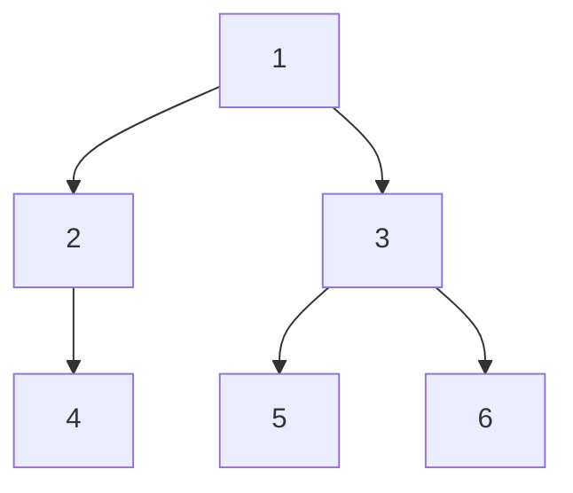
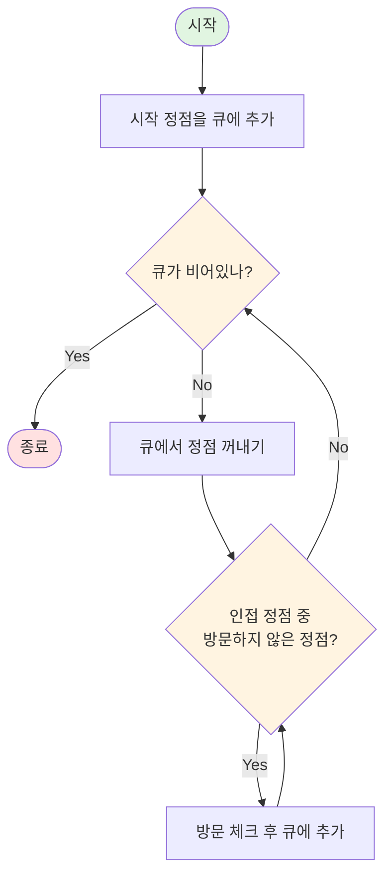

# BFS (너비 우선 탐색) 정리

> **참고**: 그래프 탐색의 공통 개념과 BFS vs DFS 비교는 [그래프 탐색 개요](../graph-traversal.md)를 참고하세요.

## 1️⃣ BFS란?

**BFS (Breadth-First Search, 너비 우선 탐색)** 란

> 그래프나 트리를 탐색할 때,
> **시작 정점에서 가까운 정점부터 차례대로 방문**하는 탐색 알고리즘
> 을 의미한다.

즉, **"같은 레벨의 정점들을 모두 방문한 후 다음 레벨로 진행"** 하는 방식으로 그래프를 탐색한다.

---

## 2️⃣ 언제 사용할까?

BFS는 다음과 같은 상황에서 사용된다:

* **최단 경로 찾기** (가중치가 없는 그래프에서)
* **레벨별 탐색** (같은 거리의 정점들을 함께 처리)
* **연결성 확인** (모든 정점이 연결되어 있는지)
* **최소 이동 횟수** (미로 탈출, 체스 말 이동 등)
* **트리 레벨 순회**

### 대표적인 예시

* **그래프 탐색** (2178, 1697, 7562 등)
* **최단 경로** (가중치 없는 그래프)
* **미로 탈출** (시작점에서 도착점까지 최소 이동)
* **네트워크 탐색** (연결된 모든 노드 찾기)

---

## 3️⃣ BFS의 핵심 개념

### 📌 핵심 아이디어

* **큐(Queue) 사용**: FIFO 원칙으로 같은 레벨의 정점들을 순서대로 처리
* **방문 체크**: 이미 방문한 정점은 다시 방문하지 않음
* **레벨별 탐색**: 시작점에서 거리 0 → 거리 1 → 거리 2 순서로 탐색

### 📐 BFS의 탐색 순서

다음 그래프에서 정점 1부터 BFS를 수행하는 과정:



**BFS 탐색 과정 (레벨별):**

```
레벨 0: [1]              큐: [1]              → 1 방문
레벨 1: [2, 3]            큐: [2, 3]            → 2, 3 방문
레벨 2: [4, 5, 6]         큐: [4, 5, 6]         → 4, 5, 6 방문

최종 탐색 순서: 1 → 2 → 3 → 4 → 5 → 6
```

**핵심 포인트:**

* **레벨 0**: 시작점(1)만 큐에 있음
* **레벨 1**: 시작점의 인접 정점들(2, 3)이 큐에 추가됨
* **레벨 2**: 레벨 1의 정점들의 인접 정점들(2→4, 3→5,6)이 큐에 추가됨
* **결과**: 시작점에서 **가까운 정점부터 먼저** 방문됨 (거리 0 → 1 → 2 순서)

이 순서는 **시작점에서의 거리**를 기준으로 정렬된다.

---

## 4️⃣ BFS 알고리즘의 구조

> **참고**: 그래프 표현 방법과 방문 체크 등 공통 개념은 [그래프 탐색 개요](../graph-traversal.md#5%EF%B8%8F⃣-공통-개념)를 참고하세요.

### 기본 구현

**BFS 알고리즘 플로우차트:**



**Java 구현 코드:**

```java
void bfs(int start) {
    Queue<Integer> queue = new ArrayDeque<>();
    boolean[] visited = new boolean[N + 1];
    
    // 시작 정점 처리
    queue.offer(start);  // offer: 큐의 뒤(rear)에 요소 추가, 성공 시 true 반환
    visited[start] = true;
    
    while (!queue.isEmpty()) {
        int current = queue.poll();  // poll: 큐의 앞(front)에서 요소 제거 및 반환, 비어있으면 null
        
        // 현재 정점 처리 (출력, 계산 등)
        System.out.print(current + " ");
        
        // 인접한 정점들 탐색
        // graph[current]: 현재 정점과 연결된 모든 정점들의 리스트
        for (int next : graph[current]) {
            if (!visited[next]) {
                visited[next] = true;
                queue.offer(next);  // 방문하지 않은 인접 정점을 큐에 추가
            }
        }
    }
}
```

**큐 연산 설명:**

* **`offer(element)`**: 큐의 뒤(rear)에 요소를 추가합니다. 추가 성공 시 `true`, 실패 시 `false`를 반환합니다. 큐가 가득 찬 경우 예외를 던지지 않고 `false`를 반환합니다.
* **`poll()`**: 큐의 앞(front)에서 요소를 제거하고 반환합니다. 큐가 비어있으면 `null`을 반환합니다. 예외를 던지지 않습니다.
* **`peek()`**: 큐의 앞 요소를 제거하지 않고 확인만 합니다. 비어있으면 `null` 반환.

### 최단 거리 계산 버전

```java
int[] bfs(int start) {
    Queue<Integer> queue = new ArrayDeque<>();
    boolean[] visited = new boolean[N + 1];
    int[] distance = new int[N + 1];
    Arrays.fill(distance, -1);  // 방문하지 않은 정점은 -1
    
    queue.offer(start);
    visited[start] = true;
    distance[start] = 0;  // 시작점의 거리는 0
    
    while (!queue.isEmpty()) {
        int current = queue.poll();
        
        for (int next : graph[current]) {
            if (!visited[next]) {
                visited[next] = true;
                distance[next] = distance[current] + 1;  // 거리 증가
                queue.offer(next);
            }
        }
    }
    
    return distance;
}
```

---

## 5️⃣ BFS의 특징

### ✅ 장점

* **최단 경로 보장**: 가중치 없는 그래프에서 시작점으로부터의 최단 거리를 보장
* **레벨별 처리**: 같은 거리의 정점들을 함께 처리할 수 있음
* **구현 단순**: 큐만 사용하면 되므로 구현이 간단
* **메모리 효율**: 큐에 저장되는 정점 수만큼만 메모리 사용

### ❌ 단점

* **메모리 사용**: 깊은 그래프에서는 큐에 많은 정점이 저장될 수 있음
* **가중치 그래프**: 가중치가 있는 그래프에서는 최단 경로를 보장하지 않음 (다익스트라 필요)

---

## 6️⃣ 시간/공간 복잡도

> **참고**: 그래프 탐색 알고리즘의 전체 시간/공간 복잡도는 [그래프 탐색 개요](../graph-traversal.md#6%EF%B8%8F⃣-시간공간-복잡도)를 참고하세요.

### BFS 특화 복잡도 분석

**시간 복잡도 구성 요소:**

* **각 정점 처리**: O(1) - 큐에서 꺼내기, 방문 체크, 거리 업데이트
* **간선 탐색**: O(E) - 모든 간선을 한 번씩 확인
* **전체**: O(V + E) - 각 정점을 한 번씩 방문하고, 각 간선을 한 번씩 확인

**공간 복잡도 구성 요소:**

* **큐**: O(V) - 최악의 경우 모든 정점이 큐에 들어갈 수 있음 (예: 완전 이진 트리에서 마지막 레벨의 모든 정점)
* **방문 배열**: O(V) - 각 정점의 방문 여부를 저장
* **전체**: O(V)

---

## 8️⃣ BFS 구현 패턴

BFS의 기본 구조는 동일하지만, 문제 유형에 따라 다음과 같은 변형이 필요합니다:

### 패턴 1: 기본 그래프 탐색

위의 기본 구현 코드를 참고하세요. 1차원 그래프에서의 기본 탐색 패턴입니다.

### 패턴 2: 2차원 격자 탐색

미로, 지도 등 2차원 배열에서 상하좌우 이동이 필요한 경우:

```java
int[] dx = {-1, 1, 0, 0};  // 상하좌우
int[] dy = {0, 0, -1, 1};

void bfs(int startX, int startY) {
    Queue<int[]> queue = new ArrayDeque<>();
    boolean[][] visited = new boolean[N][M];
    
    queue.offer(new int[]{startX, startY});
    visited[startX][startY] = true;
    
    while (!queue.isEmpty()) {
        int[] current = queue.poll();
        int x = current[0];
        int y = current[1];
        
        for (int i = 0; i < 4; i++) {
            int nx = x + dx[i];
            int ny = y + dy[i];
            
            if (nx >= 0 && nx < N && ny >= 0 && ny < M 
                && !visited[nx][ny] && map[nx][ny] == 1) {
                visited[nx][ny] = true;
                queue.offer(new int[]{nx, ny});
            }
        }
    }
}
```

### 패턴 3: 레벨별 처리

같은 거리의 정점들을 함께 처리해야 할 때 (예: 각 레벨별로 다른 작업 수행):

```java
while (!queue.isEmpty()) {
    int size = queue.size();  // 현재 레벨의 정점 개수
    
    // 현재 레벨의 모든 정점 처리
    for (int i = 0; i < size; i++) {
        int current = queue.poll();
        // 레벨별 처리 로직
    }
}
```

### 패턴 4: 최단 경로 추적

경로를 저장해야 할 때는 `parent` 배열을 사용하여 역추적:

```java
int[] parent = new int[N + 1];
Arrays.fill(parent, -1);

// 탐색 중
parent[next] = current;

// 경로 복원
List<Integer> path = new ArrayList<>();
int node = end;
while (node != -1) {
    path.add(node);
    node = parent[node];
}
Collections.reverse(path);
```
---

## 🔟 BFS vs DFS

BFS와 DFS의 비교 및 언제 어떤 알고리즘을 사용할지에 대한 자세한 내용은 [그래프 탐색 개요](../graph-traversal.md#3%EF%B8%8F⃣-bfs-vs-dfs-비교)를 참고하세요.

---

## 1️⃣1️⃣ 주의사항

### 📌 방문 체크 시점

```java
// ❌ 잘못된 예: 큐에 넣기 전에 체크하지 않음
for (int next : graph[current]) {
    if (!visited[next]) {
        queue.offer(next);  // 중복 추가 가능!
        visited[next] = true;  // 나중에 체크
    }
}

// ✅ 올바른 예: 큐에 넣기 전에 방문 체크
for (int next : graph[current]) {
    if (!visited[next]) {
        visited[next] = true;  // 먼저 체크
        queue.offer(next);
    }
}
```

큐에 넣기 전에 방문 체크를 해야 같은 정점이 여러 번 큐에 들어가는 것을 방지할 수 있다.

### 📌 가중치 있는 그래프

BFS는 **가중치가 없는 그래프**에서만 최단 경로를 보장한다.

* 가중치가 있는 그래프: **다익스트라 알고리즘** 사용
* 음수 가중치: **벨만-포드 알고리즘** 사용

### 📌 큐 구현 선택

```java
// ✅ 권장: ArrayDeque
Queue<Integer> queue = new ArrayDeque<>();

// ⚠️ 가능하지만 비권장: LinkedList
Queue<Integer> queue = new LinkedList<>();
```

**성능 비교 근거:**

| 특성 | ArrayDeque | LinkedList |
|------|-----------|------------|
| **메모리 구조** | 배열 기반 (연속 메모리) | 노드 기반 (분산 메모리) |
| **캐시 효율** | 높음 (연속 메모리 접근) | 낮음 (포인터 따라가기) |
| **메모리 오버헤드** | 낮음 (배열만 사용) | 높음 (노드당 24바이트 오버헤드) |
| **offer/poll 성능** | O(1), 실제로 매우 빠름 | O(1), 하지만 실제로는 더 느림 |
| **벤치마크 결과** | 약 2-3배 빠름 | 상대적으로 느림 |

**실제 벤치마크 예시** (100만 개 요소 offer/poll):
* `ArrayDeque`: 약 50-80ms
* `LinkedList`: 약 150-200ms

따라서 BFS 구현 시 `ArrayDeque`를 사용하는 것이 **메모리 효율성과 성능** 측면에서 모두 유리합니다.

---

## ✨ 한 줄 요약

> BFS는 **"시작점에서 가까운 정점부터 차례대로 방문하는"** 그래프 탐색 알고리즘으로, 큐를 사용하여 가중치 없는 그래프에서 최단 경로를 보장한다.

