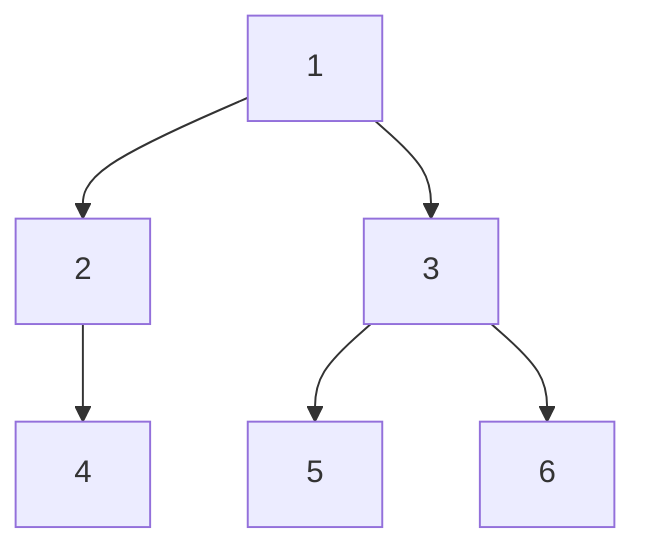

# 그래프 탐색 (Graph Traversal) 정리

## 1️⃣ 그래프 탐색이란?

**그래프 탐색 (Graph Traversal)** 이란

> 그래프의 모든 정점을 **체계적으로 방문**하는 알고리즘
> 을 의미한다.

그래프 탐색의 목적은 그래프의 구조를 이해하고, 특정 정점을 찾거나, 모든 정점을 방문하거나, 경로를 찾는 것입니다.

---

## 2️⃣ 그래프 탐색의 종류

그래프 탐색 알고리즘은 크게 두 가지로 나뉩니다:

### 📌 BFS (Breadth-First Search, 너비 우선 탐색)

* **특징**: 시작점에서 **가까운 정점부터** 차례대로 방문
* **자료구조**: 큐 (Queue)
* **탐색 순서**: 레벨별 (거리 0 → 1 → 2 → ...)
* **자세한 내용**: [BFS 상세 설명](./bfs/bfs.md)

### 📌 DFS (Depth-First Search, 깊이 우선 탐색)

* **특징**: 한 경로를 **끝까지** 탐색한 후 다른 경로로 이동
* **자료구조**: 스택 (Stack) / 재귀
* **탐색 순서**: 깊이 우선 (한 경로를 끝까지)
* **자세한 내용**: [DFS 상세 설명](./dfs/dfs.md) (추후 추가)

---

## 3️⃣ BFS vs DFS 비교

### 탐색 방법 비교

| 특성 | BFS (너비 우선) | DFS (깊이 우선) |
|------|----------------|----------------|
| **자료구조** | 큐 (Queue) | 스택 (Stack) / 재귀 |
| **탐색 순서** | 레벨별 (가까운 것부터) | 깊이 우선 (멀리까지) |
| **최단 경로** | 가중치 없는 그래프에서 보장 | 보장하지 않음 |
| **메모리** | 큐에 많은 정점 저장 가능 | 재귀 깊이만큼만 |
| **사이클 검출** | 어려움 | 쉬움 (백엣지 활용) |
| **시간 복잡도** | O(V + E) | O(V + E) |
| **공간 복잡도** | O(V) | O(V) |

### 시각적 비교

**같은 그래프에서 BFS와 DFS의 탐색 순서:**



**BFS 탐색 순서**: 1 → 2 → 3 → 4 → 5 → 6 (레벨별)

**DFS 탐색 순서**: 1 → 2 → 4 → 3 → 5 → 6 (깊이 우선)

---

## 4️⃣ 언제 어떤 알고리즘을 사용할까?

### BFS를 사용하는 경우

* **최단 경로 찾기** (가중치 없는 그래프)
* **레벨별 처리** 필요
* **시작점에서 가까운 정점부터** 탐색해야 할 때
* **미로 탈출** (최소 이동 횟수)
* **네트워크 탐색** (연결된 모든 노드 찾기)

### DFS를 사용하는 경우

* **모든 경로 탐색**
* **사이클 검출**
* **백트래킹** 문제
* **깊은 탐색**이 필요할 때
* **위상 정렬** (DFS 기반)
* **연결 요소 찾기**

---

## 5️⃣ 공통 개념

### 그래프 표현 방법

두 알고리즘 모두 그래프를 **인접 리스트(Adjacency List)**로 표현합니다:

```java
// 그래프 초기화
List<Integer>[] graph = new ArrayList[N + 1];
for (int i = 1; i <= N; i++) {
    graph[i] = new ArrayList<>();
}

// 간선 추가 예시
graph[1].add(2);
graph[2].add(1);  // 양방향인 경우
```

**`graph[i]`의 의미**: 정점 `i`와 직접 연결된 모든 정점들의 리스트

**예시 그래프 구조:**


위 그래프를 코드로 표현하면:

```java
// 1 → 2, 3
graph[1].add(2);
graph[1].add(3);
// 2 → 4
graph[2].add(4);
// 3 → 5, 6
graph[3].add(5);
graph[3].add(6);
```

결과: `graph[1] = [2, 3]`, `graph[2] = [4]`, `graph[3] = [5, 6]`

### 방문 체크

두 알고리즘 모두 **방문 체크**를 통해 같은 정점을 중복 방문하지 않습니다:

```java
boolean[] visited = new boolean[N + 1];
```

---

## 6️⃣ 시간/공간 복잡도

### 시간 복잡도

두 알고리즘 모두 **O(V + E)**:
* V: 정점의 개수
* E: 간선의 개수
* 각 정점을 한 번씩 방문하고, 각 간선을 한 번씩 확인

### 공간 복잡도

* **BFS**: O(V) - 큐에 저장되는 정점 수
* **DFS**: O(V) - 재귀 스택 또는 스택에 저장되는 정점 수

---

## ✨ 한 줄 요약

> 그래프 탐색은 **모든 정점을 체계적으로 방문**하는 알고리즘으로, BFS는 가까운 것부터, DFS는 깊이 우선으로 탐색한다.

