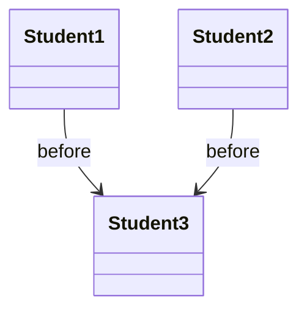
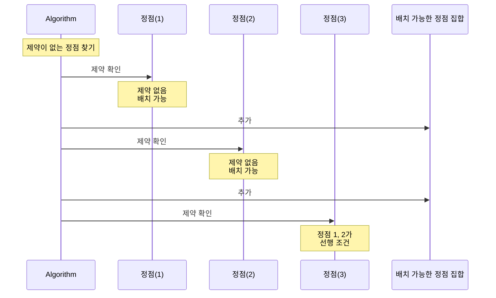
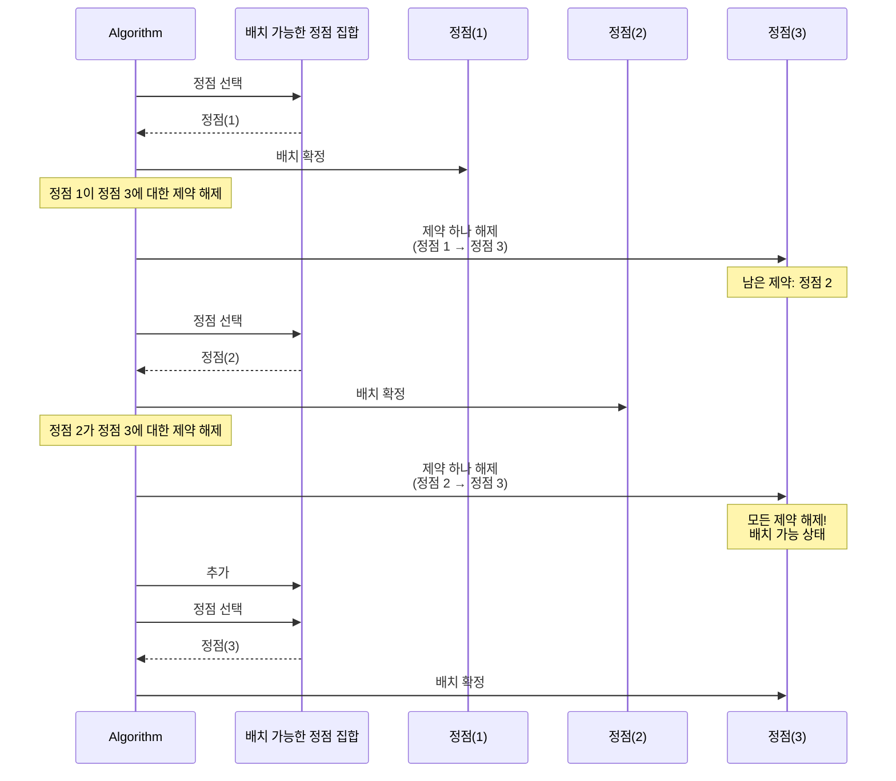
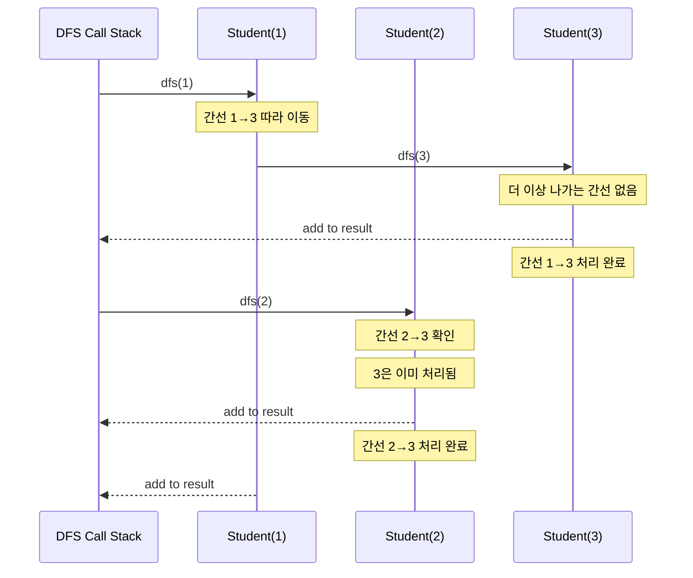

# 위상 정렬(Topological Sort) 정리

## 1️⃣ 위상 정렬이란?

**위상 정렬(Topological Sort)** 이란

> **방향 그래프(Directional Graph)** 에서
> 모든 간선의 방향을 거스르지 않도록 정점을 나열하는 것
> 을 의미한다.

즉, `A → B` 라는 간선이 있다면 **반드시 A가 B보다 앞에 위치**해야 한다.

---

## 2️⃣ 언제 사용할까?

위상 정렬은 다음과 같은 상황에서 사용된다:

* 선후 관계가 존재하는 작업 순서 결정
* 일부 비교 정보만 주어진 상태에서 전체 순서 복원
* 의존성 그래프 처리

### 대표적인 예시

* 과목 선수 과목 관계
* 빌드 시스템의 컴파일 순서
* 작업 스케줄링
* **줄 세우기 문제 (키 비교 결과)**

---

## 3️⃣ 위상 정렬이 가능한 조건

위상 정렬은 **사이클이 없는 방향 그래프(DAG)** 에서만 가능하다.

* 사이클이 존재하면

  * `A → B → C → A` 처럼
  * 누가 먼저인지 결정 불가능
* 따라서 **DAG (Directed Acyclic Graph)** 가 전제 조건

### 사이클 검출 방법

위상 정렬 알고리즘에서 사이클을 검출하는 방법:

* **Kahn 알고리즘**:
  * 위상 정렬 완료 후 결과에 포함된 정점의 개수를 확인
  * 결과 개수가 전체 정점 수 `N`보다 작으면 사이클이 존재
  * 사이클이 있으면 진입 차수가 0이 되지 않는 정점들이 남게 됨

* **DFS 기반 알고리즘**:
  * 방문 상태를 3가지로 구분: 미방문 / 방문 중 / 방문 완료
  * DFS 탐색 중 "방문 중"인 정점을 다시 만나면 사이클 존재
  * 이 방법이 사이클 검출에 더 자연스러움

> **참고**: BOJ 2252 문제에서는 입력이 항상 유효한 DAG라고 가정하므로, 
> 사이클 검출 로직을 구현하지 않아도 됩니다.

---

## 4️⃣ 그래프 모델링 방법

### 📌 최대한 간소화된 문제 상황

학생이 3명 있고, 다음과 같은 비교 결과만 알고 있다고 가정한다.

* `1 → 3` : 1번 학생은 3번 학생보다 앞
* `2 → 3` : 2번 학생은 3번 학생보다 앞

가능한 줄 세우기 결과:

```
1 2 3
2 1 3
```

즉, **3번 학생은 반드시 마지막**이지만, 1번과 2번의 상대적 순서는 정해지지 않았다.
이처럼 일부 관계만 주어진 상태를 **부분 순서(partial order)** 라고 한다.

---

### 📐 그래프 + UML 관점에서의 모델링

* 학생 → 정점(Vertex)
* `A가 B보다 앞` → 방향 간선 `A → B`

이를 UML 관계로 표현하면 다음과 같다.



이 다이어그램이 의미하는 바는 다음과 같다.

* `Student1`, `Student2`는 서로 독립
* `Student3`은 반드시 두 학생 이후에 배치되어야 함

➡️ 이 관계를 **모두 만족하는 정점 나열**이 바로 위상 정렬 결과이다.

---

### 📐 그래프 모델링

* 학생 → 정점(Vertex)
* `A가 B보다 앞` → 방향 간선 `A → B`

위 예시는 다음과 같은 그래프가 된다.

```
1 ─▶ 3
2 ─▶ 3
```

이 그래프에서 **모든 간선 방향을 만족하는 정점 나열**이 곧 위상 정렬 결과이다.

즉, 줄 세우기 문제를 그래프로 모델링하면:
> 모든 간선을 만족하는 정점 나열 = 위상 정렬 결과

---

## 5️⃣ 위상 정렬의 해결 방법 개요

위상 정렬을 수행하는 대표적인 방법은 크게 두 가지가 있다.

* **진입 차수(In-degree)를 이용하는 방법 (Kahn 알고리즘)**
* **DFS 탐색 순서를 이용하는 방법 (DFS 기반 위상 정렬)**

두 방법 모두 DAG에서 올바른 위상 정렬 결과를 보장하지만, **문제 성격과 구현 관점**에서 차이가 있다.

---

### ✅ 방법 1: Kahn 알고리즘 (진입 차수 기반)

#### 핵심 아이디어

* 각 정점은 자신보다 **앞에 와야 할 정점의 개수**를 진입 차수로 가진다
* 진입 차수가 0이라는 것은
  → **아무 제약 없이 지금 바로 배치할 수 있는 상태**임을 의미한다

즉, 이 알고리즘은

> "현재 시점에서 실행 가능한 정점 집합을 반복적으로 선택"하는 방식이다.

---

### ✨ 최소 Java 코드 스니펫 (핵심 로직만)

```java
Queue<Integer> queue = new ArrayDeque<>(); // offer: 큐에 데이터 추가, poll: 큐에서 데이터 꺼내기
List<Integer> result = new ArrayList<>();

// 1. 선행 조건이 없는 정점부터 시작
for (int i = 1; i <= N; i++) {
    if (indegree[i] == 0) {
        queue.offer(i);
    }
}

// 2. 정점 배치 → 제약 해제 반복
while (!queue.isEmpty()) {
    int current = queue.poll();
    result.add(current);

    for (int next : graph[current]) {
        indegree[next]--;          // 제약 하나 제거
        if (indegree[next] == 0) { // 모든 제약 해제
            queue.offer(next);
        }
    }
}
```

이 코드의 의미는 다음과 같다.

* Queue에는 항상 **"지금 줄에 세울 수 있는 정점"** 만 존재한다
* 한 정점을 결과에 추가하는 행위는
  → 그 정점이 갖고 있던 **후행 제약을 해제**하는 것이다
* 여러 정점이 동시에 queue에 들어갈 수 있으므로 결과는 여러 개가 될 수 있다

---

### 📊 UML 시퀀스 관점에서 본 Kahn 알고리즘

Kahn 알고리즘의 흐름은 크게 두 단계로 나누어 이해하면 직관적이다.

---

#### ① 선행 조건이 없는 정점부터 시작



설명:

* Algorithm이 모든 정점을 확인하여 제약이 없는 정점을 찾음
* 제약이 없는 정점(진입 차수 = 0)은
  → **지금 바로 배치할 수 있는 상태**
* 이 정점들을 배치 가능한 정점 집합(Queue)에 추가

> **코드 대응**: `for (int i = 1; i <= N; i++) { if (indegree[i] == 0) queue.offer(i); }`

---

#### ② 정점 배치 → 제약 해제 반복



설명:

* Algorithm이 배치 가능한 정점 집합에서 정점을 선택하여 배치 확정
* 배치된 정점에서 나가는 간선을 처리:
  * 후행 정점에 대한 **제약을 하나씩 해제**
  * 이는 "정점 1이 정점 3에 대한 제약을 해제"하는 개념적 의미
* 모든 제약이 해제된 정점은 배치 가능한 상태가 되어 집합에 추가
* 이 과정을 반복하여 모든 정점을 순서대로 배치

> **코드 대응**: 
> - `queue.poll()` → 배치 가능한 정점 선택
> - `result.append(current)` → 배치 확정
> - `graph[current]` 순회 → 나가는 간선 처리
> - `indegree[next]--` → 후행 정점의 제약 해제
> - `queue.offer(next)` → 제약이 모두 해제된 정점을 배치 가능 집합에 추가

---

### ✅ 방법 2: DFS 기반 위상 정렬

#### 핵심 아이디어

DFS 기반 방법은 관점이 다르다.

* 어떤 정점이 결과에 들어가기 위해서는
  → **그 정점에서 출발하는 모든 경로가 먼저 처리**되어야 한다
* 따라서 DFS 탐색 중
  → 더 이상 갈 곳이 없을 때 해당 정점을 결과에 추가한다

즉,

> "가장 뒤에 와야 할 정점부터 확정"하는 방식이다.

---

### ✨ 최소 Java 코드 스니펫 (DFS 기반 핵심 로직)

아래 코드는 **DFS 기반 위상 정렬의 핵심 아이디어만 담은 최소 예제**이다.

```java
List<Integer> result = new ArrayList<>();
boolean[] visited = new boolean[N + 1];

void dfs(int current) {
    visited[current] = true;

    for (int next : graph[current]) {
        if (!visited[next]) {
            dfs(next);
        }
    }

    // 모든 후행 정점 처리 후 결과에 추가
    result.add(current);
}

// 모든 정점에 대해 DFS 수행
for (int i = 1; i <= N; i++) {
    if (!visited[i]) {
        dfs(i);
    }
}

// 결과를 뒤집으면 위상 정렬 순서
Collections.reverse(result);
```

이 코드의 의미는 다음과 같다.

* 한 정점은 **자신 이후에 와야 할 모든 정점이 먼저 처리된 뒤** 결과에 추가된다
* 따라서 `result`에는
  → "뒤에 와야 할 정점부터" 쌓이게 된다
* 마지막에 결과를 뒤집으면 위상 정렬 순서가 된다

---

### 📊 UML 시퀀스 관점에서 본 DFS 기반 위상 정렬

DFS 기반 위상 정렬에서는 **어떤 간선이 언제 처리되는지**를 함께 보는 것이 중요하다.

아래 예시는 간선 `1→3`, `2→3` 이 존재하는 경우를 나타낸다.



설명:

* DFS는 간선을 따라 **끝까지 내려간 뒤** 되돌아온다
* `Student(3)`은 두 간선 `1→3`, `2→3`이 모두 처리된 뒤 가장 먼저 결과에 추가된다
* 이후 `Student(1)`, `Student(2)`는
  → 자신이 가진 모든 간선이 처리된 것이 확인된 뒤 결과에 추가된다
* 따라서 결과 리스트는 **뒤에 와야 할 정점부터 쌓이고**, 마지막에 역순으로 정렬된다

---

#### 개념적 흐름

1. 방문하지 않은 정점에서 DFS 시작
2. 인접 정점을 먼저 DFS로 방문
3. 더 이상 갈 곳이 없으면 스택에 push
4. 모든 DFS 종료 후 스택을 뒤에서부터 출력

---

#### 특징 및 주의점

* 재귀 또는 명시적 스택 사용 필요
* 방문 상태(미방문 / 방문 중 / 방문 완료)를 통해
  → **사이클 검출이 자연스럽게 가능**
* 구현 난이도는 Kahn 알고리즘보다 다소 높음

---

| 구분     | Kahn 알고리즘 | DFS 방식            |
| ------ | --------- | ----------------- |
| 핵심 개념  | 진입 차수     | 탐색 완료 순서          |
| 자료구조   | Queue     | Stack / Recursion |
| 사이클 검출 | 결과 개수로 판단 | 방문 상태로 판단         |
| 구현 난이도 | 쉬움        | 상대적으로 복잡          |
| 문제 직관과의 일치 | 앞에서부터 배치하는 방식과 자연스럽게 맞음 | 뒤에서부터 확정하는 방식 |

➡️ **BOJ 줄 세우기 문제는 Kahn 알고리즘이 가장 적합**
➡️ 문제의 도메인 의미("앞에서부터 줄 세우기")와 Kahn 알고리즘의 접근 방식이 자연스럽게 일치

---

## 7️⃣ 시간 복잡도

위상 정렬의 시간 복잡도는 **그래프 구성 단계**와 **정렬 수행 단계**로 나누어 이해하는 것이 자연스럽다.

---

### ⏱️ 그래프 구성 단계: `O(N + M)`

* 모든 학생(정점)을 한 번씩 초기화한다 → `O(N)`
* 입력으로 주어지는 비교 관계 `M`개에 대해

  * 인접 리스트에 간선을 추가하고
  * 진입 차수를 증가시킨다 → `O(M)`

따라서 그래프를 구성하는 전체 비용은 `O(N + M)` 이다.

---

### ⏱️ 위상 정렬 수행 단계: `O(N + M)`

* 각 정점은

  * 최대 한 번 queue(또는 스택)에 들어가고
  * 한 번 결과에 추가된다 → `O(N)`
* 각 간선은

  * 정확히 한 번만 제거(또는 검사)된다 → `O(M)`

즉, 불필요한 반복이나 중복 탐색 없이

> **정점과 간선을 각각 한 번씩만 처리**한다.

---

### ✅ 전체 시간 복잡도

```
O(N + M)
```

이는 입력 크기가 큰 줄 세우기 문제에서도
안정적으로 동작하는 이유이다.

---

### ⏱️ 공간 복잡도: `O(N + M)`

* **그래프 저장**: 인접 리스트로 `O(N + M)` 공간 필요
  * 정점 배열: `O(N)`
  * 간선 정보: `O(M)`
* **진입 차수 배열**: `O(N)`
* **Queue**: 최악의 경우 모든 정점이 동시에 들어갈 수 있으므로 `O(N)`
* **결과 저장**: `O(N)`

따라서 전체 공간 복잡도는 `O(N + M)` 이다.

---

## 6️⃣ 줄 세우기 문제와의 연결

* 학생 수 최대 32,000
* 비교 횟수 최대 100,000
* 일부 순서만 주어짐

➡️ UML로 보았듯이, 이 문제는
➡️ **부분 순서를 관계 그래프로 표현하고**
➡️ **제약을 하나씩 제거하며 전체 순서를 구성하는 위상 정렬 문제**이다.
➡️ 위상 정렬의 전형적인 활용 사례

---

## ✨ 한 줄 요약

> 위상 정렬은 **"선후 관계가 있는 대상들을 조건을 지키며 나열하는 알고리즘"** 이며, 줄 세우기 문제는 이를 그대로 적용하는 DAG 위상 정렬 문제이다.
