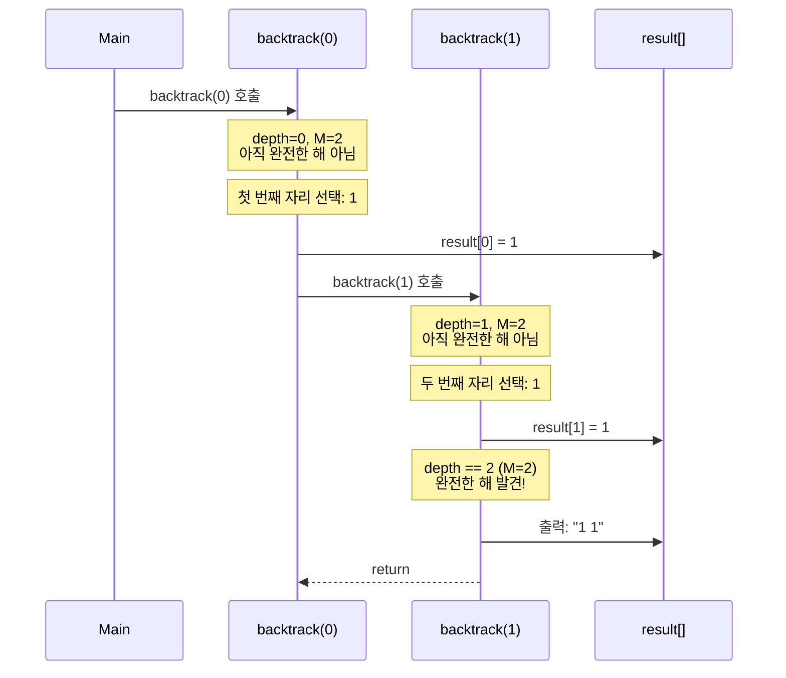
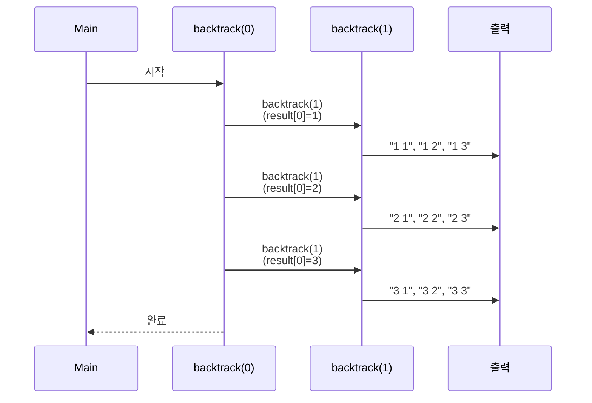

# 백트래킹(Backtracking) 정리

## 1️⃣ 백트래킹이란?

**백트래킹(Backtracking)** 이란

> **모든 가능한 경우를 체계적으로 탐색**하는 알고리즘으로,
> 조건을 만족하지 않는 경로를 만나면 **이전 단계로 되돌아가(backtrack)** 다른 경로를 탐색하는 방법
> 을 의미한다.

즉, **"시도해보고 안 되면 되돌아가기"** 전략을 사용하는 완전 탐색 알고리즘이다.

---

## 2️⃣ 언제 사용할까?

백트래킹은 다음과 같은 상황에서 사용된다:

* 모든 경우의 수를 탐색해야 하는 문제
* 제약 조건이 있는 조합/순열 생성
* 결정 문제(Decision Problem) - 가능한 해를 찾는 문제
* 최적화 문제의 일부

### 대표적인 예시

* N-Queen 문제
* 스도쿠 풀이
* 미로 찾기
* **중복 순열/조합 생성** (N과 M 시리즈)
* 부분 집합 생성

---

## 3️⃣ 백트래킹의 핵심 개념

### 📌 상태 공간 트리(State Space Tree)

백트래킹은 **상태 공간 트리**를 탐색하는 과정으로 이해할 수 있다.

* 각 노드는 **부분 해(partial solution)**를 나타낸다
* 루트에서 리프까지의 경로가 **완전한 해(complete solution)**가 된다
* 가지치기(Pruning)를 통해 불필요한 탐색을 줄인다

### 예시: N=3, M=2인 경우의 상태 공간 트리

```
                    [ ]
                   / | \
                  /  |  \
                 /   |   \
            [1]    [2]    [3]
           /|\    /|\    /|\
          / | \  / | \  / | \
      [1,1][1,2][1,3] [2,1][2,2][2,3] [3,1][3,2][3,3]
```

* 루트 `[ ]`는 빈 수열
* 첫 번째 레벨은 첫 번째 자리에 1, 2, 3을 선택
* 두 번째 레벨은 두 번째 자리에 1, 2, 3을 선택
* 리프 노드가 완전한 해 (길이 M인 수열)

---

## 4️⃣ 백트래킹 알고리즘의 구조

### 기본 템플릿

```java
void backtrack(int depth) {
    // 1. 종료 조건 (Base Case)
    if (depth == M) {
        // 완전한 해를 찾았을 때 처리
        printResult();
        return;
    }
    
    // 2. 가능한 모든 선택지 탐색
    for (int i = 1; i <= N; i++) {
        // 3. 선택 (Make Choice)
        result[depth] = i;
        
        // 4. 재귀 호출 (Recursive Call)
        backtrack(depth + 1);
        
        // 5. 선택 취소 (Unmake Choice) - 필요시
        // 중복 순열의 경우 선택 취소가 필요 없음
    }
}
```

### 핵심 요소

1. **종료 조건**: 완전한 해를 찾았을 때 (depth == M)
2. **선택지 탐색**: 각 단계에서 가능한 모든 선택을 시도
3. **재귀 호출**: 다음 단계로 진행
4. **백트래킹**: 조건을 만족하지 않으면 이전 단계로 되돌아감

---

### 📊 UML 시퀀스 관점에서 본 백트래킹

백트래킹의 재귀 호출 과정은 **상태 공간 트리를 깊이 우선으로 탐색**하는 과정으로 이해할 수 있다.

아래 예시는 N=3, M=2인 경우의 중복 순열 생성 과정을 나타낸다.

#### ① 첫 번째 자리 선택 및 재귀 호출



설명:

* `backtrack(0)`은 첫 번째 자리(depth=0)에서 1부터 N까지 모든 수를 선택
* 각 선택마다 `backtrack(1)`을 호출하여 다음 자리를 채움
* `backtrack(1)`에서는 두 번째 자리에서 1부터 N까지 모든 수를 선택
* 각 선택마다 `depth == M`이 되면 완전한 해를 찾은 것이므로 결과를 출력하고 return
* return 후 이전 단계로 돌아가 다음 선택을 시도
* 위 다이어그램은 첫 번째 자리에서 1을 선택하고 두 번째 자리에서 1을 선택하는 예시만 보여줍니다 (실제로는 1-2, 1-3도 동일한 방식으로 처리됨)

> **코드 대응**: 
> - `if (depth == M)` → 종료 조건 확인
> - `for (int i = 1; i <= N; i++)` → 모든 선택지 탐색
> - `result[depth] = i` → 선택
> - `backtrack(depth + 1)` → 재귀 호출

---

#### ② 전체 탐색 과정 (N=3, M=2)



설명:

* 각 depth에서 1부터 N까지 순서대로 선택
* 다음 depth로 재귀 호출하여 모든 조합을 탐색
* `backtrack(1)`에서는 두 번째 자리에서 1부터 N까지 모든 수를 선택하여 출력
* 완전한 해를 찾으면 출력하고 이전 단계로 돌아가 다음 선택을 시도
* 이 과정을 반복하여 모든 경우의 수를 체계적으로 탐색

➡️ 이는 **상태 공간 트리를 깊이 우선으로 탐색**하는 과정과 정확히 일치한다.

---

## 5️⃣ 백트래킹의 변형과 비교

### 백트래킹 문제 유형별 비교

백트래킹을 사용하는 대표적인 문제 유형들을 비교하면:

| 유형 | 특징 | 방문 체크 | 가지치기 | 경우의 수 |
|------|------|----------|---------|----------|
| **중복 순열** | 같은 수 여러 번 선택 가능 | 불필요 | 불필요 | N^M |
| **순열** | 각 수는 한 번만 사용 | 필요 | 불필요 | N!/(N-M)! |
| **조합** | 순서 무관, 중복 없음 | 필요 (이전 수 이후만) | 불필요 | N!/(M!(N-M)!) |
| **중복 조합** | 순서 무관, 중복 허용 | 필요 (현재 수 이후만) | 불필요 | (N+M-1)!/(M!(N-1)!) |
| **제약 조건 문제** | 특정 조건 만족해야 함 | 필요 | 필요 | 문제에 따라 다름 |

### 중복 순열의 특수성

중복 순열은 백트래킹 문제 중에서도 가장 단순한 형태이다:

* ✅ **방문 체크 불필요**: 같은 수를 여러 번 선택할 수 있으므로
* ✅ **가지치기 불필요**: 모든 경로가 유효한 해이므로
* ✅ **선택 취소 불필요**: 다음 선택에 영향을 주지 않으므로

➡️ 이는 백트래킹의 기본 구조를 이해하기에 가장 적합한 문제 유형이다.

### 중복 순열 생성 과정 시각화

N=3, M=2인 경우의 생성 과정을 단계별로 보면:

```
depth=0: 첫 번째 자리 선택
├─ 선택: 1
│  └─ depth=1: 두 번째 자리 선택
│     ├─ 선택: 1 → 출력 "1 1"
│     ├─ 선택: 2 → 출력 "1 2"
│     └─ 선택: 3 → 출력 "1 3"
├─ 선택: 2
│  └─ depth=1: 두 번째 자리 선택
│     ├─ 선택: 1 → 출력 "2 1"
│     ├─ 선택: 2 → 출력 "2 2"
│     └─ 선택: 3 → 출력 "2 3"
└─ 선택: 3
   └─ depth=1: 두 번째 자리 선택
      ├─ 선택: 1 → 출력 "3 1"
      ├─ 선택: 2 → 출력 "3 2"
      └─ 선택: 3 → 출력 "3 3"
```

➡️ 각 depth에서 **독립적으로** 1부터 N까지 선택하므로, 중복이 자연스럽게 허용됨

---

## 6️⃣ 백트래킹 vs 다른 탐색 방법

### 완전 탐색 방법 비교

| 방법 | 특징 | 시간 복잡도 | 사용 사례 |
|------|------|------------|----------|
| **백트래킹** | 조건 불만족 시 되돌아감 | 문제에 따라 다름 | 제약 조건이 있는 탐색 |
| **DFS** | 깊이 우선 탐색 | O(V + E) | 그래프 탐색 |
| **BFS** | 너비 우선 탐색 | O(V + E) | 최단 경로 탐색 |
| **브루트 포스** | 모든 경우 무차별 탐색 | 매우 높음 | 작은 입력 크기 |

### 백트래킹의 장점

* **가지치기(Pruning)**: 불필요한 탐색을 줄여 효율성 향상
* **구조화된 탐색**: 재귀를 통한 체계적인 탐색
* **메모리 효율**: 스택을 활용한 공간 복잡도 관리
* **유연성**: 다양한 제약 조건을 쉽게 추가 가능

---

## 7️⃣ 시간 복잡도 분석

백트래킹의 시간 복잡도는 **상태 공간 크기**와 **각 노드 처리 시간**으로 나누어 이해할 수 있다.

> **참고**: 아래 분석은 중복 순열 생성(N^M)을 기준으로 하며, 다른 백트래킹 문제 유형에 따라 시간 복잡도가 달라질 수 있습니다.

---

### ⏱️ 상태 공간 크기: `N^M`

* 각 자리마다 N개의 선택지가 있음
* M개의 자리를 모두 채워야 함
* 총 경우의 수: **N^M**

예시: N=3, M=2인 경우
* 3^2 = 9개의 수열 생성

---

### ⏱️ 각 노드 처리 시간: `O(1)`

* 종료 조건 확인: O(1)
* 선택 및 저장: O(1)
* 재귀 호출: O(1) (함수 호출 비용)
* 출력: O(M) (하지만 출력은 결과의 일부이므로 별도 고려)

---

### ✅ 전체 시간 복잡도

```
O(N^M)
```

이는 모든 경우의 수를 탐색해야 하므로 최적화가 불가능하다.

---

### ⏱️ 공간 복잡도: `O(M)`

* **재귀 호출 스택**: O(M) (최대 깊이 M)
  * 각 재귀 호출마다 스택 프레임 생성
  * 최대 M개의 스택 프레임이 동시에 존재
* **결과 저장**: O(M)
  * `result` 배열의 크기
* **기타 변수**: O(1)

따라서 전체 공간 복잡도는 **O(M)** 이다.

---

### 제약 조건의 영향

문제에서 `1 ≤ M ≤ N ≤ 7`로 제한되어 있으므로:

* 최악의 경우: 7^7 = 823,543개의 수열
* 각 수열의 길이: 최대 7
* 총 출력 크기: 약 5.7MB (충분히 처리 가능)

➡️ 이는 충분히 처리 가능한 범위이므로 시간/공간 복잡도 문제가 없다.

---

## 8️⃣ 사전 순 출력 보장

백트래킹에서 **각 자리에서 1부터 N까지 순서대로** 선택하면 자연스럽게 사전 순으로 출력됩니다.

### 사전 순 출력이 자연스럽게 되는 이유

1. 첫 번째 자리가 작은 수열이 먼저 생성됨
2. 첫 번째 자리가 같으면 두 번째 자리가 작은 수열이 먼저 생성됨
3. 이는 사전 순 정렬과 정확히 일치함

### 예시: N=3, M=2

```
1 1  ← 첫 번째 자리가 1, 두 번째 자리가 1
1 2  ← 첫 번째 자리가 1, 두 번째 자리가 2
1 3  ← 첫 번째 자리가 1, 두 번째 자리가 3
2 1  ← 첫 번째 자리가 2, 두 번째 자리가 1
2 2  ← 첫 번째 자리가 2, 두 번째 자리가 2
2 3  ← 첫 번째 자리가 2, 두 번째 자리가 3
3 1  ← 첫 번째 자리가 3, 두 번째 자리가 1
3 2  ← 첫 번째 자리가 3, 두 번째 자리가 2
3 3  ← 첫 번째 자리가 3, 두 번째 자리가 3
```

➡️ 자연스럽게 사전 순으로 정렬됨

---

## 9️⃣ 백트래킹의 구현 패턴

### 패턴 1: 결과 배열 사용

```java
int[] result = new int[M];

void backtrack(int depth) {
    if (depth == M) {
        printResult();
        return;
    }
    
    for (int i = 1; i <= N; i++) {
        result[depth] = i;
        backtrack(depth + 1);
    }
}
```

### 패턴 2: StringBuilder 사용 (출력 최적화)

```java
StringBuilder sb = new StringBuilder();

void backtrack(int depth) {
    if (depth == M) {
        System.out.println(sb.toString());
        return;
    }
    
    for (int i = 1; i <= N; i++) {
        if (depth > 0) sb.append(' ');
        sb.append(i);
        backtrack(depth + 1);
        // 백트래킹: 추가한 부분 제거
        int len = String.valueOf(i).length();
        if (depth > 0) len++;  // 공백 포함
        sb.setLength(sb.length() - len);
    }
}
```

---

## ✨ 한 줄 요약

> 백트래킹은 **"모든 가능한 경우를 체계적으로 탐색하되, 조건을 만족하지 않으면 되돌아가는"** 알고리즘이며, 중복 순열 생성 문제는 백트래킹의 전형적인 활용 사례이다.

