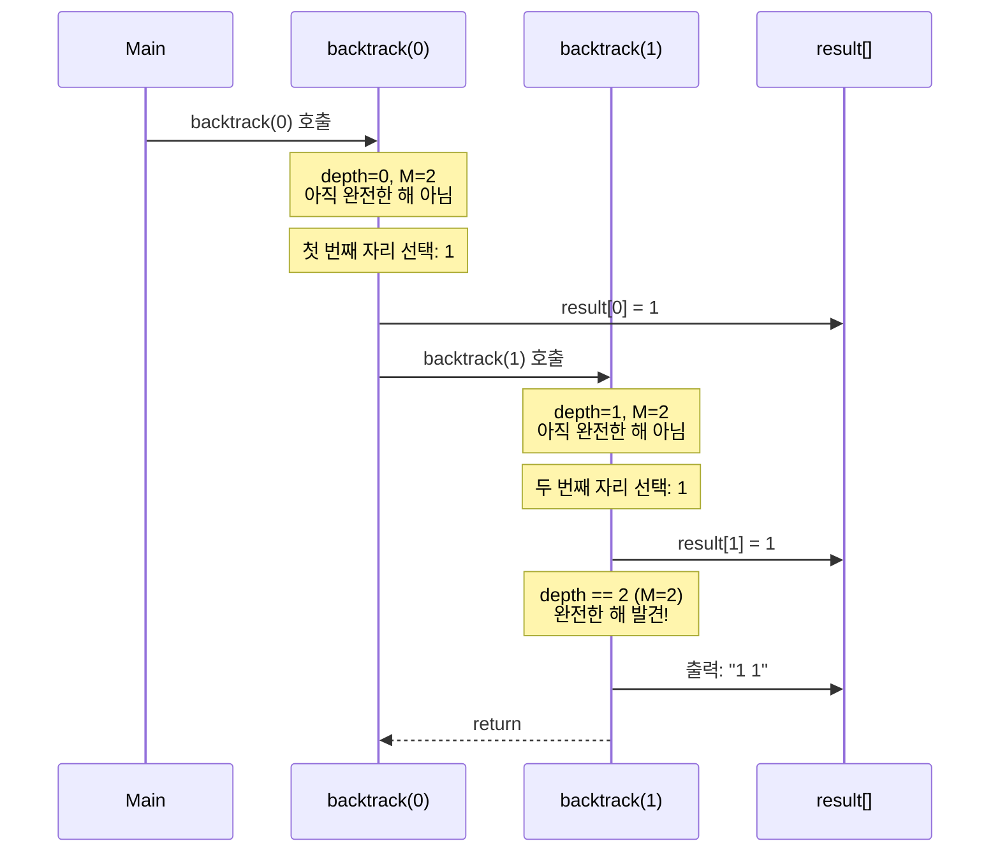
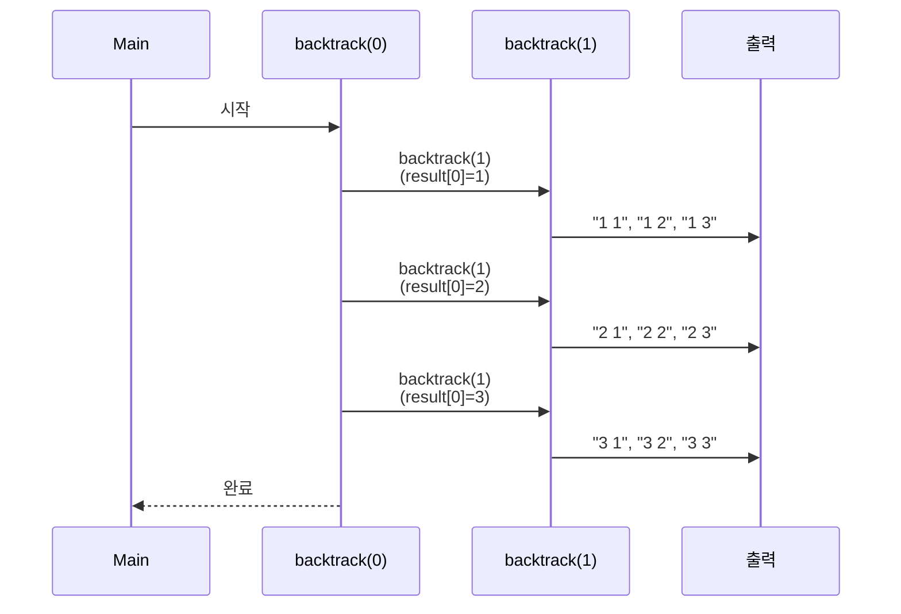

# 백트래킹(Backtracking) 정리

## 1️⃣ 백트래킹이란?

**백트래킹(Backtracking)** 이란

> **모든 가능한 경우를 체계적으로 탐색**하는 알고리즘으로,
> 조건을 만족하지 않는 경로를 만나면 **이전 단계로 되돌아가(backtrack)** 다른 경로를 탐색하는 방법
> 을 의미한다.

즉, **"시도해보고 안 되면 되돌아가기"** 전략을 사용하는 완전 탐색 알고리즘이다.

---

## 2️⃣ 언제 사용할까?

백트래킹은 다음과 같은 상황에서 사용된다:

* 모든 경우의 수를 탐색해야 하는 문제
* 제약 조건이 있는 조합/순열 생성
* 결정 문제(Decision Problem) - 가능한 해를 찾는 문제
* 최적화 문제의 일부 (최대값, 최소값 찾기)

### 대표적인 예시

* **N-Queen 문제**: 체스판에 N개의 퀸을 배치
* **스도쿠 풀이**: 빈 칸에 숫자 채우기
* **미로 찾기**: 모든 경로 탐색
* **순열/조합 생성**: 주어진 집합에서 특정 개수의 순열이나 조합 생성
* **제약 조건 탐색**: 특정 조건을 만족하는 경로나 해 찾기
* **부분 집합 생성**: 주어진 집합의 모든 부분 집합 생성
* **문자열 조합 생성**: 문자열에서 특정 크기의 조합 생성

---

## 3️⃣ 핵심 개념

### 📌 상태 공간 트리(State Space Tree)

백트래킹은 **상태 공간 트리**를 탐색하는 과정으로 이해할 수 있다.

* 각 노드는 **부분 해(partial solution)**를 나타낸다
* 루트에서 리프까지의 경로가 **완전한 해(complete solution)**가 된다
* 가지치기(Pruning)를 통해 불필요한 탐색을 줄인다

### 예시: N=3, M=2인 경우의 상태 공간 트리

```
                    [ ]
                   / | \
                  /  |  \
                 /   |   \
            [1]    [2]    [3]
           /|\    /|\    /|\
          / | \  / | \  / | \
      [1,1][1,2][1,3] [2,1][2,2][2,3] [3,1][3,2][3,3]
```

* 루트 `[ ]`는 빈 수열
* 첫 번째 레벨은 첫 번째 자리에 1, 2, 3을 선택
* 두 번째 레벨은 두 번째 자리에 1, 2, 3을 선택
* 리프 노드가 완전한 해 (길이 M인 수열)

### 📌 상태 되돌리기 (Backtracking)

백트래킹의 핵심은 **상태를 되돌리는 것**입니다.

**왜 상태를 되돌려야 할까요?**

한 경로를 탐색한 후, 다른 경로를 탐색할 때 이전 경로의 상태가 남아있으면 안 됩니다. 상태를 되돌려야 모든 가능한 경로를 올바르게 탐색할 수 있습니다.

**기본 원리:**

```java
void backtrack(상태) {
    // 상태 변경
    visited[idx] = true;
    
    // 재귀 호출: 다음 단계 탐색
    backtrack(다음 상태);
    
    // ✅ 상태 되돌리기: 다른 경로 탐색을 위해 상태 복원
    visited[idx] = false;
}
```

**상태 되돌리기가 없으면:**
* 한 번 변경된 상태가 계속 유지됨
* 다른 경로를 탐색할 수 없음
* 모든 가능한 경로를 탐색할 수 없어서 잘못된 결과

➡️ 상태를 되돌리지 않으면, 한 경로의 상태가 다른 경로 탐색을 방해합니다.

**사고 과정:**
- 한 경로를 탐색할 때 상태를 변경함
- 그 경로 탐색이 끝나면 상태를 원래대로 되돌려야 함
- 그래야 다른 경로를 탐색할 때 이전 경로의 영향이 없음

---

## 4️⃣ 백트래킹과 DFS의 관계

**핵심 관계: 백트래킹은 DFS의 한 형태입니다.**

### 백트래킹 = 상태를 되돌리는 DFS

* **백트래킹**: 상태 공간 트리를 DFS로 탐색하면서, 조건을 만족하지 않으면 **이전 상태로 되돌아가는** 방식
* **일반 DFS**: 그래프를 깊이 우선으로 탐색하지만, **상태를 되돌리지 않음**

### 구체적인 차이점

**백트래킹 (상태 되돌리기 있음):**
```java
void backtrack(상태) {
    visited[idx] = true;  // 상태 변경
    
    // 재귀 호출
    backtrack(다음 상태);
    
    visited[idx] = false; // ✅ 상태 되돌리기
    // 다른 경로를 탐색할 수 있도록 상태 복원
}
```

**일반 DFS (상태 되돌리기 없음):**
```java
void dfs(정점) {
    visited[정점] = true;  // 상태 변경
    
    // 재귀 호출
    dfs(다음 정점);
    
    // 백트래킹 없음: 방문한 정점은 다시 방문하지 않음
    // visited[정점] = false; 가 없음
}
```

**핵심 차이:**
* **백트래킹**: 재귀 호출 후 상태를 되돌려서 **다른 경로를 탐색**할 수 있게 함
* **일반 DFS**: 상태를 되돌리지 않아서 **한 번 방문한 정점은 다시 방문하지 않음**

**사고 과정:**
- 백트래킹은 "모든 가능한 경로를 탐색"해야 할 때 사용
- 일반 DFS는 "그래프의 구조를 파악"할 때 사용
- 상태를 되돌리느냐 마느냐가 핵심 차이

### 왜 백트래킹은 보통 DFS로 구현되는가?

* **재귀의 자연스러운 특성**: DFS는 재귀로 구현되며, 재귀 호출이 끝나면 자동으로 이전 상태로 돌아감
* **메모리 효율**: 스택을 활용하여 상태를 관리하므로 메모리 효율적
* **구현 간결성**: 상태를 되돌리는 것이 DFS의 재귀 특성과 자연스럽게 맞음

### 비교표

| 구분 | 백트래킹 | 일반 DFS |
|------|---------|---------|
| **상태 되돌리기** | ✅ 있음 (`visited[idx] = false`) | ❌ 없음 |
| **목적** | 모든 경로 탐색 (최대값, 모든 해 찾기) | 그래프 탐색 (연결 요소, 사이클) |
| **대상** | 상태 공간 트리 | 그래프 (정점, 간선) |
| **구현 방식** | DFS (재귀) | DFS (재귀/스택) |
| **사용 예시** | 모든 경로 탐색, 제약 조건 탐색 | 그래프 연결성, 사이클 탐지 |
| **핵심 특징** | 상태 되돌리기 | 깊이 우선 탐색 |

**결론**: 백트래킹은 "상태를 되돌리는 특수한 형태의 DFS"라고 이해하면 됩니다.

---

## 5️⃣ 알고리즘 구조

### 기본 템플릿

백트래킹의 기본 구조는 다음과 같습니다:

```java
void backtrack(상태) {
    // 1. 종료 조건 (Base Case)
    if (완전한 해를 찾았을 때) {
        // 결과 처리
        return;
    }
    
    // 2. 가능한 모든 선택지 탐색
    for (각 선택지) {
        // 3. 선택 (Make Choice) - 상태 변경
        상태를 변경();
        
        // 4. 재귀 호출 (Recursive Call)
        backtrack(다음 상태);
        
        // 5. 선택 취소 (Unmake Choice) - 상태 되돌리기 ✅
        상태를 되돌리기();  // 백트래킹의 핵심!
    }
}
```

### 상태 되돌리기가 필요한 경우 vs 불필요한 경우

**상태 되돌리기가 필요한 경우:**
* 상태가 **누적되거나 공유**되는 경우
* 예: `visited[]` 배열, `StringBuilder`, 전역 변수
* 다음 반복에서 자동으로 덮어씌워지지 않음
* 명시적으로 `visited[idx] = false;` 같은 코드 필요

**상태 되돌리기가 불필요한 경우:**
* 상태가 **독립적**인 경우
* 예: 배열의 특정 인덱스에 값 할당 (`result[depth] = i`)
* 다음 반복에서 자동으로 덮어씌워짐
* 명시적 되돌리기 불필요 (암묵적 되돌리기)

**사고 과정:**
- 상태가 독립적이면 자동으로 덮어씌워지므로 되돌릴 필요 없음
- 상태가 공유되면 명시적으로 되돌려야 함
- 문제의 특성에 따라 판단해야 함

### 핵심 요소

1. **종료 조건**: 완전한 해를 찾았을 때 또는 불가능한 경우
2. **선택지 탐색**: 각 단계에서 가능한 모든 선택을 시도
3. **상태 변경**: 선택을 적용하여 상태를 변경
4. **재귀 호출**: 다음 단계로 진행
5. **상태 되돌리기**: 재귀 호출 후 상태를 복원하여 다른 경로 탐색 가능하도록 함 ✅

### 📊 재귀 호출 과정 시각화

백트래킹의 재귀 호출 과정은 **상태 공간 트리를 깊이 우선으로 탐색**하는 과정으로 이해할 수 있다.

#### ① 첫 번째 자리 선택 및 재귀 호출



#### ② 전체 탐색 과정 (N=3, M=2)



➡️ 이는 **상태 공간 트리를 깊이 우선으로 탐색**하는 과정과 정확히 일치한다.

---

## 6️⃣ 백트래킹의 변형 (문제 유형별)

### 백트래킹 문제 유형별 비교

백트래킹을 사용하는 대표적인 문제 유형들을 비교하면:

| 유형 | 특징 | 방문 체크 | 가지치기 | 경우의 수 |
|------|------|----------|---------|----------|
| **중복 순열** | 같은 수 여러 번 선택 가능 | 불필요 | 불필요 | N^M |
| **순열** | 각 수는 한 번만 사용 | 필요 | 불필요 | N!/(N-M)! |
| **조합** | 순서 무관, 중복 없음 | 필요 (이전 수 이후만) | 불필요 | N!/(M!(N-M)!) |
| **중복 조합** | 순서 무관, 중복 허용 | 필요 (현재 수 이후만) | 불필요 | (N+M-1)!/(M!(N-1)!) |
| **문자열 조합 생성** | 문자열에서 특정 크기의 조합 생성 | 불필요 (인덱스로 제어) | 필요 (남은 문자 부족 시) | C(n, r) |
| **제약 조건 문제** | 특정 조건 만족해야 함 | 필요 | 필요 | 문제에 따라 다름 |

### 중복 순열의 특수성

중복 순열은 백트래킹 문제 중에서도 가장 단순한 형태이다:

* ✅ **방문 체크 불필요**: 같은 수를 여러 번 선택할 수 있으므로
* ✅ **가지치기 불필요**: 모든 경로가 유효한 해이므로
* ✅ **선택 취소 불필요**: 다음 선택에 영향을 주지 않으므로

➡️ 이는 백트래킹의 기본 구조를 이해하기에 가장 적합한 문제 유형이다.

### 중복 순열 생성 과정 시각화

N=3, M=2인 경우의 생성 과정을 단계별로 보면:

```
depth=0: 첫 번째 자리 선택
├─ 선택: 1
│  └─ depth=1: 두 번째 자리 선택
│     ├─ 선택: 1 → 출력 "1 1"
│     ├─ 선택: 2 → 출력 "1 2"
│     └─ 선택: 3 → 출력 "1 3"
├─ 선택: 2
│  └─ depth=1: 두 번째 자리 선택
│     ├─ 선택: 1 → 출력 "2 1"
│     ├─ 선택: 2 → 출력 "2 2"
│     └─ 선택: 3 → 출력 "2 3"
└─ 선택: 3
   └─ depth=1: 두 번째 자리 선택
      ├─ 선택: 1 → 출력 "3 1"
      ├─ 선택: 2 → 출력 "3 2"
      └─ 선택: 3 → 출력 "3 3"
```

➡️ 각 depth에서 **독립적으로** 1부터 N까지 선택하므로, 중복이 자연스럽게 허용됨

---

## 7️⃣ 시간/공간 복잡도

### 시간 복잡도

백트래킹의 시간 복잡도는 **상태 공간 크기**와 **각 노드 처리 시간**으로 나누어 이해할 수 있다.

**일반적인 시간 복잡도:**
* 상태 공간 크기: 문제에 따라 다름 (예: N^M, N!, 2^N 등)
* 각 노드 처리 시간: O(1) ~ O(N) (문제에 따라 다름)
* 전체 시간 복잡도: **O(상태 공간 크기 × 각 노드 처리 시간)**

**예시: 중복 순열 생성 (N^M)**
* 각 자리마다 N개의 선택지가 있음
* M개의 자리를 모두 채워야 함
* 총 경우의 수: **N^M**
* 시간 복잡도: **O(N^M)**

**예시: 제약 조건이 있는 탐색**
* 가지치기를 통해 불가능한 경로를 조기 종료
* 실제 탐색하는 노드 수는 이론적 경우의 수보다 훨씬 적음

### 공간 복잡도

**일반적인 공간 복잡도:**
* **재귀 호출 스택**: O(최대 깊이)
* **상태 저장**: O(문제에 따라 다름)
* **전체 공간 복잡도**: O(최대 깊이 + 상태 저장 공간)

**예시: 중복 순열 생성**
* 재귀 호출 스택: O(M) (최대 깊이 M)
* 결과 저장: O(M)
* 전체 공간 복잡도: **O(M)**

**예시: 2차원 보드 탐색**
* 재귀 호출 스택: O(최대 경로 길이)
* 보드 저장: O(R×C)
* 상태 저장: O(문제에 따라 다름)
* 전체 공간 복잡도: O(R×C + 상태 저장 공간)

---

## 8️⃣ 구현 패턴

### 패턴 1: 결과 배열 사용 (자동 상태 되돌리기)

```java
int[] result = new int[M];

void backtrack(int depth) {
    if (depth == M) {
        printResult();
        return;
    }
    
    for (int i = 1; i <= N; i++) {
        result[depth] = i;  // 상태 변경
        backtrack(depth + 1);
        // 명시적 상태 되돌리기 불필요:
        // result[depth]는 다음 반복(i++)에서 자동으로 덮어씌워짐
    }
}
```

**왜 명시적 상태 되돌리기가 불필요한가?**

* `result[depth] = i;`로 값을 할당
* 다음 반복(`i++`)에서 `result[depth]`가 자동으로 새로운 값으로 덮어씌워짐
* 중복 순열은 각 자리가 **독립적**이므로 이전 선택이 다음 선택에 영향을 주지 않음
* 따라서 **자동으로 상태가 되돌려지는 것**과 같음

**하지만 이것도 백트래킹입니다:**
* 재귀 호출이 끝나면 자동으로 이전 depth로 돌아감
* 다음 반복에서 같은 `result[depth]` 위치에 새로운 값을 할당
* 이는 **암묵적인 상태 되돌리기**라고 볼 수 있음

### 패턴 2: 명시적 상태 되돌리기 (공유 상태)

```java
boolean[] visited = new boolean[N];  // 공유 상태

void backtrack(상태) {
    if (visited[idx]) return;  // 가지치기
    
    visited[idx] = true;  // 상태 변경
    
    // 재귀 호출
    backtrack(다음 상태);
    
    visited[idx] = false;  // ✅ 명시적 상태 되돌리기 필수!
}
```

**왜 명시적 상태 되돌리기가 필요한가?**

* `visited[idx]`는 **공유 상태**이므로 자동으로 덮어씌워지지 않음
* 다른 경로를 탐색할 때 이전 경로의 상태가 남아있으면 안 됨
* 따라서 **명시적으로 `visited[idx] = false;`로 되돌려야** 다른 경로 탐색 가능

**패턴 1과의 차이:**
* **패턴 1**: 배열 인덱스에 값 할당 → 다음 반복에서 자동 덮어씌워짐 → 암묵적 되돌리기
* **패턴 2**: 공유 상태(배열, 전역 변수) → 자동 덮어씌워지지 않음 → 명시적 되돌리기 필수

**사고 과정:**
- 상태가 독립적인지 공유되는지 판단
- 독립적이면 자동으로 처리됨
- 공유되면 명시적으로 되돌려야 함

### 패턴 3: 명시적 상태 되돌리기 (StringBuilder 사용)

```java
StringBuilder sb = new StringBuilder();

void backtrack(int depth) {
    if (depth == M) {
        System.out.println(sb.toString());
        return;
    }
    
    for (int i = 1; i <= N; i++) {
        // 상태 변경: StringBuilder에 추가
        if (depth > 0) sb.append(' ');
        sb.append(i);
        
        // 재귀 호출
        backtrack(depth + 1);
        
        // ✅ 명시적 상태 되돌리기: 추가한 부분 제거
        int len = String.valueOf(i).length();
        if (depth > 0) len++;  // 공백 포함
        sb.setLength(sb.length() - len);
    }
}
```

**왜 명시적 상태 되돌리기가 필요한가?**

* `sb.append(i);`로 StringBuilder에 추가
* StringBuilder는 **누적 방식**으로 동작하므로 자동으로 덮어씌워지지 않음
* 다음 반복에서 이전 값이 남아있으면 잘못된 결과가 됨
* 따라서 **명시적으로 `sb.setLength(...)`로 되돌려야** 함

### 패턴 4: 인덱스 기반 조합 생성 (문자열 조합)

```java
static void generateCombinations(
    String order, int courseSize, int start, 
    StringBuilder current, Map<String, Integer> countMap
) {
    // 종료 조건
    if (current.length() == courseSize) {
        countMap.put(current.toString(), ...);
        return;
    }
    
    // 가지치기
    if (order.length() - start < courseSize - current.length()) {
        return;
    }
    
    // 선택지 탐색
    for (int i = start; i < order.length(); i++) {
        current.append(order.charAt(i));  // 선택
        generateCombinations(order, courseSize, i + 1, current, countMap);
        current.setLength(current.length() - 1);  // ✅ 상태 되돌리기
    }
}
```

**특징:**
* 인덱스(`start`)로 선택 가능한 범위 제어
* StringBuilder로 누적 상태 관리
* 가지치기로 불가능한 경우 조기 종료
* 인자로 모든 정보 전달 (독립적인 호출 가능)

**사고 과정:**
- 각 호출이 독립적이어야 하는지 판단
- 독립적이면 인자로 전달
- 공유되면 전역 변수 사용

**패턴 비교:**
* **패턴 1**: 배열 인덱스 → 자동 덮어씌워짐 → 암묵적 되돌리기
* **패턴 2**: boolean 배열 → 자동 덮어씌워지지 않음 → 명시적 되돌리기 필수
* **패턴 3**: StringBuilder → 자동 덮어씌워지지 않음 → 명시적 되돌리기 필수
* **패턴 4**: 인덱스 + StringBuilder → 자동 덮어씌워지지 않음 → 명시적 되돌리기 필수

---

## 8-1️⃣ 백트래킹 함수 구성 패턴

### 일반적인 함수 구성 패턴들

백트래킹 문제마다 함수 구성이 조금씩 다르지만, **공통된 패턴**이 있습니다.

#### 패턴 1: 깊이(depth) 기반

**적용 상황**: 순열/조합 생성, 고정된 개수의 선택

```java
static void backtrack(int depth) {
    if (depth == 목표_깊이) {
        // 결과 처리
        return;
    }
    
    for (int i = 시작값; i <= 끝값; i++) {
        result[depth] = i;        // 선택
        backtrack(depth + 1);     // 재귀 호출
        // 상태 되돌리기 불필요 (다음 반복에서 덮어씌워짐)
    }
}
```

**사고 과정:**
- 몇 개를 선택해야 하는지가 명확할 때
- 각 단계가 독립적일 때
- 전역 변수로 상태 관리

#### 패턴 2: 위치 기반

**적용 상황**: 2차원 보드 탐색, 그래프 탐색

```java
static void backtrack(int r, int c, int count) {
    if (제약_조건_위반) {
        return;  // 가지치기
    }
    
    visited[상태] = true;  // 상태 변경
    
    for (int i = 0; i < 방향_개수; i++) {
        int nr = r + dr[i];
        int nc = c + dc[i];
        if (isValid(nr, nc)) {
            backtrack(nr, nc, count + 1);
        }
    }
    
    visited[상태] = false;  // ✅ 상태 되돌리기 필수!
}
```

**사고 과정:**
- 위치 정보가 핵심일 때
- 공유 상태를 사용할 때
- 상태 되돌리기가 필수

#### 패턴 3: 인덱스 + 누적 상태

**적용 상황**: 문자열 조합, 독립적인 호출 필요

```java
static void generateCombinations(
    String source, int targetSize, int start, 
    StringBuilder current, Map<String, Integer> result
) {
    if (current.length() == targetSize) {
        result.put(current.toString(), ...);
        return;
    }
    
    if (가지치기_조건) {
        return;
    }
    
    for (int i = start; i < source.length(); i++) {
        current.append(source.charAt(i));  // 선택
        generateCombinations(source, targetSize, i + 1, current, result);
        current.setLength(current.length() - 1);  // ✅ 상태 되돌리기
    }
}
```

**사고 과정:**
- 각 호출이 독립적이어야 할 때
- 누적 상태를 관리할 때
- 인자로 모든 정보 전달

### 패턴 선택 가이드

**어떤 패턴을 선택할까?**

1. **깊이 기반**: 선택할 개수가 명확하고, 각 단계가 독립적
2. **위치 기반**: 위치 정보가 핵심이고, 공유 상태 사용
3. **인덱스 기반**: 독립적인 호출이 필요하고, 누적 상태 관리

### 함수 설계 원칙

**사고 과정:**

1. **상태 정보 결정**
   - 현재 진행 상황은 무엇인가? (depth, 위치, 인덱스)
   - 현재 상태는 무엇인가? (선택한 값들, 방문 정보)
   - 목표 정보는 무엇인가? (목표 크기, 목표 위치)
   - 결과는 어디에 저장할까? (전역 변수, 인자)

2. **전역 vs 인자**
   - 여러 호출에서 공유해야 하는가? → 전역
   - 각 호출이 독립적이어야 하는가? → 인자

3. **상태 되돌리기 판단**
   - 상태가 공유되는가? → 필수
   - 상태가 독립적인가? → 불필요

---

## 9️⃣ 다른 탐색 방법과의 비교

### 완전 탐색 방법 비교

| 방법 | 특징 | 시간 복잡도 | 사용 사례 |
|------|------|------------|----------|
| **백트래킹** | 조건 불만족 시 되돌아감 (상태 되돌리기) | 문제에 따라 다름 | 제약 조건이 있는 탐색 |
| **DFS** | 깊이 우선 탐색 (상태 되돌리기 없음) | O(V + E) | 그래프 탐색 |
| **BFS** | 너비 우선 탐색 | O(V + E) | 최단 경로 탐색 |
| **브루트 포스** | 모든 경우 무차별 탐색 | 매우 높음 | 작은 입력 크기 |

### 백트래킹의 장점

* **가지치기(Pruning)**: 불필요한 탐색을 줄여 효율성 향상
* **구조화된 탐색**: 재귀를 통한 체계적인 탐색
* **메모리 효율**: 스택을 활용한 공간 복잡도 관리
* **유연성**: 다양한 제약 조건을 쉽게 추가 가능
* **상태 관리**: 상태를 되돌려서 모든 경로를 탐색 가능

---

## 🔟 특수 케이스: 사전 순 출력

백트래킹에서 **각 자리에서 1부터 N까지 순서대로** 선택하면 자연스럽게 사전 순으로 출력됩니다.

### 사전 순 출력이 자연스럽게 되는 이유

1. 첫 번째 자리가 작은 수열이 먼저 생성됨
2. 첫 번째 자리가 같으면 두 번째 자리가 작은 수열이 먼저 생성됨
3. 이는 사전 순 정렬과 정확히 일치함

### 예시: N=3, M=2

```
1 1  ← 첫 번째 자리가 1, 두 번째 자리가 1
1 2  ← 첫 번째 자리가 1, 두 번째 자리가 2
1 3  ← 첫 번째 자리가 1, 두 번째 자리가 3
2 1  ← 첫 번째 자리가 2, 두 번째 자리가 1
2 2  ← 첫 번째 자리가 2, 두 번째 자리가 2
2 3  ← 첫 번째 자리가 2, 두 번째 자리가 3
3 1  ← 첫 번째 자리가 3, 두 번째 자리가 1
3 2  ← 첫 번째 자리가 3, 두 번째 자리가 2
3 3  ← 첫 번째 자리가 3, 두 번째 자리가 3
```

➡️ 자연스럽게 사전 순으로 정렬됨

---

## ✨ 한 줄 요약

> 백트래킹은 **"모든 가능한 경우를 체계적으로 탐색하되, 조건을 만족하지 않으면 되돌아가는"** 알고리즘이며, 상태를 되돌리는 특수한 형태의 DFS이다.
