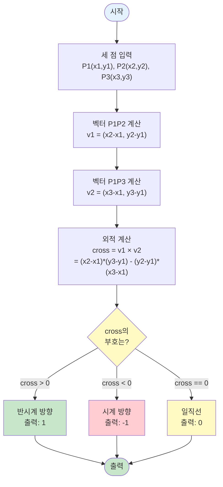

# 알고리즘: CCW (Counter Clockwise) - 외적을 이용한 방향 판단

> 📖 **문제 분석**: [1.analysis.md](./1.analysis.md)를 먼저 읽어보세요.  
> 📖 **계산 기하학 개요**: [../computational-geometry.md](../computational-geometry.md)를 참고하여 벡터와 외적의 기본 개념을 이해하세요.

이 문제는 **외적(Cross Product)을 활용**하여 세 점의 방향을 판단합니다.

**알고리즘 분류**: 계산 기하학 (Computational Geometry)

> 💡 **참고**: 벡터와 외적의 기본 개념은 [../computational-geometry.md](../computational-geometry.md)의 "2️⃣ 계산 기하학의 핵심 도구: 벡터와 외적" 섹션을 참고하세요.

---

## 🧠 해결 전략 개요

### 1️⃣ 문제의식: 세 점의 방향을 어떻게 판단할까?

**직관적인 접근:**
- 세 점을 그려보고 방향을 확인하는 것은 사람은 쉽지만 컴퓨터는 어렵다
- 수학적 방법이 필요하다

**핵심 질문:**
- "세 점의 방향을 수학적으로 어떻게 표현할까?"
- "벡터의 외적을 활용할 수 있을까?"

### 2️⃣ 해결책: 외적(Cross Product) 활용

**외적의 성질:**
- 두 벡터의 외적은 두 벡터가 이루는 평행사변형의 넓이와 관련이 있다
- 외적의 부호는 두 벡터의 상대적 방향을 나타낸다

**해결 전략:**
1. **벡터 생성**: P1을 기준으로 P1P2 벡터와 P1P3 벡터를 만든다
2. **외적 계산**: 두 벡터의 외적을 계산한다
3. **방향 판단**: 외적의 부호에 따라 방향을 판단한다

---

## 알고리즘 개요

### 📊 알고리즘 플로우차트

**전체 알고리즘 흐름:**



**핵심:**
- 외적의 부호로 방향 판단
- O(1) 시간 복잡도

---

## 구현 패턴

**핵심 구현:**

```java
// 외적 계산 함수
static int ccw(long x1, long y1, long x2, long y2, long x3, long y3) {
    // 벡터 P1P2: (x2-x1, y2-y1)
    // 벡터 P1P3: (x3-x1, y3-y1)
    // 외적 = (x2-x1)*(y3-y1) - (y2-y1)*(x3-x1)
    long cross = (x2 - x1) * (y3 - y1) - (y2 - y1) * (x3 - x1);
    
    if (cross > 0) return 1;      // 반시계 방향
    else if (cross < 0) return -1; // 시계 방향
    else return 0;                 // 일직선
}
```

**예시 (P1(1,1), P2(5,5), P3(7,3)):**
- 벡터 P1P2: (4, 4)
- 벡터 P1P3: (6, 2)
- 외적 = 4 × 2 - 4 × 6 = 8 - 24 = -16 < 0
- 결과: -1 (시계 방향)

---

## 외적(Cross Product)의 수학적 의미

> 📖 **외적의 기본 개념**: [../computational-geometry.md](../computational-geometry.md)의 "2️⃣ 계산 기하학의 핵심 도구: 벡터와 외적" 섹션을 참고하세요.

### 2차원 벡터의 외적 (이 문제에서의 활용)

**이 문제에서 사용하는 외적 공식:**
- 두 벡터 v1 = (a, b), v2 = (c, d)의 외적
- v1 × v2 = a × d - b × c

**CCW에서의 의미:**
- **외적 > 0**: P1 → P2 → P3가 반시계 방향
- **외적 < 0**: P1 → P2 → P3가 시계 방향
- **외적 = 0**: 세 점이 일직선

**이 문제에서의 시각적 이해:**

```
반시계 방향 (cross > 0):
    P3
     |
     |
P1---P2
→ P1 → P2 → P3가 반시계 방향

시계 방향 (cross < 0):
P1---P2
     |
     |
    P3
→ P1 → P2 → P3가 시계 방향

일직선 (cross = 0):
P1---P2---P3
→ 세 점이 한 직선 위에 있음
```

> 💡 **더 자세한 설명**: 외적의 기하학적 의미와 수학적 배경은 [../computational-geometry.md](../computational-geometry.md)의 "5️⃣ 계산 기하학의 핵심 개념" 섹션을 참고하세요.

---

## 시간 복잡도

**전체 시간 복잡도: `O(1)`**

**근거:**
- 세 점의 좌표만 입력받음
- 외적 계산은 상수 시간 연산
- 출력도 상수 시간

### ⏱️ 빅오 표기법과 실제 실행 시간의 관계

> 📖 **일반적인 시간 복잡도 평가 기준**: [COMPLEXITY_REFERENCE.md](../../../COMPLEXITY_REFERENCE.md)의 "시간 복잡도 평가 기준" 섹션을 참고하세요.

#### BOJ 11758 문제의 경우

**문제 제약 조건:**
- 입력: 세 점의 좌표 (각각 2개의 정수)
- 시간 제한: 1초

**연산 횟수 계산:**

1. **O(1) 알고리즘 (현재 방법):**
   ```
   입력: 3줄 × 2개 정수 = 6개 정수 읽기
   외적 계산: 상수 시간 (덧셈, 뺄셈, 곱셈)
   출력: 1개 정수
   
   총 연산 횟수: 약 10번 미만
   예상 실행 시간: 거의 0초 ✅ (매우 빠름)
   ```

**결론:**
- 시간 복잡도 O(1)로 매우 빠르게 처리 가능
- 상세한 시간 복잡도 평가 방법은 [COMPLEXITY_REFERENCE.md](../../../COMPLEXITY_REFERENCE.md)를 참고하세요

---

## 공간 복잡도

* **입력 저장**: O(1) (세 점의 좌표만 저장)
* **계산 변수**: O(1) (외적 계산에 필요한 변수들)
* **전체 공간 복잡도**: **O(1)**

### 💾 공간 복잡도 적합성 평가

> 📖 **일반적인 공간 복잡도 평가 기준**: [COMPLEXITY_REFERENCE.md](../../../COMPLEXITY_REFERENCE.md)의 "공간 복잡도 평가 기준" 섹션을 참고하세요.

#### BOJ 11758 문제의 경우

**문제 제약 조건:**
- 메모리 제한: 256 MB

**실제 메모리 사용량:**
- 입력 변수: 6개 long (각 8 bytes) = 48 bytes
- 계산 변수: 1개 long = 8 bytes
- **총합: 약 56 bytes**

#### 메모리 제한과의 비교

**문제의 메모리 제한: 256 MB**

- **사용 메모리: 약 56 bytes**
- **사용률: 56 bytes / 256 MB ≈ 0.00002%**
- **결론: 메모리 제한 내에서 충분히 여유 있음 ✅**

**결론:**
- 공간 복잡도 O(1)로 매우 효율적
- 실제 메모리 사용량이 메모리 제한보다 훨씬 작음
- 상세한 공간 복잡도 평가 방법은 [COMPLEXITY_REFERENCE.md](../../../COMPLEXITY_REFERENCE.md)를 참고하세요

---

## 이 문제의 특이사항

### 1️⃣ 오버플로우 주의

**문제 제약 조건:**
- 좌표 범위: -10,000 ~ 10,000
- 외적 계산 시 최대값: (x2-x1) × (y3-y1) = 20,000 × 20,000 = 400,000,000
- int 범위: -2,147,483,648 ~ 2,147,483,647
- **int로는 오버플로우 발생 가능!**

**해결책:**
```java
// long 타입 사용
long cross = (x2 - x1) * (y3 - y1) - (y2 - y1) * (x3 - x1);
```

> 💡 **일반적인 주의사항**: 계산 기하학에서 오버플로우는 흔한 문제입니다. [../computational-geometry.md](../computational-geometry.md)의 "9️⃣ 계산 기하학 사용 시 주의사항" 섹션을 참고하세요.

### 2️⃣ 외적의 부호와 방향

**이 문제에서 중요한 점:**
- 외적의 부호는 벡터의 순서에 따라 달라집니다
- P1P2 × P1P3: P1을 기준으로 P2에서 P3로의 방향
- P2P1 × P2P3: P2를 기준으로 P1에서 P3로의 방향 (부호 반대)

**문제에서 요구하는 것:**
- P1 → P2 → P3 순서로 이은 선분의 방향
- 따라서 **P1을 기준으로 계산해야 함**

**구현 시 주의:**
- 벡터의 순서를 정확히 지켜야 올바른 결과를 얻을 수 있음
- P1을 기준점으로 사용하는 것이 핵심

### 3️⃣ 일직선 판단

**외적이 0인 경우:**
- 세 점이 일직선 위에 있음
- 두 벡터가 평행하다는 의미
- 즉, P1P2와 P1P3가 같은 방향이거나 반대 방향

**구현:**
```java
if (cross == 0) {
    return 0;  // 일직선
}
```

**예시:**
- P1(1,1), P2(3,3), P3(5,5) → 모두 한 직선 위에 있음 → 0 반환

---

## CCW 알고리즘의 활용

> 📖 **CCW의 다양한 활용**: [../computational-geometry.md](../computational-geometry.md)의 "3️⃣ CCW (Counter Clockwise) 알고리즘" 섹션을 참고하세요.

CCW 알고리즘은 계산 기하학의 기본 도구로, 다음과 같은 문제에서 활용됩니다:

1. **볼록 껍질 (Convex Hull)**: 그라함 스캔 알고리즘에서 사용
2. **선분 교차 판단**: 두 선분이 교차하는지 확인
3. **다각형 내부 점 판단**: 점이 다각형 내부에 있는지 확인
4. **다각형의 넓이 계산**: 외적을 이용한 다각형 넓이 계산

> 💡 **구현 패턴**: 선분 교차 판단, 다각형 넓이 계산 등의 구현 패턴은 [../computational-geometry.md](../computational-geometry.md)의 "8️⃣ 계산 기하학 구현 패턴" 섹션을 참고하세요.
