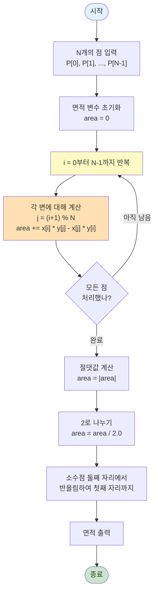

# 알고리즘: 신발끈 공식(Shoelace Formula)을 이용한 다각형 면적 계산

> 📖 **문제 분석**: [1.analysis.md](./1.analysis.md)를 먼저 읽어보세요.  
> 📖 **계산 기하학 개요**: [../computational-geometry.md](../computational-geometry.md)를 참고하여 다각형 면적 계산의 기본 개념을 이해하세요.

이 문제는 **신발끈 공식(Shoelace Formula)**을 활용하여 다각형의 면적을 계산합니다.

**알고리즘 분류**: 계산 기하학 (Computational Geometry)

---

## 🧠 해결 전략 개요

### 1️⃣ 문제의식: 다각형의 면적을 어떻게 구할까?

**직관적인 접근:**
- 삼각형의 면적은 쉽게 구할 수 있다 (밑변 × 높이 / 2)
- 하지만 다각형은 복잡한 모양일 수 있어서 직접 계산하기 어렵다

**핵심 질문:**
- "다각형을 여러 개의 삼각형으로 나눌 수 있을까?"
- "더 간단한 수학적 방법이 있을까?"

### 2️⃣ 해결책: 신발끈 공식(Shoelace Formula)

**신발끈 공식의 아이디어:**
- 다각형의 각 변을 이용하여 면적을 계산한다
- 각 변과 원점을 연결한 사다리꼴의 넓이를 모두 더하면 다각형의 넓이가 된다
- 마치 신발끈을 묶는 것처럼 좌표를 교차하여 계산한다

**해결 전략:**
1. **각 변에 대해 계산**: 다각형의 각 변 (P[i] → P[i+1])에 대해 특정 값을 계산
2. **모두 더하기**: 계산한 값들을 모두 더한다
3. **절댓값과 나누기**: 결과의 절댓값을 구하고 2로 나눈다

---

## 알고리즘 개요

### 📊 알고리즘 플로우차트

**전체 알고리즘 흐름:**



**핵심:**
- 각 변에 대해 x[i] * y[j] - x[j] * y[i] 계산
- 모두 더한 후 절댓값을 구하고 2로 나눔
- O(N) 시간 복잡도

---

## 신발끈 공식의 직관적 이해

### 💡 왜 "신발끈" 공식이라고 부를까?

**공식의 모양이 신발끈을 묶는 것처럼 보이기 때문입니다:**

```
점들: P0(x0, y0), P1(x1, y1), P2(x2, y2), ..., Pn-1(xn-1, yn-1)

계산 과정:
x0  y0
    ↘
x1  y1
    ↘
x2  y2
    ↘
... ...
    ↘
xn-1 yn-1
    ↘
x0  y0  (다시 처음으로)

이렇게 대각선으로 곱하면서 더하는 모양이 신발끈을 묶는 것처럼 보입니다!
```

### 💡 기하학적 의미: 사다리꼴 넓이의 합

**신발끈 공식은 사실 각 변과 원점을 연결한 사다리꼴의 넓이를 더한 것입니다:**

```
다각형: P0 → P1 → P2 → ... → Pn-1 → P0

각 변 P[i] → P[i+1]에 대해:
- 이 변과 원점(0,0)을 연결하면 사다리꼴이 생깁니다
- 이 사다리꼴의 넓이 = (x[i] * y[i+1] - x[i+1] * y[i]) / 2

모든 변에 대해 이런 사다리꼴을 만들고 넓이를 더하면:
- 다각형의 넓이를 구할 수 있습니다!
```

**시각적 예시 (사각형):**

```
점: (0,0) → (0,10) → (10,10) → (10,0)

각 변에 대한 사다리꼴:
1. (0,0) → (0,10): 넓이 = (0*10 - 0*0)/2 = 0
2. (0,10) → (10,10): 넓이 = (0*10 - 10*10)/2 = -50
3. (10,10) → (10,0): 넓이 = (10*0 - 10*10)/2 = -50
4. (10,0) → (0,0): 넓이 = (10*0 - 0*0)/2 = 0

합: 0 + (-50) + (-50) + 0 = -100
절댓값: 100
나누기 2: 100 / 2 = 50... 아니다!

실제로는:
합: 0*10 + 0*10 + 10*0 + 10*0 - (0*0 + 10*10 + 10*10 + 0*0)
  = 0 + 0 + 0 + 0 - (0 + 100 + 100 + 0)
  = -200
절댓값: 200
나누기 2: 200 / 2 = 100 ✅
```

---

## 구현 패턴

**핵심 구현:**

```java
// 신발끈 공식을 이용한 다각형 면적 계산
static double polygonArea(long[] x, long[] y, int n) {
    long area = 0;
    
    // 각 변에 대해 계산
    for (int i = 0; i < n; i++) {
        int j = (i + 1) % n;  // 다음 점 (마지막 점은 첫 번째 점과 연결)
        area += x[i] * y[j] - x[j] * y[i];
    }
    
    // 절댓값을 구하고 2로 나눔
    return Math.abs(area) / 2.0;
}
```

**예시 (사각형: (0,0), (0,10), (10,10), (10,0)):**

```
i=0: j=1, area += 0*10 - 0*0 = 0
i=1: j=2, area += 0*10 - 10*10 = -100
i=2: j=3, area += 10*0 - 10*10 = -100
i=3: j=0, area += 10*0 - 0*0 = 0

총합: 0 + (-100) + (-100) + 0 = -200
절댓값: 200
나누기 2: 200 / 2 = 100 ✅
```

---

## 신발끈 공식의 수학적 배경 (간단한 설명)

> 💡 **선형대수를 모르는 분들을 위한 설명**: 이 부분은 이해가 안 되면 넘어가셔도 됩니다. 공식만 외워서 사용해도 충분합니다!

**신발끈 공식은 사실 외적(Cross Product)을 이용한 것입니다:**

- 각 변 P[i] → P[i+1]은 벡터로 볼 수 있습니다
- 이 벡터와 원점을 연결한 사다리꼴의 넓이는 외적과 관련이 있습니다
- 모든 사다리꼴의 넓이를 더하면 다각형의 넓이가 됩니다

**하지만 이걸 몰라도 괜찮습니다!**
- 공식만 외워서 사용하면 됩니다
- 각 변에 대해 `x[i] * y[j] - x[j] * y[i]`를 계산하고
- 모두 더한 후 절댓값을 구하고 2로 나누면 됩니다

---

## 시간 복잡도

**전체 시간 복잡도: `O(N)`**

**근거:**
- N개의 점을 입력받음: O(N)
- 각 점에 대해 한 번씩 계산: O(N)
- 출력: O(1)
- **총 시간 복잡도: O(N)**

### ⏱️ 빅오 표기법과 실제 실행 시간의 관계

> 📖 **일반적인 시간 복잡도 평가 기준**: [COMPLEXITY_REFERENCE.md](../../../COMPLEXITY_REFERENCE.md)의 "시간 복잡도 평가 기준" 섹션을 참고하세요.

#### BOJ 2166 문제의 경우

**문제 제약 조건:**
- 입력: N개의 점 (3 ≤ N ≤ 10,000)
- 시간 제한: 2초

**연산 횟수 계산:**

1. **O(N) 알고리즘 (현재 방법):**
   ```
   입력: N줄 × 2개 정수 = 2N개 정수 읽기
   면적 계산: N번의 곱셈과 뺄셈
   출력: 1개 실수
   
   N = 10,000일 때:
   총 연산 횟수: 약 20,000번 미만
   예상 실행 시간: 거의 0초 ✅ (매우 빠름)
   ```

**결론:**
- 시간 복잡도 O(N)으로 매우 빠르게 처리 가능
- 상세한 시간 복잡도 평가 방법은 [COMPLEXITY_REFERENCE.md](../../../COMPLEXITY_REFERENCE.md)를 참고하세요

---

## 공간 복잡도

* **입력 저장**: O(N) (N개의 점의 좌표 저장)
* **계산 변수**: O(1) (면적 계산에 필요한 변수들)
* **전체 공간 복잡도**: **O(N)**

### 💾 공간 복잡도 적합성 평가

> 📖 **일반적인 공간 복잡도 평가 기준**: [COMPLEXITY_REFERENCE.md](../../../COMPLEXITY_REFERENCE.md)의 "공간 복잡도 평가 기준" 섹션을 참고하세요.

#### BOJ 2166 문제의 경우

**문제 제약 조건:**
- 메모리 제한: 128 MB

**실제 메모리 사용량:**
- 입력 변수: N개 점 × 2개 좌표 × 8 bytes (long) = 16N bytes
- 계산 변수: 1개 long = 8 bytes
- **N = 10,000일 때: 약 160,008 bytes ≈ 160 KB**

#### 메모리 제한과의 비교

**문제의 메모리 제한: 128 MB**

- **사용 메모리: 약 160 KB**
- **사용률: 160 KB / 128 MB ≈ 0.12%**
- **결론: 메모리 제한 내에서 충분히 여유 있음 ✅**

**결론:**
- 공간 복잡도 O(N)으로 효율적
- 실제 메모리 사용량이 메모리 제한보다 훨씬 작음
- 상세한 공간 복잡도 평가 방법은 [COMPLEXITY_REFERENCE.md](../../../COMPLEXITY_REFERENCE.md)를 참고하세요

---

## 이 문제의 특이사항

### 1️⃣ 오버플로우 주의

**문제 제약 조건:**
- 좌표 범위: -100,000 ~ 100,000
- 계산 시 최대값: 100,000 × 100,000 = 10,000,000,000
- int 범위: -2,147,483,648 ~ 2,147,483,647
- **int로는 오버플로우 발생!**

**해결책:**
```java
// long 타입 사용
long area = 0;
area += (long)x[i] * y[j] - (long)x[j] * y[i];
```

> 💡 **일반적인 주의사항**: 계산 기하학에서 오버플로우는 흔한 문제입니다. [../computational-geometry.md](../computational-geometry.md)의 "9️⃣ 계산 기하학 사용 시 주의사항" 섹션을 참고하세요.

### 2️⃣ 절댓값 사용

**신발끈 공식의 결과:**
- 다각형이 시계 방향이면 음수
- 다각형이 반시계 방향이면 양수
- 하지만 면적은 항상 양수여야 함

**해결책:**
```java
return Math.abs(area) / 2.0;
```

**예시:**
- 시계 방향 다각형: area = -200 → |area| = 200 → 200/2 = 100
- 반시계 방향 다각형: area = 200 → |area| = 200 → 200/2 = 100
- 둘 다 같은 면적!

### 3️⃣ 마지막 점과 첫 번째 점 연결

**다각형은 닫힌 도형이므로:**
- 마지막 점 P[N-1]과 첫 번째 점 P[0]도 연결되어야 함
- 따라서 `j = (i + 1) % N`을 사용하여 순환 구조를 만듦

**예시:**
```
점: P0, P1, P2, P3
변: P0→P1, P1→P2, P2→P3, P3→P0 (마지막 변!)
```

### 4️⃣ 반올림 처리

**문제 요구사항:**
- 소수점 아래 둘째 자리에서 반올림하여 첫째 자리까지 출력

**해결책:**
```java
double area = polygonArea(x, y, n);
System.out.printf("%.1f\n", area);
// 또는
System.out.println(String.format("%.1f", area));
```

---

## 신발끈 공식의 활용

> 📖 **다각형 면적 계산의 다양한 활용**: [../computational-geometry.md](../computational-geometry.md)의 "패턴 3: 다각형의 넓이 계산" 섹션을 참고하세요.

신발끈 공식은 다음과 같은 문제에서 활용됩니다:

1. **다각형의 면적 계산**: 이 문제와 같이 다각형의 면적을 구할 때
2. **다각형의 방향 판단**: 면적의 부호로 시계/반시계 방향 판단
3. **다각형 내부 점 판단**: 점이 다각형 내부에 있는지 확인할 때 활용

> 💡 **구현 패턴**: 다각형 관련 문제의 구현 패턴은 [../computational-geometry.md](../computational-geometry.md)의 "8️⃣ 계산 기하학 구현 패턴" 섹션을 참고하세요.

