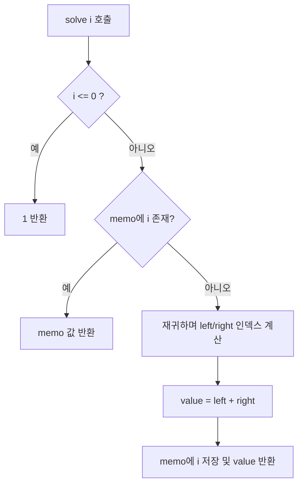

# Main.java 설계 근거

## 1) 먼저 `A_1`은 확실하게 계산할 수 있습니다
예시 입력 `N=12, P=2, Q=3, X=1, Y=0`에서

- `A_1 = A_(floor(1 / 2) - 1) + A_(floor(1 / 3) - 0) = A_-1 + A_0 = 1 + 1 = 2`

처럼 기저 조건(`i <= 0`)으로 바로 닫힙니다. 즉, `A_1`은 확실하게 구할 수 있는 기준점입니다.

## 2) 이후 항은 결국 `A_1`의 조합으로 표현됩니다.
같은 예시를 펼치면 다음처럼 됩니다.

- `A_12 = A_(floor(12 / 2) - 1) + A_(floor(12 / 3) - 0) = A_5 + A_4`
- `A_5 = A_(floor(5 / 2) - 1) + A_(floor(5 / 3) - 0) = A_1 + A_1`
- `A_4 = A_(floor(4 / 2) - 1) + A_(floor(4 / 3) - 0) = A_1 + A_1`

즉 `A_12 = 4 * A_1 = 8`입니다.

## 3) 순차형 점화식이 아니라 점프형 점화식
일반적으로 DP를 `A_n`과 `A_(n+1)`의 관계로 보는 경우가 많지만, 이 문제는 그 형태가 아닙니다. `A_i`가 바로 이전 항이 아니라 `A_(floor(i / P) - X)`, `A_(floor(i / Q) - Y)`를 참조하기 때문에, 인덱스를 한 칸씩 채우는 방식보다 "필요한 상태를 재귀로 계산"하는 방식이 더 자연스럽습니다.

## 4) 반복 상태를 캐시해 중복 계산 없애기
위 전개에서 보이듯이 `A_1`이 여러 번 반복 등장합니다. 메모이제이션이 없으면 같은 값을 매번 다시 계산하게 됩니다. 메모이제이션이 있으면 한 번 계산한 `A_i`를 `memo[i]`에서 바로 꺼내 쓸 수 있어 중복 계산이 사라집니다.

## 5) 구현은 메모이제이션 재귀로 정리된다
`N`이 최대 `10^13`이므로 `dp[0..N]` 배열을 만드는 것은 현실적이지 않습니다. 그래서 `solve(i)`를 호출해 필요한 `A_i`만 계산하고, 계산한 값은 `memo[i]`에 저장해 재사용합니다. 이때 구현에서는 기저 조건을 `i <= 0`으로 두고(`A_-1`, `A_0` 모두 1), 인덱스/연산을 `long`으로 처리합니다. 또한 Java의 정수 나눗셈 `i / p`, `i / q`는 각각 `floor(i / P)`, `floor(i / Q)`와 같다는 점을 그대로 적용합니다.

아래 흐름을 그대로 코드로 옮기면 됩니다.

