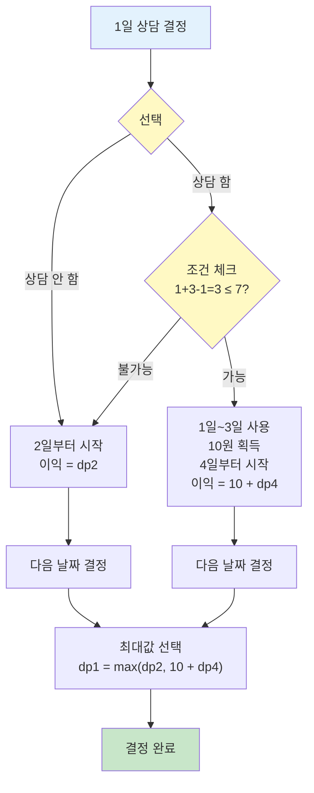

# 퇴사

## 📌 문제 요약

상담원으로 일하고 있는 백준이는 퇴사를 하려고 한다. 오늘부터 N+1일째 되는 날 퇴사를 하기 위해서, 남은 N일 동안 최대한 많은 상담을 하려고 한다.

각 상담은 상담을 완료하는데 걸리는 기간 Ti와 상담을 했을 때 받을 수 있는 금액 Pi로 이루어져 있다.

상담을 하는데 필요한 기간은 1일보다 클 수 있기 때문에, 모든 상담을 할 수는 없다. 또한, N+1일째에는 회사에 없기 때문에, N일 이후에 끝나는 상담은 할 수 없다.

상담을 적절히 했을 때, 백준이가 얻을 수 있는 최대 수익을 구하는 프로그램을 작성하시오.

---

## 🔍 문제 설명

* N일 동안의 상담 일정이 주어진다
* 각 상담은 Ti일이 걸리고, Pi의 금액을 받는다
* 상담을 하면 그 기간 동안 다른 상담을 할 수 없다
* N+1일째에는 퇴사하므로, N일 이후에 끝나는 상담은 할 수 없다
* 최대 이익을 구해야 한다

---

## 📥 입력 조건

* 첫째 줄에 N (1 ≤ N ≤ 15)이 주어진다
* 둘째 줄부터 N개의 줄에 Ti와 Pi가 공백으로 구분되어서 주어진다
  * 1일부터 N일까지 순서대로 주어진다
  * 1 ≤ Ti ≤ 5, 1 ≤ Pi ≤ 1,000

---

## 📤 출력 조건

* 첫째 줄에 백준이가 얻을 수 있는 최대 이익을 출력한다

---

## 💡 문제 핵심 해석

### 🔑 핵심 노하우: 문제를 "선택 문제"로 해석하기

이 문제를 풀기 위한 가장 중요한 포인트는 **"각 날짜마다 상담을 할지 말지 결정하는 문제"**로 해석하는 것입니다.

#### 1단계: 문제에서 주어진 정보 파악

```
각 날짜(1일, 2일, ..., N일)마다:
- 상담이 하나씩 주어짐
- 각 상담은 Ti일이 걸리고 Pi원을 받음
- 상담을 하면 그 기간 동안 다른 상담 불가
```

#### 2단계: 핵심 관찰 - "각 날짜마다 선택"

**문제를 읽고 나서 다음과 같이 생각해야 합니다:**

> "1일에는 상담을 할까? 말까?"  
> "2일에는 상담을 할까? 말까?"  
> "3일에는 상담을 할까? 말까?"  
> ...

**이렇게 각 날짜마다 2가지 선택지(할지/말지)가 있습니다!**

#### 3단계: 왜 이 해석이 중요한가?

이 해석을 통해 문제의 본질을 파악할 수 있습니다:

1. **선택의 연쇄**: 각 날짜의 선택이 다음 날짜들의 선택에 영향을 줌
   - 예: 1일 상담을 하면 (1+3=4)일부터 다음 상담 가능
   - 예: 1일 상담을 안 하면 2일부터 다음 상담 가능

2. **점화식 도출 가능**: 
   - 각 날짜마다 2가지 선택지가 있으므로
   - "i일부터의 최대 이익" = max(i일 상담 안 함, i일 상담 함)
   - 이렇게 점화식을 자연스럽게 도출할 수 있음

> **알고리즘 선택 근거**: 이 문제 해석이 DP로 이어지는 이유는 [3.reasoning.md](./3.reasoning.md)의 "알고리즘 선택 근거" 섹션을 참고하세요.

#### 4단계: 실제 예시로 단계별 이해하기

**실제 입력 예시:**
```
7
3 10   (1일: 3일 걸림, 10원)
5 20   (2일: 5일 걸림, 20원)
1 10   (3일: 1일 걸림, 10원)
1 20   (4일: 1일 걸림, 20원)
2 15   (5일: 2일 걸림, 15원)
4 40   (6일: 4일 걸림, 40원)
2 200  (7일: 2일 걸림, 200원)
```

**1일의 선택을 구체적으로 생각해보기:**

**선택 1: 1일 상담 안 함**
- 1일은 건너뛰고 2일부터 시작
- 2일부터의 최대 이익 = dp[2]
- 이 경우의 이익 = dp[2]

**선택 2: 1일 상담 함**
- 1일 상담은 3일 걸림 (1일, 2일, 3일 사용)
- 1일 상담으로 10원 획득
- 다음 상담은 4일부터 가능 (1+3=4)
- 4일부터의 최대 이익 = dp[4]
- 이 경우의 이익 = 10 + dp[4]

**결론:**
```
dp[1] = max(dp[2], 10 + dp[4])
```

**2일의 선택도 구체적으로:**

**선택 1: 2일 상담 안 함**
- 2일은 건너뛰고 3일부터 시작
- 이익 = dp[3]

**선택 2: 2일 상담 함**
- 2일 상담은 5일 걸림 (2일, 3일, 4일, 5일, 6일 사용)
- 2일 상담으로 20원 획득
- 다음 상담은 7일부터 가능 (2+5=7)
- 이익 = 20 + dp[7]

```
dp[2] = max(dp[3], 20 + dp[7])
```

이렇게 **각 날짜마다 구체적인 숫자와 함께** "할지/말지"를 결정하는 문제로 해석하면, DP 점화식을 자연스럽게 도출할 수 있습니다!

### 📊 각 날짜의 선택 과정 시각화

**1일의 선택을 예시로 간단히 표현:**



**핵심:**
- 각 날짜마다 2가지 선택지 (상담 안 함 / 상담 함)
- 상담 함 선택 시 조건 체크 필요 (N일 이내에 끝나는지)
- 두 선택지의 이익을 비교하여 최대값 선택
- **참고**: dp1은 dp[1], dp2는 dp[2]를 의미

---

### 📌 핵심 제약 조건

1. **상담을 하면 Ti일 동안 다른 상담을 할 수 없다**
   - i일 상담을 하면 → (i+T[i])일부터 다음 상담 가능

2. **N+1일째에는 퇴사하므로, N일 이후에 끝나는 상담은 할 수 없다**
   - i일 상담이 끝나는 날: i + T[i] - 1
   - 조건: `i + T[i] - 1 <= N`

3. **최대 이익을 구해야 한다**
   - 모든 가능한 선택 조합 중 최대값

**예시 분석:**
```
1일: Ti=3, Pi=10 → 1일부터 3일까지 상담 (1, 2, 3일 사용)
2일: Ti=5, Pi=20 → 2일부터 6일까지 상담 (2, 3, 4, 5, 6일 사용)
3일: Ti=1, Pi=10 → 3일만 상담
4일: Ti=1, Pi=20 → 4일만 상담
5일: Ti=2, Pi=15 → 5일부터 6일까지 상담 (5, 6일 사용)
6일: Ti=4, Pi=40 → 6일부터 9일까지 상담 (6, 7, 8, 9일 사용) → 불가능 (9일 > 7일)
7일: Ti=2, Pi=200 → 7일부터 8일까지 상담 (7, 8일 사용) → 불가능 (8일 > 7일)
```

**최적 해:**
* 1일 상담: 1, 2, 3일 사용 → 10원
* 4일 상담: 4일 사용 → 20원
* 5일 상담: 5, 6일 사용 → 15원
* 총: 10 + 20 + 15 = 45원

➡️ **동적 계획법(DP)**을 사용하여 해결할 수 있다.

---

## 🧠 해결 전략 개요

### 동적 계획법 (DP)
* dp[i] = i일부터 시작하여 얻을 수 있는 최대 이익
* 역순으로 계산하여 중복 계산 방지
* 최적 부분 구조를 활용하여 효율적으로 해결

---

## ✨ 예시

### 예시 1

**입력**
```
7
3 10
5 20
1 10
1 20
2 15
4 40
2 200
```

**출력**
```
45
```

**설명**: 
* 1일 상담 (3일 소요, 10원) → 1, 2, 3일 사용
* 4일 상담 (1일 소요, 20원) → 4일 사용
* 5일 상담 (2일 소요, 15원) → 5, 6일 사용
* 총: 10 + 20 + 15 = 45원

### 예시 2

**입력**
```
10
1 1
1 2
1 3
1 4
1 5
1 6
1 7
1 8
1 9
1 10
```

**출력**
```
55
```

**설명**: 모든 상담이 1일이므로 모두 할 수 있다. 1+2+3+4+5+6+7+8+9+10 = 55

### 예시 3

**입력**
```
10
5 10
5 9
5 8
5 7
5 6
5 10
5 9
5 8
5 7
5 6
```

**출력**
```
20
```

**설명**: 각 상담이 5일이므로 최대 2개만 할 수 있다. 10 + 10 = 20

### 예시 4

**입력**
```
10
5 50
4 40
3 30
2 20
1 10
1 10
2 20
3 30
4 40
5 50
```

**출력**
```
90
```

**설명**: 
* 1일 상담 (5일 소요, 50원) → 1, 2, 3, 4, 5일 사용
* 6일 상담 (1일 소요, 10원) → 6일 사용
* 7일 상담 (2일 소요, 20원) → 7, 8일 사용
* 9일 상담 (2일 소요, 20원) → 9, 10일 사용
* 총: 50 + 10 + 20 + 10 = 90원 (실제로는 다른 조합일 수도 있음)

---

## 📝 정리

이 문제는 **선택의 최적화 문제**로, 각 날짜마다 상담을 할지 말지 결정하여 최대 이익을 구하는 문제이다.

동적 계획법을 사용하면 O(N) 시간 복잡도로 효율적으로 해결할 수 있다.

