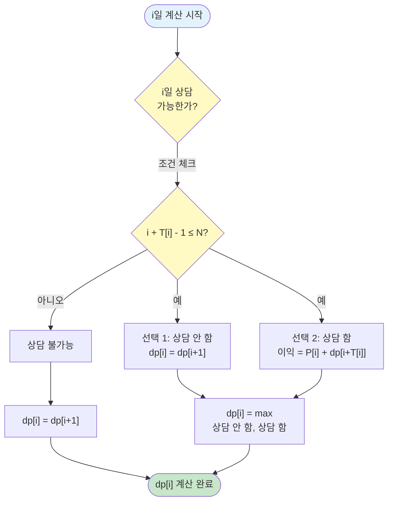

# 알고리즘: 동적 계획법

> 📖 **전체 알고리즘 설명**: [동적 계획법(Dynamic Programming) 정리](../dynamic-programming.md)

이 문제는 **동적 계획법(DP)**을 사용하여 해결합니다.  
상위 폴더의 [동적 계획법 정리 문서](../dynamic-programming.md)에서 알고리즘의 전체 이론과 개념을 확인할 수 있습니다.

---

## DP 알고리즘 개요

역순으로 계산하여 각 날짜부터 시작하여 얻을 수 있는 최대 이익을 구합니다.


### 핵심 아이디어

1. **상태 정의**: `dp[i] = i일부터 시작하여 얻을 수 있는 최대 이익`
   - "i일부터" = "i일의 선택을 고려하기 시작"
   - "최대 이익" = 최적화 문제이므로 최대값 필요

2. **점화식 도출**:
   
   > **문제 해석**: [1.analysis.md](./1.analysis.md)에서 "각 날짜마다 상담을 할지 말지 결정하는 문제"로 해석했습니다.
   
   **일반화된 점화식:**
   ```
   dp[i] = max(
       dp[i+1],              // i일 상담 안 함
       P[i] + dp[i+T[i]]     // i일 상담 함 (i+T[i]-1 ≤ N일 때만)
   )
   ```
   
   **점화식의 의미:**
   - 각 날짜마다 2가지 선택지가 있음
   - 선택 1: 상담 안 함 → (i+1)일부터의 최대 이익
   - 선택 2: 상담 함 → P[i]원 획득 + (i+T[i])일부터의 최대 이익
   - 두 선택지 중 최대값 선택
   
   > **구체적인 예시**: [1.analysis.md](./1.analysis.md)의 "4단계: 실제 예시로 단계별 이해하기" 섹션을 참고하세요.

### 📊 점화식 도출 과정 플로우차트

**각 날짜의 선택을 통한 점화식 도출 과정:**



**플로우차트 설명:**
1. i일 계산 시작
2. 조건 체크: i + T[i] - 1 ≤ N (상담이 N일 이내에 끝나는지)
3. 상담 불가능: dp[i] = dp[i+1] (상담 안 함만 가능)
4. 상담 가능: 두 선택지 비교
   - 선택 1: 상담 안 함 → dp[i+1]
   - 선택 2: 상담 함 → P[i] + dp[i+T[i]]
5. max 계산하여 최대값 선택

3. **초기값**: `dp[N+1] = 0` (퇴사일 이후에는 이익 없음)

---

## 구현 패턴

**구체적인 예시로 이해하기 (N=7):**

```java
int[] dp = new int[9];  // dp[8] = 0 (퇴사일 이후)

// 역순으로 계산 (7일 → 1일)
for (int i = 7; i >= 1; i--) {
    // 선택 1: i일 상담 안 함
    dp[i] = dp[i + 1];
    
    // 선택 2: i일 상담 함 (가능한 경우만)
    if (i + T[i] - 1 <= 7) {
        dp[i] = Math.max(dp[i], P[i] + dp[i + T[i]]);
    }
}

// 예시: i=1일 때
// dp[1] = max(dp[2], 10 + dp[4])
//        = max(1일 상담 안 함, 1일 상담 함)
```

---

**실제 계산 과정 (N=7 예시):**

```
dp[8] = 0  (초기값: 퇴사일 이후)

i=7: 
     // 선택 1: 7일 상담 안 함
     dp[7] = dp[8] = 0
     
     // 선택 2: 7일 상담 함 (조건 체크)
     // 7 + T[7] - 1 = 7 + 2 - 1 = 8 > 7 → 불가능
     // 따라서 max 계산 없이 dp[7] = dp[8] = 0 유지

i=6: 
     // 선택 1: 6일 상담 안 함
     dp[6] = dp[7] = 0
     
     // 선택 2: 6일 상담 함 (조건 체크)
     // 6 + T[6] - 1 = 6 + 4 - 1 = 9 > 7 → 불가능
     // 따라서 max 계산 없이 dp[6] = dp[7] = 0 유지

i=5: 
     // 선택 1: 5일 상담 안 함
     dp[5] = dp[6] = 0
     
     // 선택 2: 5일 상담 함 (조건 체크)
     // 5 + T[5] - 1 = 5 + 2 - 1 = 6 ≤ 7 → 가능
     dp[5] = max(dp[5], 15 + dp[7]) = max(0, 15 + 0) = 15

i=4: 
     // 선택 1: 4일 상담 안 함
     dp[4] = dp[5] = 15
     
     // 선택 2: 4일 상담 함 (조건 체크)
     // 4 + T[4] - 1 = 4 + 1 - 1 = 4 ≤ 7 → 가능
     dp[4] = max(dp[4], 20 + dp[5]) = max(15, 20 + 15) = 35

i=3: 
     // 선택 1: 3일 상담 안 함
     dp[3] = dp[4] = 35
     
     // 선택 2: 3일 상담 함 (조건 체크)
     // 3 + T[3] - 1 = 3 + 1 - 1 = 3 ≤ 7 → 가능
     dp[3] = max(dp[3], 10 + dp[4]) = max(35, 10 + 35) = 45

i=2: 
     // 선택 1: 2일 상담 안 함
     dp[2] = dp[3] = 45
     
     // 선택 2: 2일 상담 함 (조건 체크)
     // 2 + T[2] - 1 = 2 + 5 - 1 = 6 ≤ 7 → 가능
     dp[2] = max(dp[2], 20 + dp[7]) = max(45, 20 + 0) = 45

i=1: 
     // 선택 1: 1일 상담 안 함
     dp[1] = dp[2] = 45
     
     // 선택 2: 1일 상담 함 (조건 체크)
     // 1 + T[1] - 1 = 1 + 3 - 1 = 3 ≤ 7 → 가능
     dp[1] = max(dp[1], 10 + dp[4]) = max(45, 10 + 35) = 45

답: dp[1] = 45
```

---

> **최적 부분 구조와 중복 부분 문제**: [3.reasoning.md](./3.reasoning.md)의 "4️⃣ DP의 최적 부분 구조" 섹션을 참고하세요.

---

## 시간 복잡도

**전체 시간 복잡도: `O(N)`**

**근거:**
- **리스트의 항목 한 번씩 탐색**: N개의 날짜(1일부터 N일까지)를 각각 한 번씩만 처리
- **각 날짜 처리 시간**: O(1) (조건 체크, max 계산 모두 상수 시간)
- **전체 시간**: N개 항목 × O(1) = O(N)

**구체적인 계산:**
```
for (int i = N; i >= 1; i--) {  // N번 반복
    dp[i] = dp[i + 1];           // O(1)
    if (조건) {                  // O(1)
        dp[i] = Math.max(...);   // O(1)
    }
}
// 총 시간: N × O(1) = O(N)
```

**상태 개수:**
* N개 (1일부터 N일까지)

**각 상태 처리 시간:**
* O(1) (상수 시간)

---

## 공간 복잡도

* **DP 배열**: O(N)
* **입력 배열**: O(N)
* **전체 공간 복잡도**: **O(N)**

---

## 이 문제의 특이사항

### 1️⃣ 날짜 인덱스 처리

상담이 시작되는 날짜를 기준으로 계산해야 합니다.

```java
// i일의 상담을 하면
// i일부터 (i + T[i] - 1)일까지 사용
// 다음 상담은 (i + T[i])일부터 가능
```

### 2️⃣ 경계 조건 확인

N일 이후에 끝나는 상담은 할 수 없습니다.

```java
if (i + T[i] - 1 <= N) {
    // 상담 가능
}
```

### 3️⃣ 왜 역순으로 계산해야 하는가?

**핵심 이유: dp[i]를 계산하려면 미래의 값이 필요하기 때문**

**점화식을 다시 보면:**
```
dp[i] = max(
    dp[i+1],              // (i+1)일부터의 최대 이익 필요
    P[i] + dp[i+T[i]]     // (i+T[i])일부터의 최대 이익 필요
)
```

**앞에서부터 계산하면 문제 발생:**

```
i=1: dp[1] = max(dp[2], 10 + dp[4])
     → dp[2], dp[4]가 아직 계산되지 않음! ❌

i=2: dp[2] = max(dp[3], 20 + dp[7])
     → dp[3], dp[7]가 아직 계산되지 않음! ❌
```

**뒤에서부터 계산하면 자연스럽게 해결:**

```
i=7: dp[7] = max(dp[8], ...)
     → dp[8] = 0 (초기값) ✓

i=6: dp[6] = max(dp[7], ...)
     → dp[7]는 이미 계산됨 ✓

i=5: dp[5] = max(dp[6], 15 + dp[7])
     → dp[6], dp[7]는 이미 계산됨 ✓

...

i=1: dp[1] = max(dp[2], 10 + dp[4])
     → dp[2], dp[4]는 이미 계산됨 ✓
```

**결론:**
- dp[i]를 계산하려면 **dp[i+1] 또는 dp[i+T[i]]가 필요**
- 앞에서부터 계산하면 필요한 값이 아직 계산되지 않음
- **뒤에서부터 계산하면 필요한 값들이 이미 계산되어 있음**
- 이것이 역순 계산의 핵심 이유!

**DP의 일반 원리:**
- 일반적으로 "작은 문제부터 큰 문제로" 계산
- 이 문제는 "미래의 작은 문제부터 현재의 큰 문제로" 계산
- 즉, "작은 문제부터 큰 문제로"의 역순 버전

---

## 참고

* 전체 동적 계획법 알고리즘 설명: [../dynamic-programming.md](../dynamic-programming.md)
* 문제 분석: [1.analysis.md](./1.analysis.md)
* 알고리즘 적용 근거: [3.reasoning.md](./3.reasoning.md)
