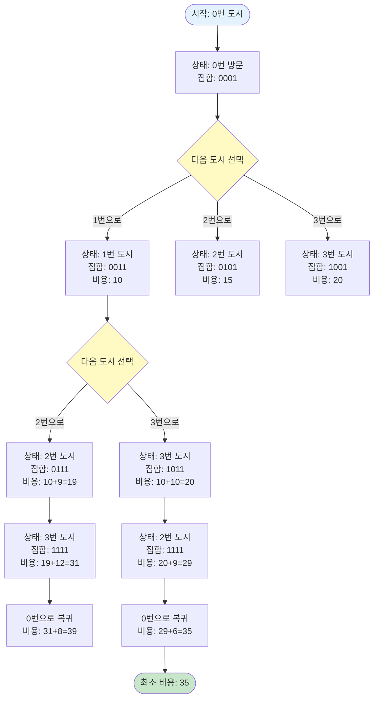

# 외판원 순회

## 📌 문제 요약

외판원이 한 도시에서 출발해 N개의 도시를 모두 거쳐 다시 원래의 도시로 돌아오는 순회 여행 경로를 계획하려고 한다. 단, 한 번 갔던 도시로는 다시 갈 수 없다. (맨 마지막에 여행을 출발했던 도시로 돌아오는 것은 예외) 가장 적은 비용을 들이는 여행 계획을 세우고자 한다.

각 도시간에 이동하는데 드는 비용은 행렬 W[i][j]형태로 주어진다. W[i][j]는 도시 i에서 도시 j로 가기 위한 비용을 나타낸다.

---

## 🔍 문제 설명

* N개의 도시가 있고, 각 도시 간 이동 비용이 주어진다
* 한 도시에서 출발하여 모든 도시를 정확히 한 번씩 방문한 후 다시 출발 도시로 돌아온다
* 각 도시는 한 번만 방문할 수 있다 (시작 도시로 돌아오는 것 제외)
* 모든 도시를 방문하는 최소 비용 경로를 구해야 한다

---

## 📥 입력 조건

* 첫째 줄에 도시의 수 N이 주어진다 (2 ≤ N ≤ 16)
* 다음 N개의 줄에는 비용 행렬이 주어진다
  * 각 행렬의 성분은 1,000,000 이하의 양의 정수
  * 갈 수 없는 경우는 0이 주어진다
  * W[i][j]는 도시 i에서 j로 가기 위한 비용
  * W[i][i]는 항상 0이다
* 항상 순회할 수 있는 경우만 입력으로 주어진다

---

## 📤 출력 조건

* 첫째 줄에 외판원의 순회에 필요한 최소 비용을 출력한다

---

## 💡 문제 핵심 해석

### 🔑 핵심 노하우: 문제를 "상태 공간 탐색" 문제로 해석하기

이 문제를 풀기 위한 가장 중요한 포인트는 **"현재 위치와 방문한 도시 집합"**을 상태로 정의하는 것입니다.

#### 1단계: 문제에서 주어진 정보 파악

```
- N개의 도시 (0번부터 N-1번 또는 1번부터 N번)
- 각 도시 간 이동 비용 행렬 W[i][j]
- 모든 도시를 정확히 한 번씩 방문
- 시작 도시로 돌아와야 함
- 최소 비용 경로 찾기
```

#### 2단계: 핵심 관찰 - "상태 정의"

**문제를 읽고 나서 다음과 같이 생각해야 합니다:**

> "현재 어느 도시에 있고, 어떤 도시들을 방문했는지"  
> "이 상태에서 남은 도시들을 모두 방문하고 시작 도시로 돌아오는 최소 비용은?"

**핵심 상태:**
- **현재 위치**: 현재 어느 도시에 있는가
- **방문한 도시 집합**: 어떤 도시들을 이미 방문했는가

#### 3단계: 왜 이 해석이 중요한가?

이 해석을 통해 문제의 본질을 파악할 수 있습니다:

1. **상태 공간 정의**: 
   - `dp[현재도시][방문한도시집합] = 최소 비용`
   - 방문한 도시 집합을 비트마스킹으로 표현 (예: 1011 = 0, 1, 3번 도시 방문)

2. **점화식 도출 가능**: 
   - 현재 도시에서 아직 방문하지 않은 도시로 이동
   - `dp[현재도시][방문집합] = min(모든 미방문 도시로 이동하는 비용)`

#### 3-1단계: 알고리즘 선택

**DP 조건 확인:**
- ✅ 최적 부분 구조: 현재 상태의 최소 비용 = min(다음 상태의 최소 비용 + 이동 비용)
- ✅ 중복 부분 문제: 같은 상태가 여러 경로에서 계산됨
- ✅ 상태 공간 제한적: N × 2^N (N ≤ 16이므로 계산 가능)
- ✅ 제약 조건이 있는 최적화 문제

**→ 비트마스킹 DP 사용** ✅

> **상세한 알고리즘 선택 근거**: [3.reasoning.md](./3.reasoning.md) 참고

#### 4단계: 실제 예시로 단계별 이해하기

**실제 입력 예시:**
```
4
0 10 15 20
5 0 9 10
6 13 0 12
8 8 9 0
```

**상태 정의 예시:**
- `dp[0][0001]` = 0번 도시에서 시작, 0번만 방문한 상태에서 나머지를 모두 방문하고 0번으로 돌아오는 최소 비용
- `dp[1][0011]` = 1번 도시에 있고, 0번과 1번을 방문한 상태에서 나머지를 모두 방문하고 0번으로 돌아오는 최소 비용
- `dp[0][1111]` = 0번 도시에 있고, 모든 도시를 방문한 상태 → 0번으로 돌아오는 비용만 계산

**💡 시작 도시 고정:** TSP는 순환 경로이므로 어떤 도시에서 시작하든 최소 비용은 같습니다. 따라서 0번 도시에서만 시작하면 됩니다.

> **자세한 설명**: [2.algorithm.md](./2.algorithm.md)의 "시작 도시 고정" 섹션 참고

**비트마스킹 표현:**

방문한 도시 집합을 비트마스킹으로 표현합니다. 

**기본 개념:**
- 각 비트가 하나의 도시를 나타냄 (예: 0011 = 0번, 1번 방문)
- 비트 연산으로 방문 상태를 효율적으로 관리
  - `1 << i`: i번 비트만 켜기
  - `visited | (1 << i)`: i번 도시 방문 추가
  - `visited & (1 << i)`: i번 도시 방문 확인
  - `(1 << N) - 1`: 모든 도시 방문 확인

> **자세한 비트마스킹 설명**: [2.algorithm.md](./2.algorithm.md)의 "비트마스킹 표현식 구체적인 예시" 섹션을 참고하세요.

**최적 경로:**
- 0 → 1 → 3 → 2 → 0
- 비용: 10 + 10 + 9 + 6 = 35

➡️ **비트마스킹을 사용한 동적 계획법(DP)**을 사용하여 해결할 수 있다.

---

### 📊 상태 공간 시각화

**외판원 순회의 상태 공간:**



**핵심:**
- 각 상태는 (현재 도시, 방문한 도시 집합)으로 표현
- 비트마스킹으로 방문 집합을 효율적으로 표현
- 모든 도시를 방문한 후 시작 도시로 돌아오는 비용 계산

---

### 📌 핵심 제약 조건

1. **각 도시는 정확히 한 번만 방문**
   - 방문한 도시 집합을 비트마스킹으로 관리
   - 이미 방문한 도시로는 이동 불가

2. **모든 도시를 방문해야 함**
   - 최종 상태: 모든 도시를 방문한 집합 (예: 1111...1)
   - 모든 도시를 방문한 후에만 시작 도시로 복귀 가능

3. **시작 도시로 돌아와야 함**
   - 모든 도시를 방문한 후, 시작 도시로 돌아오는 비용 추가
   - `dp[현재도시][모든도시방문] = W[현재도시][시작도시]`

4. **최소 비용을 구해야 함**
   - 모든 가능한 경로 중 최소값 선택

**예시 분석:**
```
도시: 0, 1, 2, 3
비용 행렬:
  0  1  2  3
0 0  10 15 20
1 5  0  9  10
2 6  13 0  12
3 8  8  9  0

최적 경로: 0 → 1 → 3 → 2 → 0
비용: 10 + 10 + 9 + 6 = 35
```

---

## 🧠 해결 전략 개요

### 비트마스킹을 사용한 동적 계획법 (DP)

* `dp[현재도시][방문한도시집합]` = 현재 도시에서 방문한 도시 집합 상태일 때, 나머지 도시를 모두 방문하고 시작 도시로 돌아오는 최소 비용
* 비트마스킹으로 방문한 도시 집합을 효율적으로 표현
* 메모이제이션으로 중복 계산 방지

---

## ✨ 예시

### 예시 1

**입력**
```
4
0 10 15 20
5 0 9 10
6 13 0 12
8 8 9 0
```

**출력**
```
35
```

**설명**: 
* 최적 경로: 0 → 1 → 3 → 2 → 0
* 비용: 10 + 10 + 9 + 6 = 35

### 예시 2

**입력**
```
3
0 1 2
1 0 1
2 1 0
```

**출력**
```
3
```

**설명**: 
* 최적 경로: 0 → 1 → 2 → 0
* 비용: 1 + 1 + 1 = 3

### 예시 3

**입력**
```
2
0 1
1 0
```

**출력**
```
2
```

**설명**: 
* 경로: 0 → 1 → 0
* 비용: 1 + 1 = 2

---

## 📝 정리

이 문제는 **비트마스킹을 사용한 동적 계획법**으로 해결하는 전형적인 외판원 순회 문제(TSP)이다.

상태를 (현재 도시, 방문한 도시 집합)으로 정의하고, 비트마스킹으로 방문 집합을 효율적으로 표현하여 O(N² × 2^N) 시간 복잡도로 해결할 수 있다.

