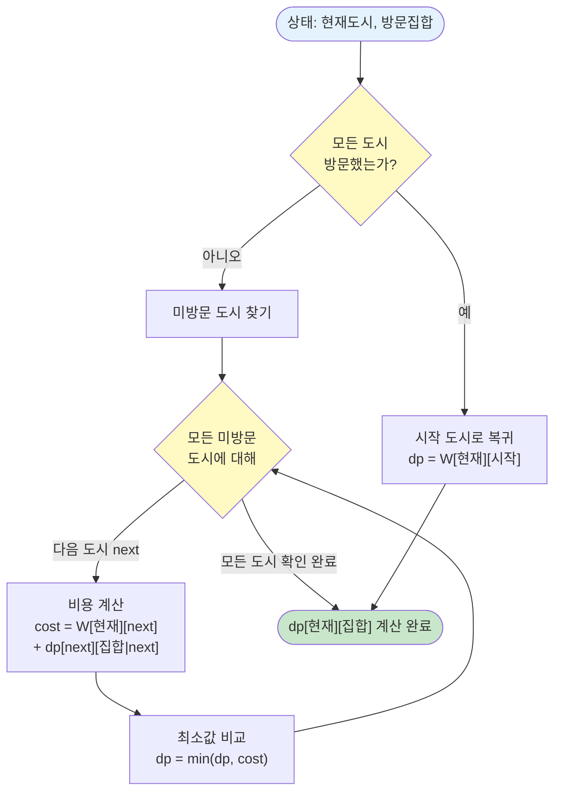

# 알고리즘: 비트마스킹을 사용한 동적 계획법

> 📖 **전체 알고리즘 설명**: [동적 계획법(Dynamic Programming) 정리](../dynamic-programming.md)

이 문제는 **비트마스킹을 사용한 동적 계획법(DP)**을 사용하여 해결합니다.  
상위 폴더의 [동적 계획법 정리 문서](../dynamic-programming.md)에서 알고리즘의 전체 이론과 개념을 확인할 수 있습니다.

---

## DP 알고리즘 개요

비트마스킹을 사용하여 방문한 도시 집합을 표현하고, 현재 도시와 방문 집합을 상태로 정의하여 최소 비용을 계산합니다.

### 알고리즘 선택

**DP 조건:** ✅ 최적 부분 구조, ✅ 중복 부분 문제, ✅ 상태 공간 제한적 (N × 2^N), ✅ 제약 조건이 있는 최적화 문제

**→ 비트마스킹 DP 사용** ✅

> **상세한 알고리즘 선택 근거**: [3.reasoning.md](./3.reasoning.md) 참고

### 핵심 아이디어

1. **상태 정의**: `dp[현재도시][방문한도시집합]` = 현재 도시에서 방문한 도시 집합 상태일 때, 나머지 도시를 모두 방문하고 시작 도시로 돌아오는 최소 비용
   - "현재 도시" = 현재 위치한 도시 번호
   - "방문한 도시 집합" = 비트마스킹으로 표현 (예: 1011 = 0, 1, 3번 도시 방문)
   - "최소 비용" = 최적화 문제이므로 최소값 필요

2. **점화식 도출**:
   
   > **문제 해석**: [1.analysis.md](./1.analysis.md)에서 이 문제를 "현재 위치와 방문한 도시 집합"을 상태로 정의하는 문제로 해석했습니다.
   
   **일반화된 점화식:**
   ```
   // 모든 도시를 방문한 경우
   if (방문집합 == 모든도시방문) {
       dp[현재도시][방문집합] = W[현재도시][시작도시]
   }
   // 아직 방문하지 않은 도시가 있는 경우
   else {
       dp[현재도시][방문집합] = min(
           모든 미방문 도시 next에 대해:
           W[현재도시][next] + dp[next][방문집합 | (1 << next)]
       )
   }
   ```
   
   **점화식의 의미:**
   - 모든 도시를 방문한 경우: 시작 도시로 돌아오는 비용만 계산
   - 아직 방문하지 않은 도시가 있는 경우: 
     - 현재 도시에서 미방문 도시로 이동
     - 이동 비용 + 해당 상태에서의 최소 비용
     - 모든 가능한 다음 도시 중 최소값 선택

   > **구체적인 예시**: [1.analysis.md](./1.analysis.md)의 "4단계: 실제 예시로 단계별 이해하기" 섹션을 참고하세요.

### 📊 점화식 도출 과정 플로우차트

**외판원 순회의 점화식 도출 과정:**



**플로우차트 설명:**
1. 현재 상태: (현재 도시, 방문한 도시 집합)
2. 모든 도시를 방문했는지 확인
3. 모든 도시 방문: 시작 도시로 돌아오는 비용 반환
4. 미방문 도시 존재: 모든 미방문 도시로 이동하는 경우를 고려
5. 각 경우의 비용을 계산하고 최소값 선택

3. **초기값**: 메모이제이션 배열을 -1로 초기화 (미계산 상태)

---

## 구현 패턴

**구체적인 예시로 이해하기 (N=4, 도시 0~3):**

```java
int[][] dp = new int[N][1 << N];  // dp[도시][방문집합]
// -1로 초기화 (미계산 상태)

int solve(int current, int visited) {
    // 모든 도시를 방문한 경우
    if (visited == (1 << N) - 1) {
        // 시작 도시(0)로 돌아오는 비용
        return W[current][0] != 0 ? W[current][0] : INF;
    }
    
    // 이미 계산된 경우
    if (dp[current][visited] != -1) {
        return dp[current][visited];
    }
    
    dp[current][visited] = INF;
    
    // 모든 미방문 도시로 이동
    for (int next = 0; next < N; next++) {
        // 이미 방문한 도시는 건너뛰기
        if ((visited & (1 << next)) != 0) continue;
        
        // 갈 수 없는 경로는 건너뛰기
        if (W[current][next] == 0) continue;
        
        // 다음 상태로 이동
        int nextVisited = visited | (1 << next);
        int cost = W[current][next] + solve(next, nextVisited);
        
        dp[current][visited] = Math.min(dp[current][visited], cost);
    }
    
    return dp[current][visited];
}

// 시작: 0번 도시에서 시작, 0번만 방문한 상태
int answer = solve(0, 1 << 0);
```

---

**실제 계산 과정 (N=4 예시):**

```
도시: 0, 1, 2, 3
비용 행렬:
  0  1  2  3
0 0  10 15 20
1 5  0  9  10
2 6  13 0  12
3 8  8  9  0

비트마스킹:
- 0001 = 0번만 방문 (1)
- 0011 = 0, 1번 방문 (3)
- 0101 = 0, 2번 방문 (5)
- 1001 = 0, 3번 방문 (9)
- 1111 = 모든 도시 방문 (15)

계산 과정:
solve(0, 0001):
  - next=1: 10 + solve(1, 0011)
  - next=2: 15 + solve(2, 0101)
  - next=3: 20 + solve(3, 1001)
  - 최소값 선택

solve(1, 0011):
  - next=2: 9 + solve(2, 0111)
  - next=3: 10 + solve(3, 1011)
  - 최소값 선택

solve(2, 0111):
  - next=3: 12 + solve(3, 1111)
  - solve(3, 1111) = W[3][0] = 8
  - 결과: 12 + 8 = 20

solve(3, 1011):
  - next=2: 9 + solve(2, 1111)
  - solve(2, 1111) = W[2][0] = 6
  - 결과: 9 + 6 = 15

solve(1, 0011):
  - min(9 + 20, 10 + 15) = min(29, 25) = 25

solve(0, 0001):
  - min(10 + 25, 15 + ?, 20 + ?) = 35
```

---

> **최적 부분 구조와 중복 부분 문제**: [3.reasoning.md](./3.reasoning.md)의 "4️⃣ DP의 최적 부분 구조" 섹션을 참고하세요.

---

## 시간 복잡도

**전체 시간 복잡도: `O(N² × 2^N)`**

**근거:**
- **상태 개수**: N개 도시 × 2^N개 방문 집합 = N × 2^N
- **각 상태 처리 시간**: O(N) (모든 미방문 도시 확인)
- **전체 시간**: N × 2^N × O(N) = O(N² × 2^N)

**구체적인 계산:**
```
for (int current = 0; current < N; current++) {      // N번
    for (int visited = 0; visited < (1 << N); visited++) {  // 2^N번
        for (int next = 0; next < N; next++) {       // N번
            // O(1) 연산
        }
    }
}
// 총 시간: N × 2^N × N = O(N² × 2^N)
```

**상태 개수:**
* N개 도시 × 2^N개 방문 집합 = N × 2^N

**각 상태 처리 시간:**
* O(N) (모든 미방문 도시 확인)

---

## 공간 복잡도

* **DP 배열**: O(N × 2^N)
* **입력 배열**: O(N²)
* **전체 공간 복잡도**: **O(N × 2^N)**

---

## 이 문제의 특이사항

### 1️⃣ 비트마스킹 사용

방문한 도시 집합을 비트마스킹으로 표현합니다.

```java
// i번 도시 방문 체크
visited |= (1 << i);

// i번 도시 방문 여부 확인
if ((visited & (1 << i)) != 0) {
    // 이미 방문함
}

// 모든 도시 방문 확인
if (visited == (1 << N) - 1) {
    // 모든 도시 방문 완료
}
```

#### 📚 비트마스킹 표현식 구체적인 예시 (N=4 기준)

**기본 개념:**
```
N = 4 (도시: 0, 1, 2, 3)
비트 위치: 3 2 1 0 (오른쪽부터 0번째)
도시 번호: 3 2 1 0
```

**1. `1 << i` - i번 비트만 1인 값 만들기**

```java
1 << 0 = 1   = 0001 (2진수)  // 0번 도시만
1 << 1 = 2   = 0010 (2진수)  // 1번 도시만
1 << 2 = 4   = 0100 (2진수)  // 2번 도시만
1 << 3 = 8   = 1000 (2진수)  // 3번 도시만
```

**2. `visited | (1 << i)` - i번 도시 방문 추가**

```java
visited = 0;           // 0000 (아무 도시도 방문 안 함)
visited |= (1 << 0);   // 0000 | 0001 = 0001 (0번 방문)
visited |= (1 << 1);   // 0001 | 0010 = 0011 (0번, 1번 방문)
visited |= (1 << 3);   // 0011 | 1000 = 1011 (0번, 1번, 3번 방문)
```

**3. `visited & (1 << i)` - i번 도시 방문 확인**

```java
visited = 0011 (0번, 1번 방문)

visited & (1 << 0) = 0011 & 0001 = 0001 ≠ 0  // 0번 방문함 ✅
visited & (1 << 1) = 0011 & 0010 = 0010 ≠ 0  // 1번 방문함 ✅
visited & (1 << 2) = 0011 & 0100 = 0000 = 0  // 2번 방문 안 함 ❌
visited & (1 << 3) = 0011 & 1000 = 0000 = 0  // 3번 방문 안 함 ❌
```

**4. `visited == (1 << N) - 1` - 모든 도시 방문 확인**

```java
N = 4
(1 << 4) - 1 = 16 - 1 = 15 = 1111 (2진수)

visited = 1111  // 모든 도시 방문
visited == 15  // true ✅

visited = 1011  // 0, 1, 3번만 방문
visited == 15  // false ❌
```

**5. 실제 코드에서의 사용 예시**

```java
// 시작: 0번 도시에서 시작, 0번만 방문한 상태
int visited = 1 << 0;  // visited = 0001

// 1번 도시로 이동
int nextVisited = visited | (1 << 1);  
// 계산: 0001 | 0010 = 0011

// 2번 도시가 이미 방문했는지 확인
if ((nextVisited & (1 << 2)) != 0) {
    // 계산: 0011 & 0100 = 0000 = 0 → 방문 안 함, 이동 가능
}

// 모든 도시 방문 확인
if (nextVisited == (1 << 4) - 1) {
    // 계산: 0011 == 1111? → false (아직 2번, 3번 미방문)
}
```

**6. 비트마스킹 값과 의미 매핑 (N=4)**

| 비트마스킹 값 | 2진수 | 방문한 도시 | 의미 |
|------------|------|-----------|------|
| 0 | 0000 | 없음 | 아무 도시도 방문 안 함 |
| 1 | 0001 | 0번 | 0번만 방문 |
| 3 | 0011 | 0, 1번 | 0번, 1번 방문 |
| 5 | 0101 | 0, 2번 | 0번, 2번 방문 |
| 7 | 0111 | 0, 1, 2번 | 0번, 1번, 2번 방문 |
| 15 | 1111 | 0, 1, 2, 3번 | 모든 도시 방문 |

**7. 점화식에서의 사용**

```java
// 현재 상태: visited = 0011 (0번, 1번 방문)
// 2번 도시로 이동하려고 함

// 2번 도시가 이미 방문했는지 확인
if ((visited & (1 << 2)) != 0) {
    // 0011 & 0100 = 0000 = 0 → 방문 안 함, 이동 가능
}

// 2번 도시 방문 추가
int nextVisited = visited | (1 << 2);
// 계산: 0011 | 0100 = 0111 (0번, 1번, 2번 방문)

// 다음 상태로 재귀 호출
solve(2, nextVisited);  // solve(2, 0111)
```

**핵심 요약:**
- `1 << i`: i번 비트만 켜기 (2^i 값)
- `visited | (1 << i)`: i번 비트 켜기 (OR 연산으로 방문 추가)
- `visited & (1 << i)`: i번 비트 확인 (AND 연산으로 방문 여부 확인)
- `(1 << N) - 1`: 모든 비트 켜기 (2^N - 1, 모든 도시 방문)

**8. 코드에서의 실제 사용**

다음은 `Main.java`에서 사용되는 비트 연산들입니다:

```java
// 1. DP 배열 크기 정의
dp = new int[N][1 << N];  
// 1 << N = 2^N (모든 방문 조합 개수)

// 2. 시작 상태 초기화
int answer = solve(0, 1 << 0);
// 1 << 0 = 1 = 0001 (0번 도시만 방문)

// 3. 모든 도시 방문 확인
if (visited == (1 << N) - 1) {
    // (1 << N) - 1 = 모든 비트가 1 (모든 도시 방문)
}

// 4. 방문 여부 확인
if ((visited & (1 << next)) != 0) {
    // next번 비트가 켜져있으면 이미 방문함
    continue;
}

// 5. 방문 상태 추가
int nextVisited = visited | (1 << next);
// next번 비트를 켜서 방문 상태에 추가
```

**각 비트 연산의 역할:**
- `1 << N`: DP 배열의 두 번째 차원 크기 (모든 방문 조합 수)
- `1 << 0`: 시작 상태 (0번 도시만 방문)
- `(1 << N) - 1`: 종료 조건 (모든 도시 방문 완료)
- `visited & (1 << next)`: 방문 여부 확인 (AND 연산)
- `visited | (1 << next)`: 방문 상태 추가 (OR 연산)

### 2️⃣ 메모이제이션 사용

재귀 함수와 메모이제이션을 사용하여 중복 계산을 방지합니다.

```java
int[][] dp = new int[N][1 << N];
// -1로 초기화 (미계산 상태)

if (dp[current][visited] != -1) {
    return dp[current][visited];  // 이미 계산된 값 재사용
}
```

### 3️⃣ 경계 조건 확인

- 갈 수 없는 경로 (W[i][j] == 0)는 건너뛰기
- 시작 도시로 돌아올 수 있는지 확인

### 4️⃣ 시작 도시 고정

**왜 시작 도시를 하나로 고정해도 될까?**

TSP는 **순환 경로(Cycle)** 문제이기 때문에, 어떤 도시에서 시작하든 최소 비용은 같습니다.

**구체적인 예시:**

```
도시: 0, 1, 2, 3
경로: 0 → 1 → 3 → 2 → 0 (비용: 35)

같은 경로를 다른 도시에서 시작하면:
- 1 → 3 → 2 → 0 → 1 (비용: 35) ✅ 같은 경로
- 2 → 0 → 1 → 3 → 2 (비용: 35) ✅ 같은 경로
- 3 → 2 → 0 → 1 → 3 (비용: 35) ✅ 같은 경로
```

**핵심:**
- 순환 경로이므로 시작점이 달라도 같은 경로입니다
- 따라서 **0번 도시에서 시작하는 경우만 계산**하면 됩니다
- 다른 도시에서 시작하는 경우는 중복 계산입니다

**만약 모든 도시에서 시작하는 경우를 계산한다면:**
```java
// 불필요한 중복 계산
int answer = Integer.MAX_VALUE;
for (int start = 0; start < N; start++) {
    answer = Math.min(answer, solve(start, 1 << start));
}
// → 같은 경로를 N번 계산하게 됨 (비효율적)
```

**효율적인 방법:**
```java
// 시작 도시를 0번으로 고정
int answer = solve(0, 1 << 0);
// → 한 번만 계산하면 됨 (효율적)
```

**시작 도시를 0번으로 고정하여 계산:**

```java
// 0번 도시에서 시작, 0번만 방문한 상태
int answer = solve(0, 1 << 0);
```

**주의:**
- 시작 도시는 0번으로 고정하지만, **경로는 0번에서 시작해서 0번으로 돌아오는 경로**입니다
- 모든 도시를 방문한 후 시작 도시(0번)로 돌아오는 비용을 계산합니다

---

## 참고

* 전체 동적 계획법 알고리즘 설명: [../dynamic-programming.md](../dynamic-programming.md)
* 문제 분석: [1.analysis.md](./1.analysis.md)
* 알고리즘 적용 근거: [3.reasoning.md](./3.reasoning.md)

