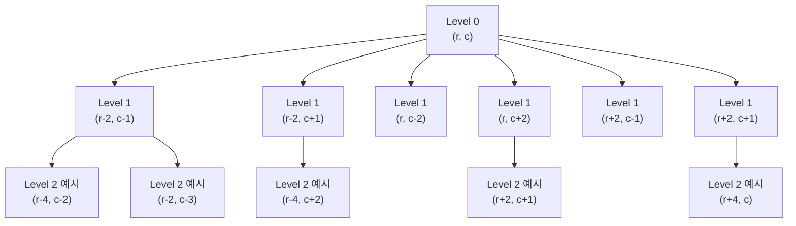

# Main.java 설계 근거 정리

## 1. 그래프 최단 거리 문제로의 해석

이 문제는 체스판의 각 좌표 `(r, c)`를 정점으로 보고, 데스 나이트의 이동 가능 규칙을 간선으로 보면 그래프 탐색 문제로 해석할 수 있습니다.

- 정점: 체스판 위의 각 칸 `(r, c)`
- 간선: 한 번의 이동으로 갈 수 있는 6개 좌표
- 간선 가중치: 모두 동일(이동 1회)

즉, 시작점 `(r1, c1)`에서 도착점 `(r2, c2)`까지의 최소 간선 수를 구하는 문제입니다.

간단히 보면 아래처럼 상태가 확장됩니다.

## 2. BFS 알고리즘 선택 근거

모든 이동의 비용이 동일하므로, 이 문제는 가중치 없는 그래프에서의 최단 거리 문제입니다. 이 경우 BFS가 시작점에서 가까운 거리 순서대로 탐색하므로 최단 이동 횟수를 정확히 보장합니다.

또한 순환 가능성이 있으므로 같은 좌표를 반복 방문하면 비효율이 커집니다. 따라서 `visited`(또는 `dist`) 배열로 재방문을 차단해 중복 탐색을 제거해야 합니다.

## 3. 시간/공간 복잡도 판단

체스판 한 변 길이를 `N`이라 하면 전체 칸 수는 `N^2`입니다.

- 각 칸은 최대 1번 방문
- 방문 시 고정된 6방향만 확인

따라서

- 시간 복잡도: `O(N^2)`
- 공간 복잡도: `O(N^2)`

제약 `N <= 200`에서 최악의 경우 칸 수는 `200 x 200 = 40,000`개입니다. 이웃 확인까지 포함하면 대략 `40,000 x 6 = 240,000`회 수준으로, 제한 내에서 충분히 안전합니다.
