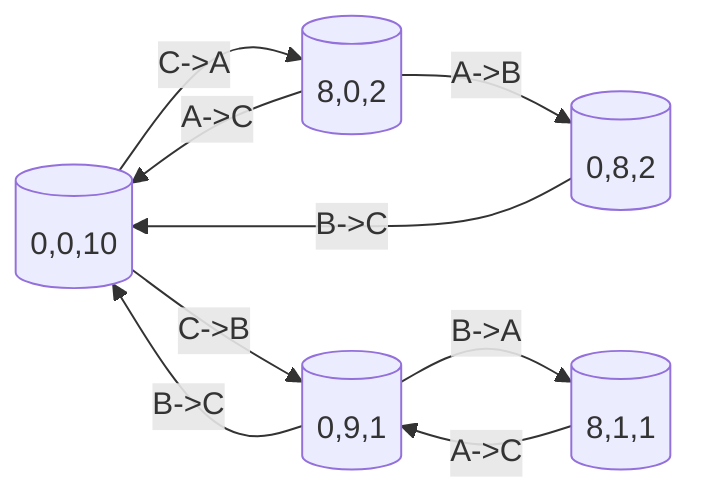

# Main.java 설계 근거 정리

## 1. 알고리즘 판단: 상태 그래프 탐색(BFS/DFS)

이 문제는 그래프가 직접 주어지지 않지만, "현재 물통 상태"를 정점으로, "한 번의 붓기 연산"을 간선으로 해석하면 전형적인 그래프 탐색 문제로 바뀝니다. 문제에서 요구하는 것은 최적값 하나가 아니라 가능한 결과들의 집합이므로, 시작 상태 `(0, 0, C)`에서 출발해 도달 가능한 상태를 모두 방문하는 방식이 가장 자연스럽습니다. 따라서 BFS나 DFS로 상태공간을 완전탐색하고, 탐색 과정에서 `a == 0`인 상태를 만날 때마다 해당 상태의 `c` 값을 정답에 기록하면 요구사항을 정확히 충족할 수 있습니다.

아래는 예시 입력 `(A,B,C)=(8,9,10)`에서 일부 상태를 그래프로 나타낸 그림입니다. 정점은 `(a,b,c)` 상태이고, 화살표는 한 번의 붓기 연산으로 도달 가능한 전이를 의미합니다.



## 2. 상태 표현 판단: 3차원에서 2차원으로 축소

상태를 `(a, b, c)`로 두면 직관적이지만, 이 문제에서는 총 물의 양이 항상 보존된다는 조건이 있습니다. 즉 언제나 `a + b + c = C`가 성립하므로, `a`와 `b`만 알면 `c = C - a - b`로 즉시 복원할 수 있습니다. 그래서 구현에서는 상태를 2차원 `(a, b)`로 축소해도 정보가 전혀 손실되지 않습니다. 이 선택을 적용하면 방문 배열을 `visited[a][b]`로 단순하게 설계할 수 있고, 불필요한 차원을 줄여 코드와 메모리 사용량을 함께 줄일 수 있습니다.

```java
// 2차원 상태 표현
boolean[][] visited = new boolean[A + 1][B + 1];
boolean[] possible = new boolean[C + 1];

int c = C - a - b; // 필요 시 즉시 복원
if (a == 0) possible[c] = true;
```

3차원 방문 배열을 사용해도 정답은 구할 수 있지만, 이 문제의 구조에서는 2차원 축소가 더 간결하고 실용적인 설계입니다.

## 3. 전이와 복잡도 판단: 6가지 붓기 연산 완전탐색

각 상태에서 가능한 동작은 방향을 고려한 물통 쌍 기준으로 최대 6가지이며, `A -> B`, `A -> C`, `B -> A`, `B -> C`, `C -> A`, `C -> B`를 모두 확인하면 됩니다. 각 전이에서 실제로 옮길 수 있는 물의 양은 "출발 물통의 현재 물"과 "도착 물통의 남은 용량" 중 작은 값으로 결정되며, 이는 문제의 "한 물통이 비거나 다른 물통이 찰 때까지 붓는다"는 규칙을 그대로 구현한 것입니다.

```java
int move = Math.min(amount[from], limit[to] - amount[to]);
```

이 전이들을 매 상태마다 생성하고, 아직 방문하지 않은 상태만 큐(또는 스택)에 넣어 탐색을 이어가면 도달 가능한 상태를 빠짐없이 수집할 수 있습니다. 상태공간을 2차원으로 두면 가능한 상태 수는 `(A + 1) * (B + 1)`이고, 상태당 전이는 최대 6개이므로 시간 복잡도는 `O(A * B)`, 공간 복잡도도 `O(A * B)`입니다. 제약이 `A, B, C <= 200`이므로 최대 상태 수는 `201 * 201 = 40401`로 충분히 작아 완전탐색을 적용해도 시간과 메모리 모두 안전합니다.

---

결론적으로 이 문제는 상태 그래프 탐색으로 해석하는 것이 맞고, 구현에서는 총량 보존 성질을 이용해 상태를 2차원으로 축소하는 설계가 가장 효율적입니다.
