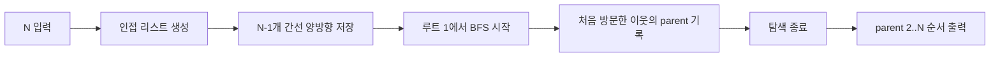

# 알고리즘: 판단 내용을 실제 코드로 옮긴 구성

## 1. 완전 탐색 배제 판단의 반영

3번 파일의 첫 판단(O(N^2) 반복 탐색 불가)은 코드에서 "트리 전체 1회 순회" 구조로 반영됩니다. `Main.java`는 인접 리스트를 만든 뒤 루트 `1`에서 시작해 큐 기반 탐색을 한 번만 수행합니다. 즉 노드마다 간선을 다시 스캔하지 않고, 각 간선/노드를 상수 횟수로만 처리합니다.

```java
for (int i = 0; i < n - 1; i++) {
    int u = nextInt();
    int v = nextInt();
    graph[u].add(v);
    graph[v].add(u);
}

bfsParent(1, graph, parent, visited);
```

## 2. 트리 성질 판단의 반영

루트가 `1`로 고정되면 부모가 유일하다는 판단은 `visited` + `parent` 갱신 규칙으로 옮겼습니다. 코드에서 현재 노드 `cur`의 이웃 `next`를 처음 방문할 때만 `parent[next] = cur`를 기록합니다. 이 선택 때문에 별도의 역추적 없이도 부모 배열이 바로 완성됩니다.

```java
if (visited[next]) {
    continue;
}
visited[next] = true;
parent[next] = cur;
queue.offer(next);
```

## 3. 탐색 방식 선택 판단의 반영

입력이 무방향 트리라는 판단은 양방향 인접 리스트 구성으로 반영됩니다. 이후 BFS로 레벨 순서대로 확장하면서 모든 노드를 정확히 한 번 방문합니다. 탐색이 끝나면 문제 요구 그대로 `2..N` 순서로 부모를 출력합니다.

```java
for (int node = 2; node <= n; node++) {
    sb.append(parent[node]).append('\n');
}
```

## 4. 판단-코드 대응 흐름

현재 `Main.java`의 실제 흐름은 "입력으로 그래프 구성 -> 루트 1 BFS -> parent[2..N] 출력"이며, 3번 파일의 판단 1/2/3이 각각 여기에 대응됩니다. 입력은 `nextInt()` 정적 메서드로 읽고, 출력은 `StringBuilder`로 모아 한 번에 출력합니다.


