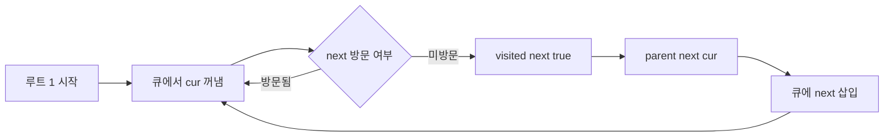

# Main.java 설계 근거 정리 이해 중심

이 문서는 BOJ 11725 트리의 부모 찾기를
왜 BFS DFS 한 번으로 풀 수 있는지 쉽게 설명합니다.

## 1. 핵심 아이디어 한 줄

`1번`을 루트로 정하고 탐색할 때,
처음 방문한 노드의 직전 노드가 그 노드의 부모입니다.

## 2. 왜 이 방식이 맞는가

트리는 사이클이 없고 두 노드 사이 경로가 유일합니다.
그래서 루트 `1`에서 어떤 노드 `x`로 가는 길도 하나뿐이라,
`x`를 처음 방문했을 때의 이전 노드를 부모로 저장하면 바뀔 일이 없습니다.

코드 규칙은 아래 한 줄로 정리됩니다.

```java
if (!visited[next]) {
    visited[next] = true;
    parent[next] = cur;
    queue.offer(next);
}
```

문제 예제 1 간선을 루트 `1` 기준으로 보면 아래와 같습니다.

- 1-6
- 6-3
- 3-5
- 4-1
- 2-4
- 4-7

```text
        1
      /   \
     6     4
     |    / \
     3   2   7
     |
     5
```

따라서 부모는 바로 다음처럼 정해집니다.

- parent[2] = 4
- parent[3] = 6
- parent[4] = 1
- parent[5] = 3
- parent[6] = 1
- parent[7] = 4

BFS 진행 순서를 실제로 적어 보면 더 명확합니다.

```text
초기
queue = [1]
visited[1] = true

1 처리 후
6 4 처음 방문
parent[6] = 1
parent[4] = 1
queue = [6, 4]

6 처리 후
3 처음 방문
parent[3] = 6
queue = [4, 3]

4 처리 후
2 7 처음 방문
parent[2] = 4
parent[7] = 4
queue = [3, 2, 7]

3 처리 후
5 처음 방문
parent[5] = 3
queue = [2, 7, 5]
```

아래 흐름도도 같은 내용을 요약합니다.



## 3. 복잡도

- 시간 복잡도 O N
- 공간 복잡도 O N

트리의 간선 수는 `N-1`이므로 인접 리스트를 만든 뒤 한 번 탐색하면 충분합니다.