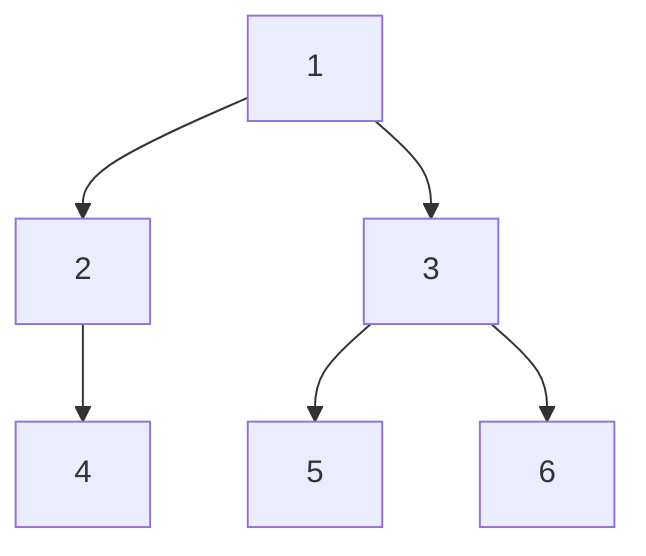
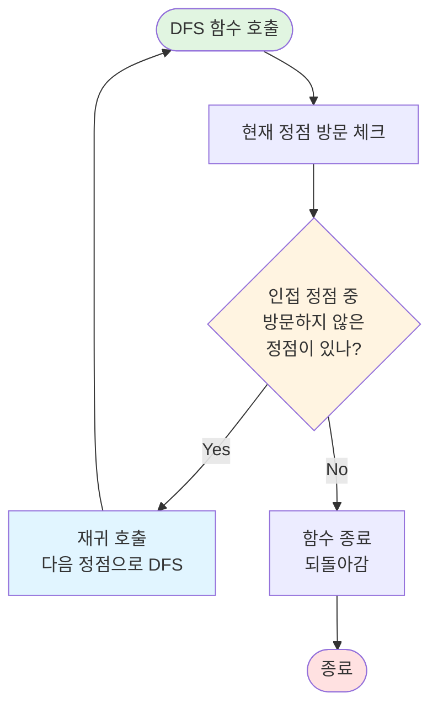
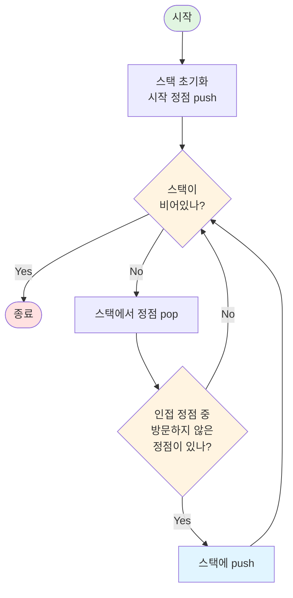

# DFS (깊이 우선 탐색) 정리

> **참고**: 그래프 탐색의 공통 개념과 BFS vs DFS 비교는 [그래프 탐색 개요](../graph-traversal.md)를 참고하세요.

## 1️⃣ DFS란?

**DFS (Depth-First Search, 깊이 우선 탐색)** 란

> 그래프나 트리를 탐색할 때,
> **한 경로를 끝까지 탐색한 후 다른 경로로 이동**하는 탐색 알고리즘
> 을 의미한다.

즉, **"한 가지 경로를 끝까지 따라간 후, 되돌아와서 다른 경로를 탐색"** 하는 방식으로 그래프를 탐색한다.

---

## 2️⃣ 언제 사용할까?

DFS는 다음과 같은 상황에서 사용된다:

* **사이클 검출** (백엣지 활용)
* **연결 요소 찾기** (Connected Component)
* **모든 경로 탐색** (백트래킹)
* **위상 정렬** (DFS 기반)
* **트리 순회** (전위, 중위, 후위 순회)
* **백트래킹 문제**

### 대표적인 예시

* **순열 사이클** (10451)
* **사이클 검출**
* **연결 요소 개수**
* **백트래킹** (N-Queen, 스도쿠 등)
* **위상 정렬** (DFS 기반)

---

## 3️⃣ DFS의 핵심 개념

### 📌 핵심 아이디어

* **스택(Stack) 또는 재귀 사용**: LIFO 원칙으로 한 경로를 끝까지 탐색
* **방문 체크**: 이미 방문한 정점은 다시 방문하지 않음
* **깊이 우선 탐색**: 한 경로를 끝까지 따라간 후 되돌아옴

### 📐 DFS의 탐색 순서

다음 그래프에서 정점 1부터 DFS를 수행하는 과정:



**DFS 탐색 과정 (깊이 우선):**

```
1. 1 방문 → 2로 이동
2. 2 방문 → 4로 이동
3. 4 방문 → 더 이상 갈 곳 없음, 2로 되돌아옴
4. 2에서 더 이상 갈 곳 없음, 1로 되돌아옴
5. 1에서 3으로 이동
6. 3 방문 → 5로 이동
7. 5 방문 → 더 이상 갈 곳 없음, 3으로 되돌아옴
8. 3에서 6으로 이동
9. 6 방문 → 더 이상 갈 곳 없음, 3으로 되돌아옴
10. 3에서 더 이상 갈 곳 없음, 1로 되돌아옴
11. 1에서 더 이상 갈 곳 없음, 종료

최종 탐색 순서: 1 → 2 → 4 → 3 → 5 → 6
```

**핵심 포인트:**

* **깊이 우선**: 한 경로를 끝까지 따라감 (1 → 2 → 4)
* **되돌아오기**: 더 이상 갈 곳이 없으면 이전 정점으로 되돌아옴 (4 → 2 → 1)
* **다른 경로 탐색**: 되돌아온 후 다른 경로를 탐색 (1 → 3 → 5 → 6)

이 순서는 **스택의 LIFO 특성**을 활용한다.

---

## 4️⃣ DFS 알고리즘의 구조

> **참고**: 그래프 표현 방법과 방문 체크 등 공통 개념은 [그래프 탐색 개요](../graph-traversal.md#5%EF%B8%8F⃣-공통-개념)를 참고하세요.

### 기본 구현 (재귀 방식)

**DFS 알고리즘 플로우차트 (재귀 핵심 영역):**



**플로우차트 설명:**

1. **DFS 함수 호출**: DFS 함수가 호출됨 (처음 호출 또는 재귀 호출)
2. **방문 체크**: 현재 정점을 방문했다고 표시
3. **인접 정점 확인**: 현재 정점과 연결된 정점 중 방문하지 않은 정점이 있는지 확인
4. **재귀 호출**: 방문하지 않은 정점이 있으면 그 정점으로 DFS를 재귀 호출
   * 재귀 호출은 **다시 시작점(DFS 함수 호출)으로 돌아가서** 같은 과정을 반복
   * 이렇게 **깊이 들어가며** 탐색을 계속함
5. **되돌아오기**: 재귀 호출이 끝나면 (더 이상 갈 곳이 없어서 함수 종료) 다시 돌아옴
6. **함수 종료**: 모든 인접 정점을 확인했으면 함수 종료 (이전 재귀 호출로 되돌아감)

**핵심 포인트:**
* **재귀의 순환**: 재귀 호출이 다시 시작점으로 돌아가서 같은 과정을 반복
* **깊이 우선**: 한 경로를 끝까지 따라감 (재귀 호출)
* **되돌아오기**: 더 이상 갈 곳이 없으면 이전 정점으로 되돌아옴 (함수 종료)
* **백트래킹**: 모든 경로를 탐색하기 위해 되돌아가며 다른 경로 탐색

**Java 구현 코드 (재귀 방식):**

```java
void dfs(int current) {
    visited[current] = true;
    
    // 현재 정점 처리 (출력, 계산 등)
    System.out.print(current + " ");
    
    // 인접한 정점들 탐색
    // graph[current]: 현재 정점과 연결된 모든 정점들의 리스트
    for (int next : graph[current]) {
        if (!visited[next]) {
            dfs(next);  // 재귀적으로 DFS 호출
        }
    }
}
```

### 스택을 사용한 반복 방식

재귀 대신 명시적 스택을 사용할 수도 있습니다:

**스택 방식 DFS 플로우차트 (핵심 영역):**



**플로우차트 설명:**

1. **스택 초기화**: 시작 정점을 스택에 push하고 방문 체크
2. **스택 확인**: 스택이 비어있지 않으면 계속 진행
3. **정점 pop**: 스택에서 정점을 꺼내어 현재 정점으로 처리
4. **인접 정점 확인**: 현재 정점과 연결된 정점 중 방문하지 않은 정점이 있는지 확인
5. **스택에 push**: 방문하지 않은 인접 정점을 스택에 push하고 방문 체크
6. **반복**: 스택 확인으로 돌아가서 반복 (스택이 비어있을 때까지)

**Java 구현 코드:**

```java
void dfs(int start) {
    Stack<Integer> stack = new Stack<>();
    boolean[] visited = new boolean[N + 1];
    
    stack.push(start);
    visited[start] = true;
    
    while (!stack.isEmpty()) {
        int current = stack.pop();
        
        // 현재 정점 처리
        System.out.print(current + " ");
        
        // 인접한 정점들을 역순으로 스택에 추가
        // (정순으로 탐색하려면 역순으로 추가해야 함)
        for (int i = graph[current].size() - 1; i >= 0; i--) {
            int next = graph[current].get(i);
            if (!visited[next]) {
                visited[next] = true;
                stack.push(next);
            }
        }
    }
}
```

**재귀 방식 vs 스택 방식 비교:**

| 특성 | 재귀 방식 | 스택 방식 |
|------|----------|----------|
| **자료구조** | 함수 호출 스택 (암묵적) | 명시적 Stack |
| **제어 흐름** | 재귀 호출로 순환 | while 루프로 반복 |
| **플로우차트** | 재귀 호출이 시작점으로 돌아감 | 스택 push/pop으로 반복 |
| **구현 복잡도** | 간단 (재귀 호출만) | 약간 복잡 (스택 관리) |
| **스택 오버플로우** | 위험 (깊은 그래프) | 위험 낮음 (명시적 제어 가능) |

**핵심 차이점:**
* **재귀 방식**: 함수 호출 스택을 사용하여 재귀적으로 함수를 호출하는 순환 구조
* **스택 방식**: 명시적 스택을 사용하여 while 루프로 반복하는 선형 구조

**재귀 vs 스택:**

* **재귀 방식**: 구현이 간단하고 직관적, 스택 오버플로우 위험
* **스택 방식**: 명시적 제어 가능, 스택 오버플로우 위험 낮음

---

## 5️⃣ DFS의 특징

### ✅ 장점

* **메모리 효율**: 재귀 깊이만큼만 메모리 사용 (일반적으로 BFS보다 적음)
* **사이클 검출 용이**: 백엣지를 활용하여 사이클을 쉽게 검출 가능
* **백트래킹 적합**: 경로를 되돌아가며 탐색하기 쉬움
* **구현 단순**: 재귀를 사용하면 매우 간단하게 구현 가능

### ❌ 단점

* **최단 경로 보장 불가**: 깊이 우선 탐색이므로 최단 경로를 보장하지 않음
* **스택 오버플로우**: 깊은 그래프에서는 재귀 깊이 제한에 걸릴 수 있음
* **경로 추적**: 최단 경로를 찾기 어려움

---

## 6️⃣ 시간/공간 복잡도

> **참고**: 그래프 탐색 알고리즘의 전체 시간/공간 복잡도는 [그래프 탐색 개요](../graph-traversal.md#6%EF%B8%8F⃣-시간공간-복잡도)를 참고하세요.

### DFS 특화 복잡도 분석

**시간 복잡도 구성 요소:**

* **각 정점 처리**: O(1) - 방문 체크, 처리 로직
* **간선 탐색**: O(E) - 모든 간선을 한 번씩 확인
* **전체**: O(V + E) - 각 정점을 한 번씩 방문하고, 각 간선을 한 번씩 확인

**공간 복잡도 구성 요소:**

* **재귀 스택 또는 스택**: O(V) - 최악의 경우 모든 정점이 스택에 들어갈 수 있음 (예: 선형 그래프)
* **방문 배열**: O(V) - 각 정점의 방문 여부를 저장
* **전체**: O(V)

---

## 7️⃣ DFS 구현 패턴

DFS의 기본 구조는 동일하지만, 문제 유형에 따라 다음과 같은 변형이 필요합니다:

### 패턴 1: 기본 그래프 탐색

위의 기본 구현 코드를 참고하세요. 1차원 그래프에서의 기본 탐색 패턴입니다.

### 패턴 2: 2차원 격자 탐색

미로, 지도 등 2차원 배열에서 상하좌우 이동이 필요한 경우:

```java
int[] dx = {-1, 1, 0, 0};  // 상하좌우
int[] dy = {0, 0, -1, 1};

void dfs(int x, int y) {
    visited[x][y] = true;
    
    // 현재 위치 처리
    
    for (int i = 0; i < 4; i++) {
        int nx = x + dx[i];
        int ny = y + dy[i];
        
        if (nx >= 0 && nx < N && ny >= 0 && ny < M 
            && !visited[nx][ny] && map[nx][ny] == 1) {
            dfs(nx, ny);
        }
    }
}
```

### 패턴 3: 사이클 검출

백엣지를 활용하여 사이클을 검출:

```java
// visited: 방문 완료
// inStack: 현재 탐색 중인 경로에 포함됨
boolean[] visited = new boolean[N + 1];
boolean[] inStack = new boolean[N + 1];

boolean hasCycle(int current) {
    visited[current] = true;
    inStack[current] = true;
    
    for (int next : graph[current]) {
        if (!visited[next]) {
            if (hasCycle(next)) {
                return true;
            }
        } else if (inStack[next]) {
            // 백엣지 발견: 사이클 존재
            return true;
        }
    }
    
    inStack[current] = false;  // 경로에서 제거
    return false;
}
```

### 패턴 4: 연결 요소 개수

방문하지 않은 정점에서 DFS를 시작할 때마다 하나의 연결 요소를 찾음:

```java
int componentCount = 0;
for (int i = 1; i <= N; i++) {
    if (!visited[i]) {
        dfs(i);
        componentCount++;  // 새로운 연결 요소 발견
    }
}
```

### 패턴 5: 경로 추적

경로를 저장해야 할 때는 재귀 호출 시 경로를 전달:

```java
List<Integer> path = new ArrayList<>();

void dfs(int current, List<Integer> path) {
    visited[current] = true;
    path.add(current);
    
    // 목표 지점 도달 시 경로 저장
    if (current == target) {
        // 경로 처리
    }
    
    for (int next : graph[current]) {
        if (!visited[next]) {
            dfs(next, path);
        }
    }
    
    // 백트래킹: 경로에서 제거
    path.remove(path.size() - 1);
    visited[current] = false;  // 다른 경로에서 재방문 가능하도록
}
```

---

## 8️⃣ DFS vs BFS

DFS와 BFS의 비교 및 언제 어떤 알고리즘을 사용할지에 대한 자세한 내용은 [그래프 탐색 개요](../graph-traversal.md#3%EF%B8%8F⃣-bfs-vs-dfs-비교)를 참고하세요.

---

## 9️⃣ 주의사항

### 📌 방문 체크 시점

```java
// ✅ 올바른 예: DFS 함수 시작 시점에 방문 체크
void dfs(int current) {
    visited[current] = true;  // 먼저 체크
    
    for (int next : graph[current]) {
        if (!visited[next]) {
            dfs(next);
        }
    }
}
```

DFS 함수 시작 시점에 방문 체크를 해야 같은 정점을 여러 번 방문하는 것을 방지할 수 있다.

### 📌 스택 오버플로우

깊은 그래프에서는 재귀 깊이 제한에 걸릴 수 있습니다:

```java
// 재귀 깊이 제한이 있는 경우 스택 방식 사용
void dfs(int start) {
    Stack<Integer> stack = new Stack<>();
    // ... 스택 방식 구현
}
```

### 📌 백트래킹에서의 방문 체크 해제

모든 경로를 탐색해야 하는 백트래킹 문제에서는 방문 체크를 해제해야 합니다:

```java
void dfs(int current) {
    visited[current] = true;
    
    // 현재 정점 처리
    
    for (int next : graph[current]) {
        if (!visited[next]) {
            dfs(next);
        }
    }
    
    // 백트래킹: 방문 체크 해제
    visited[current] = false;  // 다른 경로에서 재방문 가능
}
```

### 📌 재귀 vs 스택 선택

* **재귀 방식**: 구현이 간단하고 직관적, 대부분의 경우 권장
* **스택 방식**: 깊은 그래프나 스택 오버플로우 위험이 있는 경우 사용

---

## ✨ 한 줄 요약

> DFS는 **"한 경로를 끝까지 탐색한 후 되돌아와서 다른 경로를 탐색하는"** 그래프 탐색 알고리즘으로, 재귀나 스택을 사용하여 사이클 검출, 연결 요소 찾기, 백트래킹 등에 활용된다.

