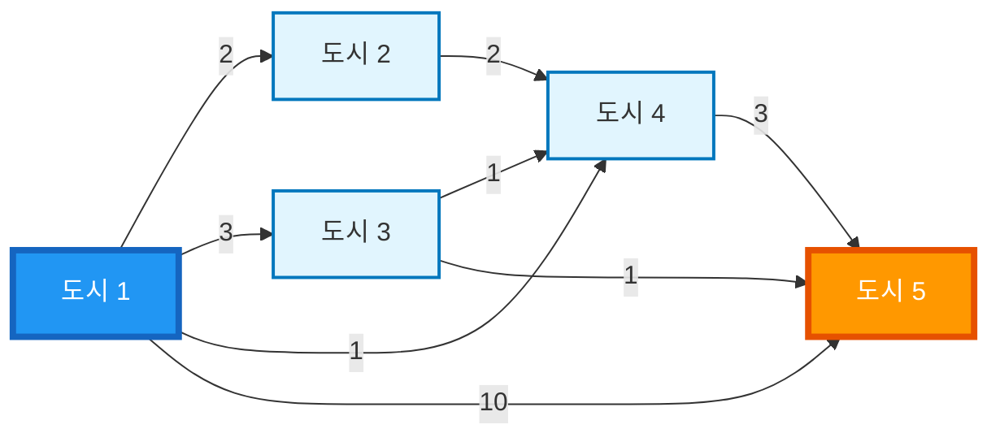

# 최소비용 구하기

## 📌 문제 요약

N개의 도시가 있고, 한 도시에서 다른 도시로 가는 M개의 버스가 있습니다. A번째 도시에서 B번째 도시까지 가는데 드는 **최소 버스 비용**을 구하는 문제입니다.

도시의 번호는 1부터 N까지입니다.

---

## 🔍 문제 설명

* **도시 개수**: N개 (1 ≤ N ≤ 1,000)
* **버스 개수**: M개 (1 ≤ M ≤ 100,000)
* **버스 정보**: 출발 도시 번호, 도착 도시 번호, 버스 비용
* **버스 비용**: 0 이상 100,000 미만의 정수
* **목표**: A번째 도시에서 B번째 도시까지 가는데 드는 최소 비용

> **중요**: 출발점에서 도착점을 갈 수 있는 경우만 입력으로 주어집니다.

---

## 📥 입력 조건

* 첫째 줄: 도시의 개수 N
* 둘째 줄: 버스의 개수 M
* 셋째 줄부터 M+2줄까지: 버스 정보 (출발 도시, 도착 도시, 비용)
* M+3째 줄: 구하고자 하는 구간의 출발점 도시번호와 도착점 도시번호

---

## 📤 출력 조건

* 첫째 줄에 출발 도시에서 도착 도시까지 가는데 드는 최소 비용을 출력

---

## 💡 문제 핵심 해석

* 도시를 **정점(Vertex)**, 버스를 **간선(Edge)**, 버스 비용을 **가중치(Weight)**로 표현
* **가중치가 있는 방향 그래프**에서의 최단 경로 문제
* 시작점에서 도착점까지의 **최소 비용 경로**를 찾는 문제

➡️ **가중치가 있는 그래프에서의 최단 경로 문제**이므로 **다익스트라 알고리즘**을 사용

---

## ✨ 예시

### 예시 1: 문제에서 제공한 예시

**입력**
```
5
8
1 2 2
1 3 3
1 4 1
1 5 10
2 4 2
3 4 1
3 5 1
4 5 3
1 5
```

**그래프 구조**
```
도시 1에서: → 도시 2 (비용 2), → 도시 3 (비용 3), → 도시 4 (비용 1), → 도시 5 (비용 10)
도시 2에서: → 도시 4 (비용 2)
도시 3에서: → 도시 4 (비용 1), → 도시 5 (비용 1)
도시 4에서: → 도시 5 (비용 3)
```

**시각적 표현**



**출력**
```
4
```

**설명**: 
도시 1에서 도시 5까지 가는 최소 비용 경로:
- 경로 1: 1 → 5 (비용 10)
- 경로 2: 1 → 3 → 5 (비용 3 + 1 = 4) ✅ 최소
- 경로 3: 1 → 4 → 5 (비용 1 + 3 = 4) ✅ 최소
- 경로 4: 1 → 2 → 4 → 5 (비용 2 + 2 + 3 = 7)
- 경로 5: 1 → 3 → 4 → 5 (비용 3 + 1 + 3 = 7)

최소 비용은 4입니다.

---

### 예시 2: 간단한 케이스

**입력**
```
3
3
1 2 5
2 3 3
1 3 10
1 3
```

**그래프 구조**
```
도시 1에서: → 도시 2 (비용 5), → 도시 3 (비용 10)
도시 2에서: → 도시 3 (비용 3)
```

**출력**
```
8
```

**설명**: 
- 경로 1: 1 → 3 (비용 10)
- 경로 2: 1 → 2 → 3 (비용 5 + 3 = 8) ✅ 최소

---

### 예시 3: 직선 경로

**입력**
```
4
3
1 2 1
2 3 2
3 4 3
1 4
```

**그래프 구조**
```
도시 1 → 도시 2 → 도시 3 → 도시 4
```

**출력**
```
6
```

**설명**: 
- 경로: 1 → 2 → 3 → 4 (비용 1 + 2 + 3 = 6)

---

## 📝 정리

이 문제는 **가중치가 있는 방향 그래프에서의 최단 경로 찾기** 문제로, 다익스트라 알고리즘을 사용하여 효율적으로 해결할 수 있습니다.
