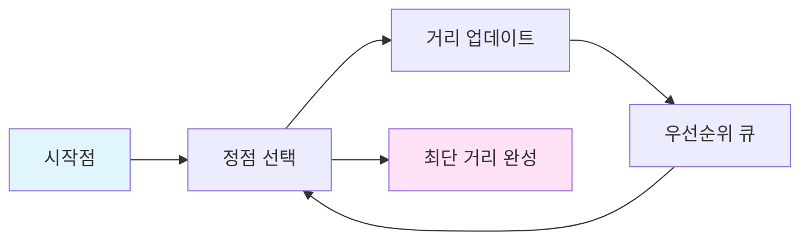
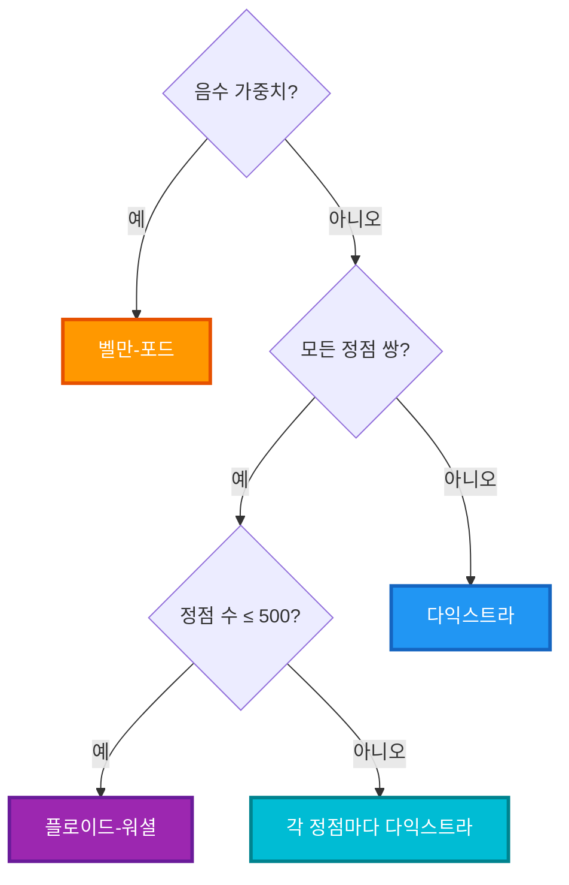
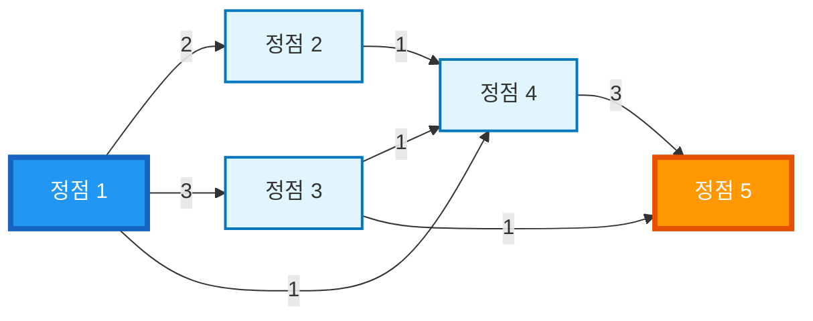
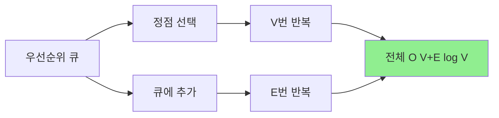
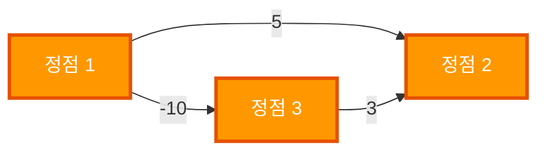
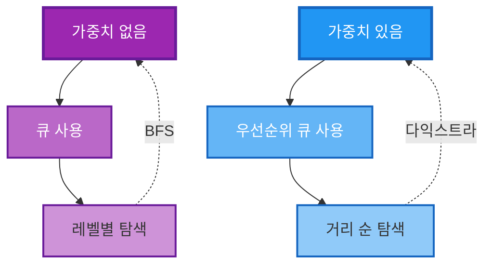

# 다익스트라 알고리즘 (Dijkstra's Algorithm) 정리

## 🎯 핵심 요약

> **다익스트라 알고리즘**: 음수 가중치가 없는 그래프에서 **시작점으로부터 모든 정점까지의 최단 거리**를 구하는 그리디 알고리즘

**다익스트라 알고리즘 흐름:**

1. **시작점** 설정
2. **가장 가까운 정점 선택**
3. **인접 정점 거리 업데이트**
4. **우선순위 큐에 추가**
5. **반복** (모든 정점 처리 완료까지)
6. **최단 거리 완성**



**시간 복잡도**: O((V + E) log V)  
**사용 빈도**: ⭐⭐⭐⭐⭐ (최단 경로 문제의 90% 이상)

---

## 📊 알고리즘 비교

| 알고리즘 | 가중치 | 시간 복잡도 | 사용 빈도 | 언제 사용? |
|---------|--------|------------|----------|----------|
| **다익스트라** | 양수만 | O((V + E) log V) | ⭐⭐⭐⭐⭐ | 단일 시작점, 음수 없음 |
| **벨만-포드** | 음수 가능 | O(V × E) | ⭐⭐ | 음수 가중치, 음수 사이클 감지 |
| **플로이드-워셜** | 음수 가능 | O(V³) | ⭐⭐⭐ | 모든 정점 쌍의 거리 필요 |

### 알고리즘 선택 가이드

**알고리즘 선택 가이드:**



---

## 🔍 다익스트라 알고리즘이란?

### 기본 개념

**그리디 알고리즘**의 일종으로, 매 순간 **가장 가까운 정점**을 선택하여 최단 경로를 구합니다.

**핵심 아이디어:**

1. **시작점**에서 시작
2. **가장 가까운 정점 선택**
3. **인접 정점 거리 갱신**
4. **우선순위 큐에 추가**
5. **반복**


### 동작 과정 (단계별)

**동작 과정:**

1. **초기화**: 시작점의 거리를 0으로 설정, 우선순위 큐에 추가
2. **반복** (큐가 빌 때까지):
   - 큐에서 거리가 가장 작은 정점 선택
   - 선택한 정점의 인접 정점 확인
   - 새로운 거리 계산
   - 더 짧은 경로 발견 시 거리 업데이트 및 큐에 추가
3. **완료**: 모든 정점까지의 최단 거리 반환

---

## 🎨 시각적 예시

### 예시 그래프

**예시 그래프:**



### 단계별 실행 과정

#### 1단계: 초기화

**거리 배열:**
- dist[1] = 0 ✅
- dist[2] = ∞
- dist[3] = ∞
- dist[4] = ∞
- dist[5] = ∞

**우선순위 큐:** (거리, 정점) 형식
- (0, 1) ✅: 거리 0, 정점 1

#### 2단계: 정점 1 선택 (거리 0)

**거리 배열:**
- dist[1] = 0 ✅ (처리 완료)
- dist[2] = 2 (업데이트)
- dist[3] = 3 (업데이트)
- dist[4] = 1 (업데이트)
- dist[5] = ∞

**우선순위 큐:** (거리, 정점) 형식
- (1, 4) ← 다음 선택 대상: 거리 1, 정점 4
- (2, 2): 거리 2, 정점 2
- (3, 3): 거리 3, 정점 3

**업데이트**: 정점 1에서 출발하는 간선 확인
- 1 → 2: dist[2] = 0 + 2 = 2
- 1 → 3: dist[3] = 0 + 3 = 3
- 1 → 4: dist[4] = 0 + 1 = 1

#### 3단계: 정점 4 선택 (거리 1, 가장 가까움)

**거리 배열:**
- dist[1] = 0 ✅
- dist[2] = 2
- dist[3] = 3
- dist[4] = 1 ✅ (처리 완료)
- dist[5] = 4 (업데이트)

**우선순위 큐:** (거리, 정점) 형식
- (2, 2) ← 다음 선택 대상: 거리 2, 정점 2
- (3, 3): 거리 3, 정점 3
- (4, 5): 거리 4, 정점 5

**업데이트**: 정점 4에서 출발하는 간선 확인
- 4 → 5: dist[5] = 1 + 3 = 4

#### 4단계: 정점 2 선택 (거리 2)

**거리 배열:**
- dist[1] = 0 ✅
- dist[2] = 2 ✅ (처리 완료)
- dist[3] = 3
- dist[4] = 1 ✅
- dist[5] = 4

**우선순위 큐:** (거리, 정점) 형식
- (3, 3) ← 다음 선택 대상: 거리 3, 정점 3
- (4, 5): 거리 4, 정점 5

**업데이트**: 정점 2에서 출발하는 간선 확인
- 2 → 4: dist[4] = min(1, 2 + 1) = 1 (변경 없음)

#### 5단계: 정점 3 선택 (거리 3)

**거리 배열:**
- dist[1] = 0 ✅
- dist[2] = 2 ✅
- dist[3] = 3 ✅ (처리 완료)
- dist[4] = 1 ✅
- dist[5] = 4

**우선순위 큐:** (거리, 정점) 형식
- (4, 5) ← 다음 선택 대상: 거리 4, 정점 5

**업데이트**: 정점 3에서 출발하는 간선 확인
- 3 → 4: dist[4] = min(1, 3 + 1) = 1 (변경 없음)
- 3 → 5: dist[5] = min(4, 3 + 1) = 4 (변경 없음)

#### 6단계: 정점 5 선택 (거리 4)

**거리 배열:**
- dist[1] = 0 ✅
- dist[2] = 2 ✅
- dist[3] = 3 ✅
- dist[4] = 1 ✅
- dist[5] = 4 ✅ (처리 완료)

**우선순위 큐:** (거리, 정점) 형식
- (비어있음) - 모든 정점 처리 완료

**최종 결과**: 정점 1에서 정점 5까지의 최단 거리는 **4**

**최단 경로**: 1 → 4 → 5 (비용: 1 + 3 = 4) 또는 1 → 3 → 5 (비용: 3 + 1 = 4)

---

## 💻 구현 코드

### 기본 구현

```java
import java.util.*;

class Edge {
    int to, weight;
    Edge(int to, int weight) {
        this.to = to;
        this.weight = weight;
    }
}

int[] dijkstra(int start, List<Edge>[] graph, int N) {
    // 1. 거리 배열 초기화
    int[] dist = new int[N + 1];
    Arrays.fill(dist, Integer.MAX_VALUE);
    dist[start] = 0;
    
    // 2. 우선순위 큐 초기화 (거리 순으로 정렬)
    PriorityQueue<int[]> pq = new PriorityQueue<>((a, b) -> a[0] - b[0]);
    pq.offer(new int[]{0, start});
    
    // 3. 방문 체크 배열
    boolean[] visited = new boolean[N + 1];
    
    // 4. 메인 루프
    while (!pq.isEmpty()) {
        int[] current = pq.poll();
        int distance = current[0];
        int node = current[1];
        
        // 이미 처리된 정점은 건너뛰기
        if (visited[node]) continue;
        visited[node] = true;
        
        // 인접 정점 확인 및 거리 업데이트
        for (Edge edge : graph[node]) {
            int next = edge.to;
            int weight = edge.weight;
            
            // 더 짧은 경로 발견 시 업데이트
            if (dist[next] > distance + weight) {
                dist[next] = distance + weight;
                pq.offer(new int[]{dist[next], next});
            }
        }
    }
    
    return dist;
}
```

### 그래프 구성

```java
// 인접 리스트로 그래프 표현
List<Edge>[] graph = new ArrayList[N + 1];
for (int i = 1; i <= N; i++) {
    graph[i] = new ArrayList<>();
}

// 간선 추가 (방향 그래프)
graph[1].add(new Edge(2, 5));  // 1 → 2 (가중치 5)
graph[1].add(new Edge(3, 3));  // 1 → 3 (가중치 3)
```

---

## 📈 시간/공간 복잡도

### 시간 복잡도

**시간 복잡도 계산:**

- 우선순위 큐에서 정점 선택: O(log V)
- 우선순위 큐에 추가: O(log V)
- V개 정점 처리: O(V)
- E개 간선 확인: O(E)
- **전체**: O((V + E) log V)



**우선순위 큐 사용**: O((V + E) log V)
- 각 정점 처리: O(log V)
- 각 간선 확인: O(log V)
- 총 V개 정점, E개 간선

**배열 기반**: O(V²)
- 각 정점마다 최소 거리 정점 찾기: O(V)
- V개 정점 처리

### 공간 복잡도

| 자료구조 | 공간 복잡도 |
|---------|------------|
| 그래프 (인접 리스트) | O(V + E) |
| 거리 배열 | O(V) |
| 우선순위 큐 | O(V) |
| **전체** | **O(V + E)** |

---

## ⚠️ 주의사항

### 1. 음수 가중치 불가

**음수 가중치 예시:**



**문제**: 다익스트라는 음수 가중치가 있으면 최단 경로를 보장하지 않음

**해결**: 벨만-포드 알고리즘 사용

### 2. 우선순위 큐 중복 처리

```java
// ✅ 올바른 방법
if (visited[node]) continue;  // 이미 처리된 정점 건너뛰기
visited[node] = true;
```

**이유**: 같은 정점이 여러 번 큐에 들어갈 수 있음

### 3. 오버플로우 방지

```java
// ✅ 안전한 비교
if (distance != Integer.MAX_VALUE && dist[next] > distance + weight) {
    dist[next] = distance + weight;
}
```

---

## 🔄 다익스트라 vs BFS

| 특성 | BFS | 다익스트라 |
|------|-----|-----------|
| **가중치** | 없음 (모두 1) | 있음 (다양함) |
| **자료구조** | 큐 | 우선순위 큐 |
| **시간 복잡도** | O(V + E) | O((V + E) log V) |
| **사용 시기** | 가중치 없는 그래프 | 가중치 있는 그래프 |



---

## 🎯 구현 패턴

### 패턴 1: 기본 다익스트라

위의 기본 구현 코드 참고

### 패턴 2: 목표 정점까지의 최단 거리

```java
int dijkstraToTarget(int start, int target, List<Edge>[] graph, int N) {
    // ... 기본 구현과 동일 ...
    
    while (!pq.isEmpty()) {
        int[] current = pq.poll();
        int distance = current[0];
        int node = current[1];
        
        // 목표 정점 도달 시 즉시 반환
        if (node == target) {
            return distance;
        }
        
        // ... 나머지 동일 ...
    }
    
    return dist[target];
}
```

### 패턴 3: 경로 추적

```java
int[] parent = new int[N + 1];
Arrays.fill(parent, -1);

// 다익스트라 수행 중
if (dist[next] > distance + weight) {
    dist[next] = distance + weight;
    parent[next] = node;  // 경로 저장
    pq.offer(new int[]{dist[next], next});
}

// 경로 복원
List<Integer> path = new ArrayList<>();
int node = target;
while (node != -1) {
    path.add(node);
    node = parent[node];
}
Collections.reverse(path);
```
---

## ✨ 핵심 정리

**다익스트라 알고리즘의 핵심:**

| 항목 | 내용 |
|------|------|
| **특징** | 그리디 알고리즘, 음수 가중치 불가, 우선순위 큐 사용 |
| **시간 복잡도** | O((V + E) log V) - 우선순위 큐 기반 |
| **사용 시기** | 단일 시작점, 양수 가중치, 최단 경로 문제 |
| **구현 요소** | 거리 배열, 우선순위 큐, 방문 체크 |

> **한 줄 요약**: 다익스트라 알고리즘은 음수 가중치가 없는 그래프에서 시작점으로부터 모든 정점까지의 최단 거리를 효율적으로 구하는 그리디 알고리즘이다.
