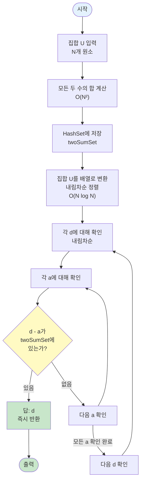

# 알고리즘: 두 수의 합을 미리 계산 + 해시셋 활용

> 📖 **문제 분석**: [1.analysis.md](./1.analysis.md)를 먼저 읽어보세요.  
> 📖 **해시 자료구조 설명**: [해시맵(HashMap) 정리](../hash-map.md)

이 문제는 **두 수의 합을 미리 계산하고 해시셋(HashSet)을 활용**하여 해결합니다.

**알고리즘 분류**: 해시셋을 활용한 최적화 문제 (동적 계획법 아님)

---

## 🧠 해결 전략 개요

### 1️⃣ 문제의식: 3개의 수를 직접 선택하는 것은 너무 느림

**직접적인 접근 (모든 세 수의 조합 확인):**
```
for (int i = 0; i < N; i++) {
    for (int j = 0; j < N; j++) {
        for (int k = 0; k < N; k++) {
            long sum = arr[i] + arr[j] + arr[k];
            if (set.contains(sum)) {
                // 최대값 찾기
            }
        }
    }
}
// 시간 복잡도: O(N³) = 10⁹ (N=10³일 때)
// 예상 실행 시간: 10초 ❌ (시간 초과)
```

**문제점:**
- N = 10³일 때, 10⁹번의 연산 필요
- 시간 제한 1초를 초과할 가능성이 높음
- **3개의 수를 직접 선택하는 방식은 비효율적**

### 2️⃣ 고민: 어떻게 하면 더 빠르게 할 수 있을까?

**핵심 질문:**
- "세 수의 합을 어떻게 하면 더 효율적으로 찾을 수 있을까?"
- "3개의 수를 선택하는 대신 다른 방법은 없을까?"
- "d = a + b + c를 다른 형태로 변환할 수 있을까?"

### 3️⃣ 해결책: 문제 변환을 통해 2개로 줄이기

**변환의 힘:**
- 원래: d = a + b + c (3개의 수를 선택)
- 변환: d - a = b + c (1개의 수와 2개의 수의 합)
- **3개 선택 → 1개 선택 + 2개 합 확인으로 변환**

**해결 전략:**
1. **두 수의 합을 미리 계산**: 모든 두 수의 합을 계산하여 HashSet에 저장
   - 시간: O(N²)
   - 공간: O(N²)

2. **변환을 통한 효율적 확인**: d = a + b + c를 d - a = b + c로 변환
   - 각 d와 a에 대해 d - a가 두 수의 합 집합에 있는지 확인
   - 시간: O(N²) (각 d에 대해 각 a 확인)

3. **내림차순 확인으로 최적화**: 집합을 내림차순으로 정렬하여 첫 번째로 찾은 값이 최대값
   - 첫 번째로 찾은 유효한 d가 답

**효율성 비교:**
- 직접 접근: O(N³) = 10⁹ (시간 초과)
- 변환 접근: O(N²) = 10⁶ (충분히 빠름) ✅

---

## 알고리즘 개요

### 📊 알고리즘 플로우차트

**전체 알고리즘 흐름:**



**핵심:**
- 두 수의 합을 미리 계산하여 O(1) 조회
- 내림차순 확인으로 첫 번째 찾은 값이 최대값

---

## 구현 패턴

**핵심 구현:**

```java
// 1단계: 두 수의 합을 미리 계산
Set<Long> twoSumSet = new HashSet<>();
for (int i = 0; i < N; i++) {
    for (int j = 0; j < N; j++) {
        twoSumSet.add(arr[i] + arr[j]);
    }
}

// 2단계: 내림차순 정렬 후 각 d와 a에 대해 확인
Arrays.sort(arr);
for (int i = N - 1; i >= 0; i--) {
    long d = arr[i];
    for (int j = 0; j < N; j++) {
        if (twoSumSet.contains(d - arr[j])) {
            System.out.println(d);
            return;
        }
    }
}
```

**예시 (U = {2, 3, 5, 10, 18}):**
- 두 수의 합: {4, 5, 6, 7, 8, 10, 12, 13, 15, 20, 21, 23, 28, 36}
- d = 18, a = 10: 18 - 10 = 8 → twoSumSet에 있음 (3+5=8) → 답: 18

---

## 시간 복잡도

**전체 시간 복잡도: `O(N²)`**

**근거:**
- **두 수의 합 계산**: N²개 조합, 각각 O(1) → O(N²)
- **각 d와 a 확인**: N × N = N²번, 각 확인 O(1) → O(N²)
- **정렬**: O(N log N)
- **전체 시간: O(N²) + O(N log N) + O(N²) = O(N²)**

### ⏱️ 빅오 표기법과 실제 실행 시간의 관계

> 📖 **일반적인 시간 복잡도 평가 기준**: [COMPLEXITY_REFERENCE.md](../../../COMPLEXITY_REFERENCE.md)의 "시간 복잡도 평가 기준" 섹션을 참고하세요.

#### BOJ 2295 문제의 경우

**문제 제약 조건:**
- N ≤ 10³
- 시간 제한: 1초

**연산 횟수 계산:**

1. **O(N²) 알고리즘 (현재 방법):**
   ```
   두 수의 합 계산: N × N = 10³ × 10³ = 10⁶
   각 d와 a 확인: N × N = 10³ × 10³ = 10⁶
   정렬: N log N ≈ 10³ × 10 = 10⁴
   
   총 연산 횟수: 약 2×10⁶
   예상 실행 시간: 2×10⁶ / 10⁸ = 0.02초 ✅ (1초 미만, 충분히 빠름)
   ```

2. **O(N³) 알고리즘 (브루트 포스):**
   ```
   모든 세 수의 조합: N × N × N = 10³ × 10³ × 10³ = 10⁹
   
   총 연산 횟수: 약 10⁹
   예상 실행 시간: 10⁹ / 10⁸ = 10초 ❌ (1초 초과, 시간 초과)
   ```

**결론:**
- N = 10³일 때: O(N²) = 10⁶ < 10⁸ (통과) ✅, O(N³) = 10⁹ > 10⁸ (시간 초과) ❌
- 상세한 시간 복잡도 평가 방법은 [COMPLEXITY_REFERENCE.md](../../../COMPLEXITY_REFERENCE.md)를 참고하세요

---

## 공간 복잡도

* **두 수의 합 HashSet**: O(N²) (최대 N²개의 합)
* **입력 배열**: O(N)
* **전체 공간 복잡도**: **O(N²)**

### 💾 공간 복잡도 적합성 평가

> 📖 **일반적인 공간 복잡도 평가 기준**: [COMPLEXITY_REFERENCE.md](../../../COMPLEXITY_REFERENCE.md)의 "공간 복잡도 평가 기준" 섹션을 참고하세요.

#### BOJ 2295 문제의 경우

**문제 제약 조건:**
- N ≤ 10³
- 메모리 제한: 128 MB

**실제 메모리 사용량:**
- 입력 배열: 10³ × 8 bytes ≈ 8 KB
- HashSet: 10⁶ × 24 bytes ≈ 24 MB
- **총합: 약 24 MB**

#### 메모리 제한과의 비교

**문제의 메모리 제한: 128 MB**

- **사용 메모리: 약 24 MB**
- **사용률: 24 MB / 128 MB ≈ 19%**
- **결론: 메모리 제한 내에서 충분히 여유 있음 ✅**

**결론:**
- 공간 복잡도 O(N²)는 이 문제에 적합함
- 실제 메모리 사용량(약 24 MB)이 메모리 제한(128 MB)보다 훨씬 작음
- 상세한 공간 복잡도 평가 방법은 [COMPLEXITY_REFERENCE.md](../../../COMPLEXITY_REFERENCE.md)를 참고하세요

---

## 이 문제의 특이사항

### 1️⃣ 같은 수를 여러 번 사용 가능

문제에서 "x, y, z, k가 서로 같아도 된다"고 명시되어 있으므로, 같은 수를 여러 번 사용할 수 있습니다.

```java
// 예: 2 + 2 + 2 = 6
// 두 수의 합 계산 시 i == j인 경우도 포함해야 함
for (int i = 0; i < N; i++) {
    for (int j = 0; j < N; j++) {  // j는 0부터 시작 (같은 수 포함)
        twoSumSet.add(arr[i] + arr[j]);
    }
}
```

### 2️⃣ 내림차순 확인으로 최적화

집합을 내림차순으로 정렬하고 큰 값부터 확인하면, 첫 번째로 찾은 유효한 값이 최대값입니다.

```java
Arrays.sort(arr, Collections.reverseOrder());
// 첫 번째로 찾은 값이 답
```

### 3️⃣ HashSet을 사용하는 이유

두 수의 합이 특정 값과 같은지 확인하는 작업이 O(1) 시간에 가능합니다.

```java
if (twoSumSet.contains(remainder)) {  // O(1) 평균 시간
    // 찾음
}
```

배열이나 리스트를 사용하면 O(N²) 시간이 걸리지만, HashSet을 사용하면 O(1) 시간에 확인 가능합니다.
