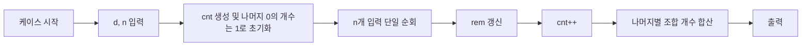

# 알고리즘: 판단 내용을 실제 코드로 옮긴 구성

## 1. 완전 탐색 배제 판단의 반영

3번 파일의 첫 판단(O(N^2) 완전 탐색 불가)은 코드에서 "구간을 직접 만들지 않는 구조"로 반영됩니다. `Main.java`는 테스트케이스마다 수열을 한 번만 읽고, 각 원소에서 상수 시간 갱신만 수행합니다. 즉 시작점/끝점 이중 루프가 아니라 단일 입력 순회 루프를 택해 계산 경로를 고정했습니다.

```java
for (int i = 0; i < n; i++) {
    int value = nextInt();
    rem = (int) ((rem + (long) value) % d);
    cnt[rem]++;
}
```

## 2. 누적합 나머지 동일 판단의 반영

두 누적합의 나머지가 같으면 유효 구간이라는 판단은 `rem` 상태 추적으로 옮겼습니다. 코드에서 누적합 전체를 저장하지 않고 현재 누적 나머지 `rem`만 유지하며, 원소를 읽을 때마다 `(rem + value) % d`로 갱신합니다. 이 선택 때문에 별도의 prefix 배열 없이도 필요한 정보가 유지됩니다.

```java
int rem = 0;
int value = nextInt();
rem = (int) ((rem + (long) value) % d);
```

## 3. 나머지 빈도 조합 판단의 반영

같은 나머지 빈도 `cnt[r]`에서 조합 `k*(k-1)/2`를 더한다는 판단은 코드에서 두 단계로 구현됩니다. 먼저 단일 순회 동안 `cnt`를 완성하고, 이후 나머지 전체를 돌며 조합식을 합산합니다. 또한 `prefix[0]` 포함 판단을 `cnt[0] = 1` 초기화로 직접 반영했습니다.

```java
long[] cnt = new long[d];
cnt[0] = 1L;

long answer = 0L;
for (int r = 0; r < d; r++) {
    long k = cnt[r];
    answer += k * (k - 1L) / 2L;
}
```

## 4. 판단-코드 대응 흐름

현재 `Main.java`의 실제 흐름은 "입력 순회로 빈도 구축 -> 조합 합산"이며, 3번 파일의 판단 1/2/3이 각각 여기에 대응됩니다. 입력은 `nextInt()` 정적 메서드로 읽고, 케이스별 정답을 `StringBuilder`에 모아 출력합니다.


