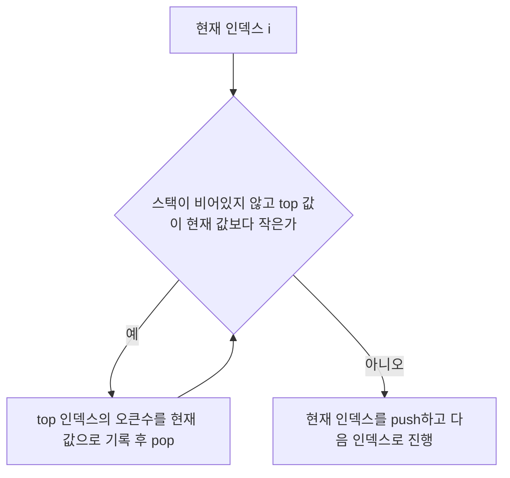

# Main.java 설계 근거 정리

## 1. 완전탐색으로 해결할 수 없습니다.

각 위치에서 오른쪽을 끝까지 확인하면 최악 `O(N^2)`입니다.
예를 들어 수열이 1씩 감소하는 경우이고 `N = 1,000,000`라면 비교 횟수는 약 `5 x 10^11`이므로 시간 제한을 만족할 수 없습니다.
따라서 이미 확인한 정보를 버리지 않고 재사용하는 방식이 필요합니다.

## 2. 스택으로 수열을 한 번만 순회해 모든 오큰수를 구할 수 있습니다

핵심은 오큰수를 찾으면 이전 항목 중 오큰수를 찾지 못한 항목들에 동일하게 적용할 수 있는지 확인하는 것입니다. 수열을 오른쪽으로 순회하며 오큰수를 찾지 못한 A[a], A[b], A[c], A[d]를 확인할 때 A[c] < A[d] 임을 확인해서 A[c]의 오큰수가 A[d]임을 확인하면, A[b] < A[d]인지 확인하여 동일한 오큰수인지 확인합니다. 맞다면 확정하고 이전 항목에 대해서도 동일하게 확인하고, 아니라면 현재 값을 스택에 넣고, 다음 인덱스인 A[e]로 오큰수를 찾는 과정을 진행합니다.

이런 방식의 연산을 위해 스택 자료형을 사용합니다. 아직 오큰수를 찾지 못한 항을 스택에 push하고, 오큰수를 찾은 경우 pop하며 오큰수를 동일하게 적용하거나 탐색을 계속할지 판단하는 것입니다.

예를 들어 `5 2 3 7`을 보면,
- `5` push
- `2` push
- `3`에서 `2`의 오큰수를 `3`으로 확정하고 `2`가 pop, `5`의 오큰수는 `3`이 아님을 확인. `3` push
- `7`에서 `3`, `5`의 오큰수를 `7`로 확정하고 `3`, `5`를 pop

과 같이 진행됩니다. 각 항은 최대 1번 push하고, 1번 pop되므로 전체 연산은 `O(N)`이 되어 시간 내에 문제를 해결할 수 있습니다.
