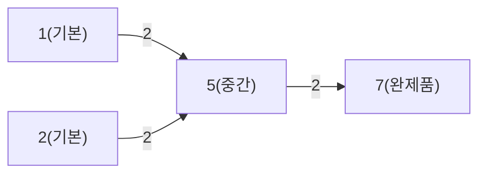

# Main.java 설계 근거 정리

## 1. DAG로 표현되는 관계

부품 번호(기본 부품, 중간 부품, 완제품)를 모두 정점으로 보고,
입력 `X Y K`를 "`X`를 만들기 위해 `Y`가 `K`개 필요"한 관계로 해석하면 가중치가 있는 방향 그래프로 모델링할 수 있습니다.

- 정점: 부품 번호 `1 ~ N`
- 간선: `Y -> X` (하위 부품에서 상위 부품으로 기여)
- 가중치: 필요 개수 `K`

문제 조건에서 두 중간 부품이 서로를 필요로 하는 경우가 없으므로 순환이 없고, 그래프는 DAG(Directed Acyclic Graph)입니다.

예시 관계를 그래프로 보면 다음과 같습니다.

## 2. 위상정렬을 통한 해결

DAG에서는 위상정렬로 선후 관계를 보장한 계산이 가능합니다.

- 진입 차수 0 정점 = 다른 부품이 필요 없는 기본 부품
- 위상정렬 순서 = 기본 부품 -> 중간 부품 -> 완제품

따라서 기본 부품에서 시작해, 각 간선을 따라 가중치(`K`)를 곱해 상위 부품으로 누적 전달하면, 완제품 `N`을 결국 "기본 부품 조합" 형태로 정확히 표현할 수 있습니다.

## 3. DP 적용 이유

각 부품 `i`에 대해 "기본 부품별 필요 개수"를 배열(또는 테이블)로 관리합니다.

- `need[i][b]`: 부품 `i` 1개를 만들 때 기본 부품 `b`가 필요한 개수

초기값(기본 부품):

`need[b][b] = 1`

점화식(`cur -> next`, 간선 가중치 `k`):

`need[next][b] += need[cur][b] * k`

위상정렬 순서로 처리하면, 하위 부품의 계산 결과를 그대로 재사용해 상위 부품을 계산할 수 있습니다.

중간 부품이 여러 경로에서 반복 참조되더라도 이미 계산된 `need` 값을 재사용하므로, 같은 중간 부품을 매번 다시 분해 계산하지 않습니다. 이 점이 DP의 핵심이며, 중복 계산을 줄이면서 정확한 누적 결과를 얻을 수 있습니다.
